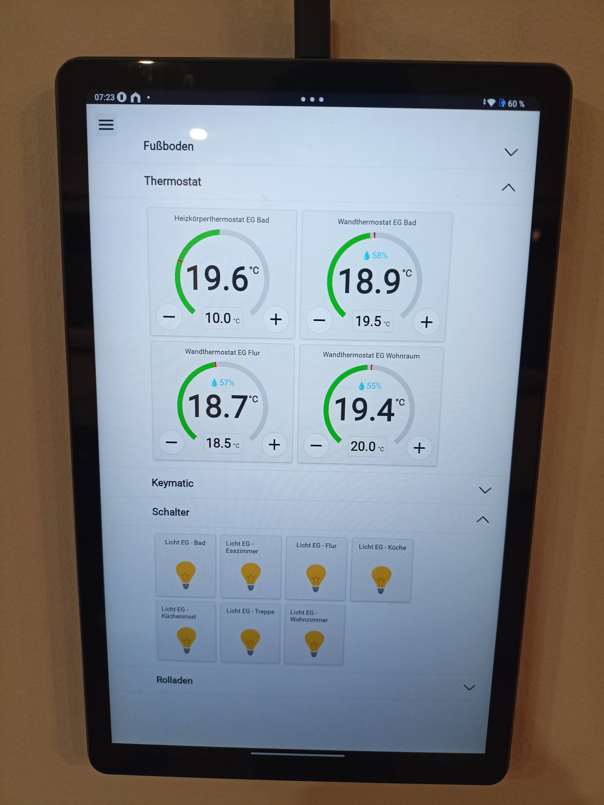
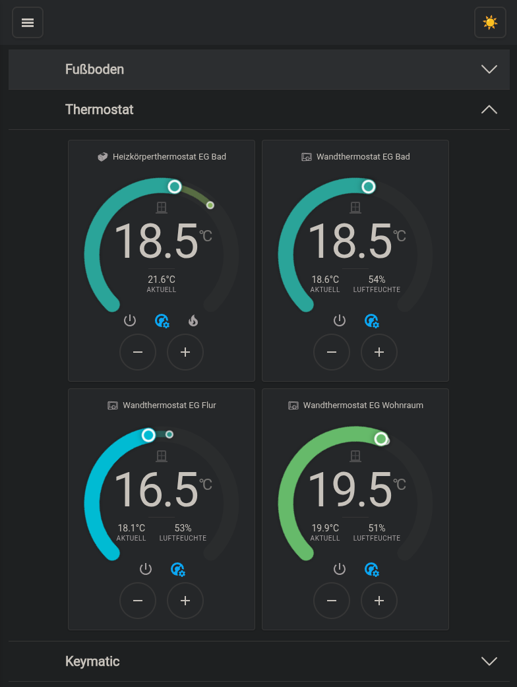
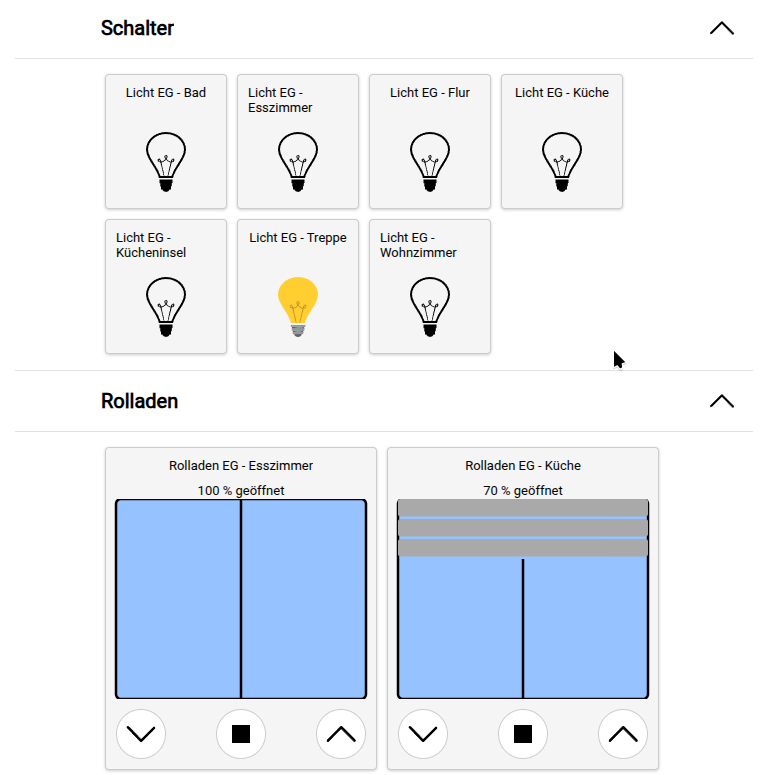
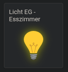
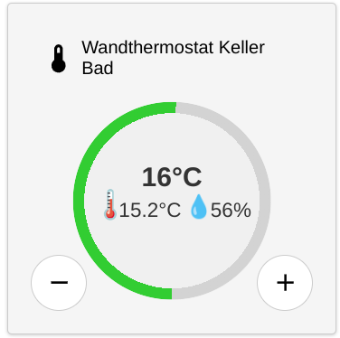
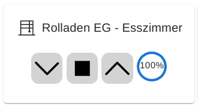
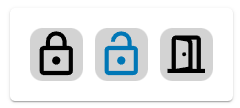
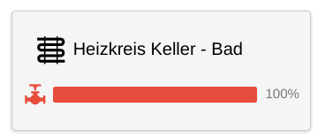

<div align="center">

# CCU3 Add-on: Modern Web-UI



[](https://github.com/firsttris/ccu-addon-mui/actions/workflows/build.yml)
[](https://opensource.org/licenses/MIT)

[](https://reactjs.org/)
[](https://www.typescriptlang.org/)
[](https://vitejs.dev/)
[](https://golang.org/)

**A modern, fast, and responsive Progressive Web App (PWA) with integrated WebSocket server for your CCU3.**

My motivation was to refresh the proven CCU3 with modern software and give it a contemporary, responsive interface.

[Deutsche Version](README.md)

</div>

## 🚀 Features

- **Modern UI**: Responsive design, optimized for tablets and mobile devices.
- **Device Support**: Control of switches, thermostats, blinds, doors, and floor heating; energy meter readings.
- **Real-time Updates**: WebSocket-based communication for instant device status updates.
- **Device Health**: Low batteries and unreachable devices are shown on the card and collected on the start page.
- **Login with a CCU user**: Log in once per device, it then stays logged in.
- **PWA-Ready**: Installable as a native app on Android and iOS home screens.
- **WakeLock Support**: Prevents screen standby for continuous control.
- **Easy Installation**: Simple add-on installation for CCU3 systems.

## 🏗️ Installation

### Install Add-on
1.  Download the latest addon `tar.gz` file from the [Releases Page](https://github.com/firsttris/ccu-addon-mui/releases).
2.  Install it as a plugin on your CCU3 under "Additional Software".
    *   _Note: Upload and reboot take some time._
3.  The add-on is available at `http://<Your-CCU-IP>/addons/mui`.

### Prerequisites for CCU3
*   **Rooms & Trades**: For the add-on to work, you must have rooms or trades configured in your CCU3 and channels assigned.

### Login
On first use, log in with a **CCU WebUI user** (like RedMatic). The device then stays logged in – also after closing the app or a restart; the login is renewed automatically whenever it is used. The password is not stored.

Without logging in, nobody on the network can read or control devices. To turn the login off, create `/usr/local/etc/config/mui.conf` containing `AUTH_MODE=none` and restart the add-on. To log out all devices, delete `/usr/local/etc/config/mui-auth.key` and restart the add-on.

### HTTPS Workaround (Chrome)
Features like PWA and WakeLock require a secure context (HTTPS). Since the CCU3 uses local HTTP by default:
1.  Open `chrome://flags` in Chrome.
2.  Search for `Insecure origins treated as secure`.
3.  Add your CCU3 IP (e.g., `http://192.168.178.111`).
4.  Restart Chrome.

## ℹ️ User Interface Overview

### Channels View
Here you can see and change the status of the channels assigned to the selected room.

<div align="center">
  
  
</div>

<details>
<summary><strong>📱 Device Support</strong></summary>

### [Switch](src/controls/SwitchControl.tsx)
**Channel Type:** `SWITCH_VIRTUAL_RECEIVER`



- Show light status
- Switch light on/off

### [Thermostat](src/controls/ThermostatControl.tsx)
**Channel Type:** `HEATING_CLIMATECONTROL_TRANSCEIVER`



- Show current humidity
- Show target temperature and current temperature
- Show window open status
- Set target temperature
- Switch between manual and automatic mode
- Turn thermostat off
- Boost mode (only for radiator thermostats)

### [Blinds](src/controls/BlindsControl.tsx)
**Channel Type:** `BLIND_VIRTUAL_RECEIVER`



- Show opening percentage
- Open/Close/Stop
- Set opening percentage by clicking

_For this to work properly, you must measure and configure the opening and closing times for your blinds in the CCU3._

### [Door Opener](src/controls/DoorControl.tsx)
**Channel Type:** `KEYMATIC`



- Show door status
- Unlock/Lock/Open door (unlocking and opening ask for confirmation)

### [Energy Meter](src/controls/EnergyMeterControl.tsx)
**Channel Type:** `ENERGIE_METER_TRANSMITTER` (HmIP-ESI)

- Current power and meter readings (electricity) or meter reading and flow (gas)
- One card per meter

### [Floor Heating](src/controls/FloorControl.tsx)
**Channel Type:** `CLIMATECONTROL_FLOOR_TRANSCEIVER`



- Show valve opening percentage
- Show target temperature and current temperature

</details>

## 📲 Add PWA to Home Screen

### Android
1.  Open the PWA in the browser.
2.  Menu (three dots) -> "Add to Home screen".

### iOS
1.  Open the PWA in Safari.
2.  Share button -> "Add to Home Screen".

### WakeLock
Prevents standby. If it doesn't work, check `chrome://flags` -> `Experimental Web Platform features` (usually active by default in newer versions).

## 💻 Development and Build

### Prerequisites
- **Node.js**: v22.12+
- **Go**: v1.27+

### Quick Start
```bash
git clone https://github.com/firsttris/ccu-addon-mui.git
cd ccu-addon-mui
npm install
```

**Frontend and Go server locally, against the real CCU:**
```bash
cp go-server/.env.example go-server/.env
# Set CCU_HOST, CCU_USER/CCU_PASS and CALLBACK_HOST (this machine's IP) in .env
npm run dev
```
Starts the Go server and the frontend (http://localhost:4200) together; Ctrl+C stops both and unregisters the server from the CCU. The CCU must be able to reach this machine on port 9099, otherwise no events arrive.

**Frontend only, against the add-on installed on the CCU:**
```bash
# Adjust CCU IP in vite.config.mts (proxyTargets), then:
npm run start:fe:ccu3
```

### Build
```bash
npm run build
```
Creates React app, Go server, and an installable `.tar.gz` archive.

### WebSocket Test
The easiest way is [websocat](https://github.com/vi/websocat) on the command line. Browser extensions are rejected by the server's origin check.
```bash
websocat ws://<CCU-IP>/ws/mui
{"type": "login", "username": "Admin", "password": "<CCU password>"}
{"type": "getRooms", "deviceId": "test-device"}
```
Without a `login` first, the server answers `authentication required` (unless `AUTH_MODE=none`). All messages are described in the [Go server README](go-server/README.md#-websocket-protocol).

## 🤝 Contributions

We welcome pull requests! Visit our [Issues Page](https://github.com/firsttris/ccu-addon-mui/issues).

## ⚖️ License

Licensed under the [MIT License](LICENSE).
