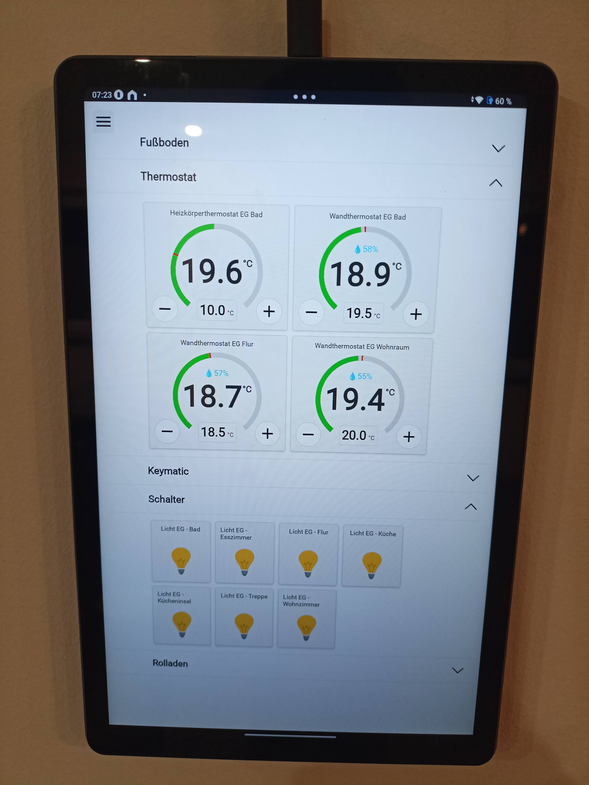
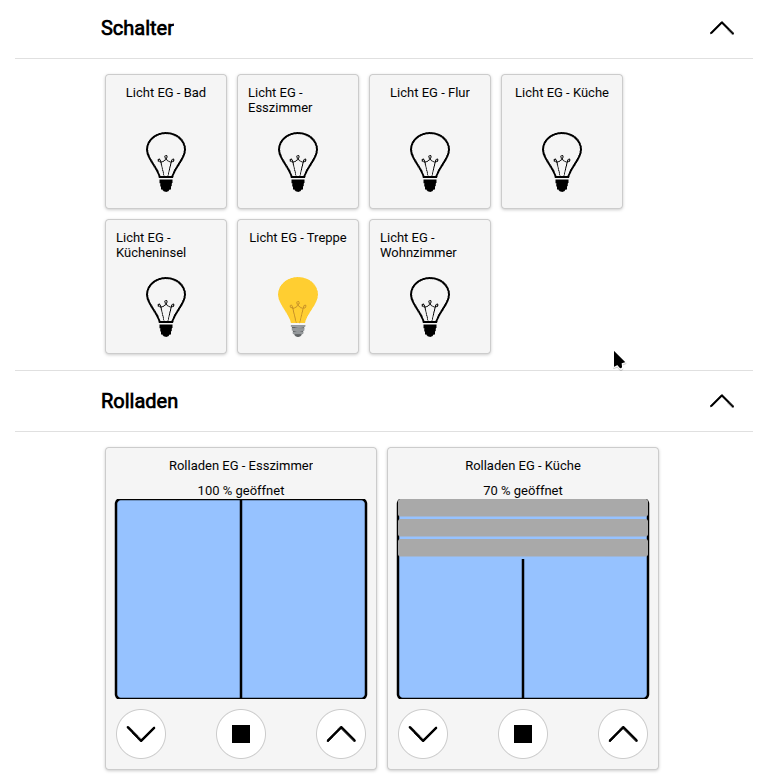
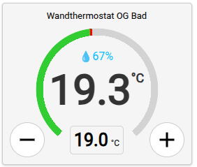
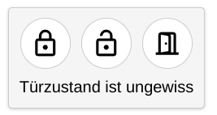

<div align="center">

# CCU3 Add-on: Modern Web-UI



[](https://github.com/firsttris/ccu-addon-mui/actions/workflows/build.yml)
[](https://opensource.org/licenses/MIT)

[](https://reactjs.org/)
[](https://www.typescriptlang.org/)
[](https://vitejs.dev/)
[](https://golang.org/)
[](https://nx.dev/)

**A modern, fast, and responsive Progressive Web App (PWA) with integrated WebSocket server for your CCU3.**

My motivation was to refresh the proven CCU3 with modern software and give it a contemporary, responsive interface.

[Deutsche Version](README.md)

</div>

## 🚀 Features

- **Modern UI**: Responsive design, optimized for tablets and mobile devices.
- **Device Support**: Control of switches, thermostats, blinds, doors, and floor heating.
- **Real-time Updates**: WebSocket-based communication for instant device status updates.
- **PWA-Ready**: Installable as a native app on Android and iOS home screens.
- **WakeLock Support**: Prevents screen standby for continuous control.
- **Easy Installation**: Simple add-on installation for CCU3 systems.

## 🏗️ Installation

### Install Add-on
1.  Download the latest addon `tar.gz` file from the [Releases Page](https://github.com/firsttris/ccu-addon-mui/releases).
2.  Install it as a plugin on your CCU3 under "Additional Software".
    *   _Note: Upload and reboot take some time._
3.  The add-on is available at `http://<Your-CCU-IP>/addons/mui`.

### Prerequisites for CCU3
*   **Rooms & Trades**: For the add-on to work, you must have rooms or trades configured in your CCU3 and channels assigned.

### HTTPS Workaround (Chrome)
Features like PWA and WakeLock require a secure context (HTTPS). Since the CCU3 uses local HTTP by default:
1.  Open `chrome://flags` in Chrome.
2.  Search for `Insecure origins treated as secure`.
3.  Add your CCU3 IP (e.g., `http://192.168.178.111`).
4.  Restart Chrome.

## ℹ️ User Interface Overview

### Channels View
Here you can see and change the status of the channels assigned to the selected room.

<div align="center">
  
  
</div>

<details>
<summary><strong>📱 Device Support</strong></summary>

### [Switch](src/controls/SwitchControl.tsx)
**Channel Type:** `SWITCH_VIRTUAL_RECEIVER`


- Show light status
- Switch light on/off

### [Thermostat](src/controls/ThermostatControl.tsx)
**Channel Type:** `HEATING_CLIMATECONTROL_TRANSCEIVER`



- Show current humidity
- Show target temperature and current temperature
- Show window open status
- Set target temperature
- Switch between manual and automatic mode
- Turn thermostat off
- Boost mode (only for radiator thermostats)

### [Blinds](src/controls/BlindsControl.tsx)
**Channel Type:** `BLIND_VIRTUAL_RECEIVER`


- Show opening percentage
- Open/Close/Stop
- Set opening percentage by clicking

_For this to work properly, you must measure and configure the opening and closing times for your blinds in the CCU3._

### [Door Opener](src/controls/DoorControl.tsx)
**Channel Type:** `KEYMATIC`



- Show door status
- Unlock/Lock/Open door

### [Floor Heating](src/controls/FloorControl.tsx)
**Channel Type:** `CLIMATECONTROL_FLOOR_TRANSCEIVER`


- Show valve opening percentage
- Show target temperature and current temperature

</details>

## 📲 Add PWA to Home Screen

### Android
1.  Open the PWA in the browser.
2.  Menu (three dots) -> "Add to Home screen".

### iOS
1.  Open the PWA in Safari.
2.  Share button -> "Add to Home Screen".

### WakeLock
Prevents standby. If it doesn't work, check `chrome://flags` -> `Experimental Web Platform features` (usually active by default in newer versions).

## 💻 Development and Build

### Prerequisites
- **Node.js**: v18+
- **Go**: v1.21+

### Quick Start
```bash
git clone https://github.com/firsttris/ccu-addon-mui.git
cd ccu-addon-mui
npm install
# Adjust IP in proxy.config.json
npm start
```

### Build
```bash
npm run build
```
Creates React app, Go server, and an installable `.tar.gz` archive.

### WebSocket Test
Use a [WebSocket Test Client](https://chromewebstore.google.com/detail/websocket-test-client/fgponpodhbmadfljofbimhhlengambbn).
URL: `ws://<CCU-IP>/addons/red/ws/webapp`
Test message: `{"type": "getRooms", "deviceId": "test-device"}`

## 🤝 Contributions

We welcome pull requests! Visit our [Issues Page](https://github.com/firsttris/ccu-addon-mui/issues).

## ⚖️ License

Licensed under the [MIT License](LICENSE).
