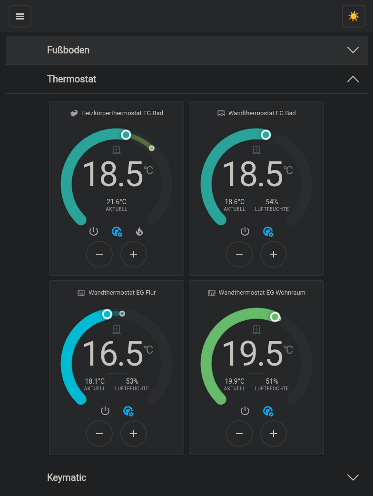
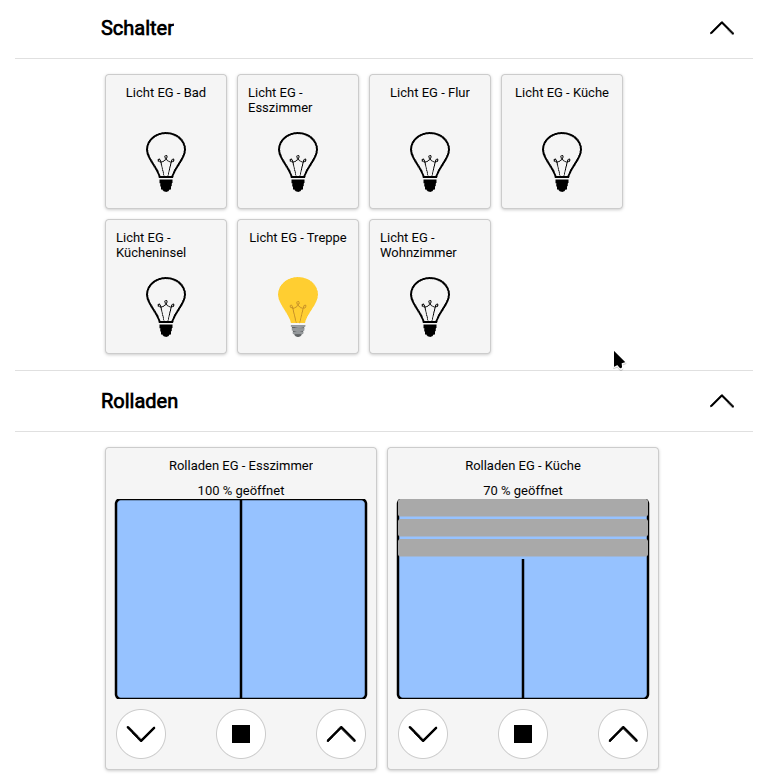

<div align="center">

# CCU3 Add-on: Moderne Web-UI


[](https://github.com/firsttris/ccu-addon-mui/actions/workflows/build.yml)
[](https://opensource.org/licenses/MIT)

[](https://reactjs.org/)
[](https://www.typescriptlang.org/)
[](https://vitejs.dev/)
[](https://golang.org/)
[](https://nx.dev/)

**Eine moderne, schnelle und responsive Progressive Web App (PWA) mit integriertem WebSocket-Server für Ihre CCU3.**

Meine Motivation war es, die bewährte CCU3 mit moderner Software aufzufrischen und ihr ein zeitgemäßes, responsives Interface zu verleihen.

[English Version](README.en.md)

</div>

## 🚀 Funktionen

- **Moderne UI**: Responsives Design, optimiert für Tablets und mobile Geräte.
- **Geräteunterstützung**: Steuerung von Schaltern, Thermostaten, Jalousien, Türen und Fußbodenheizungen.
- **Echtzeit-Updates**: WebSocket-basierte Kommunikation für sofortige Gerätestatus-Updates.
- **PWA-Bereit**: Installierbar als native App auf Android- und iOS-Startbildschirmen.
- **WakeLock-Unterstützung**: Verhindert Bildschirm-Standby für kontinuierliche Steuerung.
- **Einfache Installation**: Einfache Add-on-Installation für CCU3-Systeme.

## 🏗️ Installation

### Add-on installieren
1.  Laden Sie die neueste Addon-`tar.gz`-Datei von der [Releases-Seite](https://github.com/firsttris/ccu-addon-mui/releases) herunter.
2.  Installieren Sie es als Plugin auf Ihrer CCU3 unter "Zusätzliche Software".
    *   _Hinweis: Hochladen und Neustart dauern einige Zeit._
3.  Das Add-on ist unter `http://<Ihre-CCU-IP>/addons/mui` verfügbar.

### Voraussetzungen für CCU3
*   **Räume & Gewerke**: Damit das Add-on funktioniert, müssen Sie Räume oder Gewerke in Ihrer CCU3 konfiguriert und Kanäle zugewiesen haben.

### HTTPS Workaround (Chrome)
Funktionen wie PWA und WakeLock benötigen einen sicheren Kontext (HTTPS). Da die CCU3 standardmäßig lokales HTTP nutzt:
1.  Öffnen Sie `chrome://flags` in Chrome.
2.  Suchen Sie nach `Insecure origins treated as secure`.
3.  Fügen Sie Ihre CCU3-IP hinzu (z.B. `http://192.168.178.111`).
4.  Starten Sie Chrome neu.


## ℹ️ Benutzeroberfläche-Übersicht

### Kanäle-Ansicht
Hier können Sie den Status der Kanäle sehen und ändern, die dem ausgewählten Raum zugeordnet sind.

<div align="center">
  
  
</div>

<details>
<summary><strong>📱 Geräteunterstützung</strong></summary>

### [Schalter](src/controls/SwitchControl.tsx)
**Kanaltyp:** `SWITCH_VIRTUAL_RECEIVER`


- Lichtstatus anzeigen
- Licht ein-/ausschalten

### [Thermostat](src/controls/ThermostatControl.tsx)
**Kanaltyp:** `HEATING_CLIMATECONTROL_TRANSCEIVER`


- Aktuelle Luftfeuchtigkeit anzeigen
- Zieltemperatur und aktuelle Temperatur anzeigen
- Fenster-offen-Status anzeigen
- Zieltemperatur einstellen
- Zwischen manuellem und automatischem Modus wechseln
- Thermostat ausschalten
- Boost-Modus (nur für Heizkörperthermostate)

### [Jalousien](src/controls/BlindsControl.tsx)
**Kanaltyp:** `BLIND_VIRTUAL_RECEIVER`


- Öffnungsprozentsatz anzeigen
- Öffnen/Schließen/Stoppen
- Öffnungsprozentsatz durch Anklicken einstellen

_Damit dies ordnungsgemäß funktioniert, müssen Sie die Öffnungs- und Schließzeiten für Ihre Jalousien in der CCU3 messen und konfigurieren._

### [Türöffner](src/controls/DoorControl.tsx)
**Kanaltyp:** `KEYMATIC`


- Türstatus anzeigen
- Tür entriegeln/verriegeln/öffnen

### [Fußbodenheizung](src/controls/FloorControl.tsx)
**Kanaltyp:** `CLIMATECONTROL_FLOOR_TRANSCEIVER`


- Öffnungsprozentsatz des Ventils anzeigen
- Zieltemperatur und aktuelle Temperatur anzeigen

</details>


## 📲 PWA zum Startbildschirm hinzufügen

### Android
1.  Öffnen Sie die PWA im Browser.
2.  Menü (drei Punkte) -> "Zum Startbildschirm hinzufügen".

### iOS
1.  Öffnen Sie die PWA in Safari.
2.  Teilen-Button -> "Zum Startbildschirm hinzufügen".

### WakeLock
Verhindert Standby. Falls es nicht geht, prüfen Sie `chrome://flags` -> `Experimental Web Platform features` (in neueren Versionen meist standardmäßig aktiv).

## 💻 Entwicklung und Build

### Voraussetzungen
- **Node.js**: v18+
- **Go**: v1.21+

### Quick Start
```bash
git clone https://github.com/firsttris/ccu-addon-mui.git
cd ccu-addon-mui
npm install
# IP in proxy.config.json anpassen
npm start
```

### Build
```bash
npm run build
```
Erstellt React-App, Go-Server und ein installierbares `.tar.gz` Archiv.

### WebSocket-Test
Nutzen Sie einen [WebSocket Test Client](https://chromewebstore.google.com/detail/websocket-test-client/fgponpodhbmadfljofbimhhlengambbn).
URL: `ws://<CCU-IP>/addons/red/ws/webapp`
Test-Nachricht: `{"type": "getRooms", "deviceId": "test-device"}`

## 🤝 Beiträge

Wir freuen uns über Pull-Requests! Besuchen Sie unsere [Issues-Seite](https://github.com/firsttris/ccu-addon-mui/issues).

## ⚖️ Lizenz

Lizenziert unter der [MIT License](LICENSE).