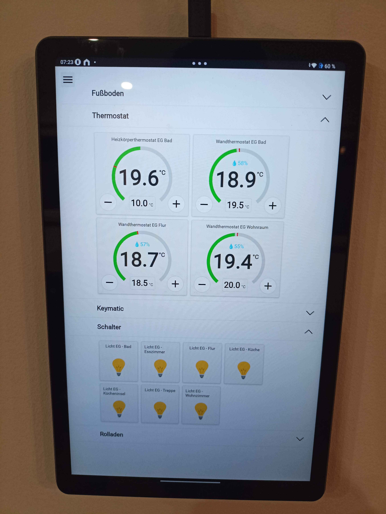
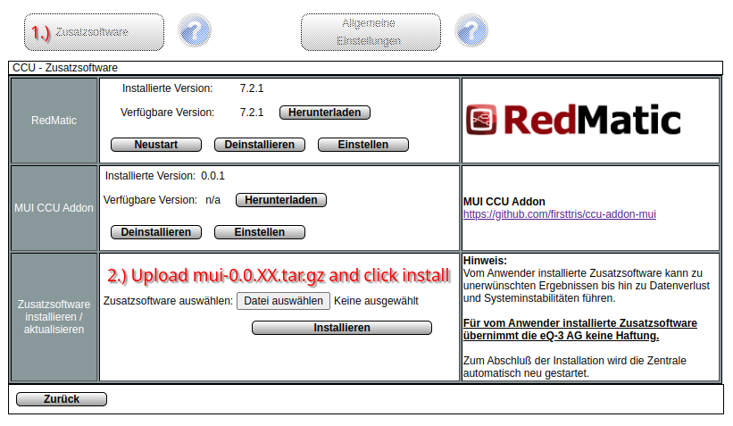
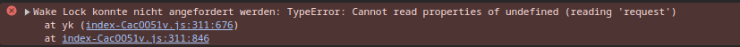
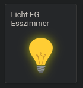
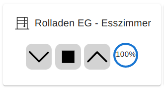
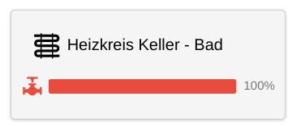

# CCU3 Add-on: Modern Web UI

A modern, fast, and responsive Progressive Web App (PWA) for your CCU3 with an integrated WebSocket server.

Whether you're a developer looking to contribute or a user seeking a better interface for your CCU3,
this project has something for you. Dive in to explore the features, installation steps, and how you can get involved.

# Motivation

My motivation was to have a user-friendly app for the tablet in our kitchen, allowing us to conveniently control all devices in the house.



# Technology Stack

This project is built with a robust set of technologies to ensure high performance and maintainability:

## Frontend

- [React](https://reactjs.org/): A JavaScript library for building user interfaces.
- [TypeScript](https://www.typescriptlang.org/): A strongly typed superset of JavaScript that adds static types.
- [Emotion](https://emotion.sh/docs/introduction): A library designed for writing CSS styles with JavaScript.
- [WebSocket](https://developer.mozilla.org/en-US/docs/Web/API/WebSockets_API): Two-way interactive communication between browser and server.
- [Vite](https://vitejs.dev/): Next generation frontend tooling.
- [Nx](https://nx.dev/): Smart, fast and extensible build system.

## Backend

- [Bun](https://bun.sh/): Fast all-in-one JavaScript runtime and bundler.
- [TypeScript](https://www.typescriptlang.org/): Type-safe server code.
- [WebSocket Server](https://github.com/websockets/ws): WebSocket implementation for Node.js.
- [Homematic Libraries](https://github.com/hobbyquaker): XML-RPC and ReGa script support.

# Prerequisites for CCU3

**Configure Rooms and or Trades (Gewerke) and Assign Channels (Devices)**

   To ensure this add-on functions properly, you need to have rooms or trades configured in your CCU3. Each room should have channels assigned with appropriate names, as the add-on queries the rooms, their channels, and the datapoints of those channels. Without this setup, the add-on will not work.

# Installation

To install this add-on:

1. Download the latest addon `tar.gz` file from the [releases page](https://github.com/firsttris/ccu-addon-mui/releases).
2. Install it as a plugin on your CCU3 via the settings page under "Additional Software".
   
3. Please Note: Upload and Reboot takes some time, depending on your Box ccu3 vs raspberry. (This is because we need to copy the nodejs binary)
4. The add-on will be available at `http://192.168.178.111/addons/mui` (replace with your CCU IP).

**Note:** Node-RED is **no longer required**! This add-on now includes its own integrated WebSocket server that:
- Runs natively on the CCU3
- Uses port 8183 for local ReGa connections (no authentication needed)
- Automatically handles CCU events via XML-RPC
- Provides real-time updates via WebSocket

## Updates

The CCU3 will automatically check for new versions via GitHub Releases. When an update is available:
1. Go to Settings → Additional Software
2. Check for updates
3. Download and install the new version

## Setting Insecure CCU3 Origin as Secure

In the latest Chrome version, Progressive Web App (PWA) features and WakeLock only work with HTTPS.
You need to set up the IP of your CCU3 as a secure origin.

1. Open Chrome and go to `chrome://flags`.
2. Search for `Insecure origins treated as secure`
3. Enter IP Adress of CCU3 e.g. `http://192.168.178.111` (replace with your IP).
4. Enable
5. Save and relaunch Chrome

## Adding the PWA to Your Home Screen

Progressive Web Apps (PWAs) can be installed on your device like native apps. Follow these steps to add our PWA to your home screen:

### On Android:

1. Open the PWA in your browser (e.g., Chrome, Firefox).
2. Tap the browser's menu (usually three dots in the top right corner).
3. Select "Add to Home screen".

### On iOS:

1. Open the PWA in Safari.
2. Tap the Share button (the box with an upward arrow).
3. Scroll down and select "Add to Home Screen".

After these steps, the PWA will appear as an icon on your home screen, and you can use it just like a native app.

## Use WakeLock to prevent Screen from Standby

To perevent the PWA from going into standby, we use the [WakeLock API](https://developer.mozilla.org/en-US/docs/Web/API/Screen_Wake_Lock_API).

Steps to enable WakeLock experimental API in Chrome:

NOTE: The WakeLock API may no longer be experimental by the time you read this.

1. Open Chrome and go to `chrome://flags`.
2. Search for and enable `Experimental Web Platform features`.
3. Save and relaunch Chrome.

After these steps, the WakeLock API should be enabled, preventing your screen from going into standby while using the PWA.

To verify if WakeLock is working, check the browser console for the following error:

This error indicates the WakeLock API is unavailable, review the steps above.

# Device Support

This project currently supports the following devices:

### [Switch](src/controls/SwitchControl.tsx)

**Channel Type:** `SWITCH_VIRTUAL_RECEIVER`



**Features:**

- Display Light Status
- Switch Light On/Off

### [Thermostat](src/controls/ThermostatControl.tsx)

**Channel Type:** `HEATING_CLIMATECONTROL_TRANSCEIVER`


**Features:**

- Show Current Humidity
- Show Target Temperature
- Show Current Temperature
- Show Window Open State
- Set Target Temperature

### [Blinds](src/controls/BlindsControl.tsx)

**Channel Type:** `BLIND_VIRTUAL_RECEIVER`



**Features:**

- Show open percentage
- Open/Close
- Stop
- Set the open percentage of the blinds by clicking on them

_For this to work properly, you need to measure and configure the opening and closing times for your blinds in the CCU3._

### [Door Operator](src/controls/DoorControl.tsx)

**Channel Type:** `KEYMATIC`


**Features:**

- Show Door Status
- Unlock Door
- Lock Door
- Open Door

### [Floor Heating](src/controls/FloorControl.tsx)

**Channel Type:** `CLIMATECONTROL_FLOOR_TRANSCEIVER`



**Features:**

- Display the opening percentage of the floor heating valve
- Set target temperature
- Show current temperature

# User Interface Overview

The current user interface represents a responsive version of the rooms view of the CCU3.

## Rooms View

Here you see all rooms configured in the ccu3, and you can select the room in which you want to see or modify channels.


## Channels View

This is the channels view.  
Here you can see and change the state of the channels associated with the selected room.


# Development and Build

## Prerequisites

To build this project, you need:

- **[Node.js](https://nodejs.org/)** (v18 or higher) - for npm and build tools
- **[Bun](https://bun.sh/)** (latest) - for bundling the WebSocket server
  ```bash
  # Install Bun
  curl -fsSL https://bun.sh/install | bash
  ```

## Setup

To develop and build this project, follow these steps:

1. Clone the repository: `git clone https://github.com/firsttris/ccu-addon-mui.git`
2. Navigate into the project directory: `cd ccu-addon-mui`
3. Install the dependencies: `npm install`
4. Set your CCU3 IP in: [proxy.config.json](proxy.config.json)
5. Start the development server: `npm start`
6. To build the project, use: `npm run build`

This will:
- Build the frontend React app
- Bundle the WebSocket server with all dependencies
- Download the Node.js ARM32 binary for CCU3
- Create a `.tar.gz` addon package ready for installation

## WebSocket Testing

To test your WebSocket connection, you can use the [WebSocket Test Client](https://chromewebstore.google.com/detail/websocket-test-client/fgponpodhbmadfljofbimhhlengambbn) Chrome Addon:

1. Open the WebSocket Test Client and go to "Options".
2. Enter your WebSocket Endpoint URL: `ws://192.168.178.111/addons/red/ws/webapp` (replace with your actual IP).
3. Press "Connect". (Status "OPEN" indicates a successful connection.)
4. Test the connection by sending the content of the [getRooms.tcl](src/rega/getRooms.tcl) script as payload.

## Homematic API Summary

I have collected an API Summary, where you have an quick overview of all methods for the different homematic API's

[API Summary](/docs/api/README.md)

# Issues

Want to start contributing to this project?

Please visit our [issues page](https://github.com/firsttris/ccu-addon-mui/issues) for the latest issues and feature requests.

# Contributions

We welcome pull requests to add features or support for new devices. Your contributions are appreciated!
