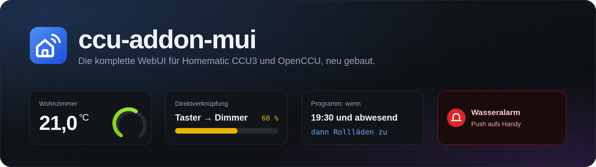
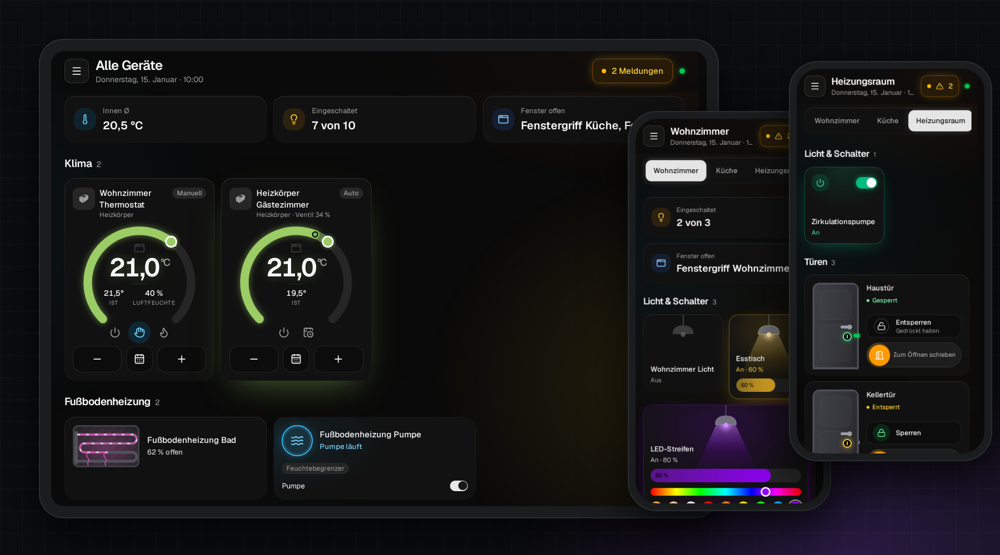
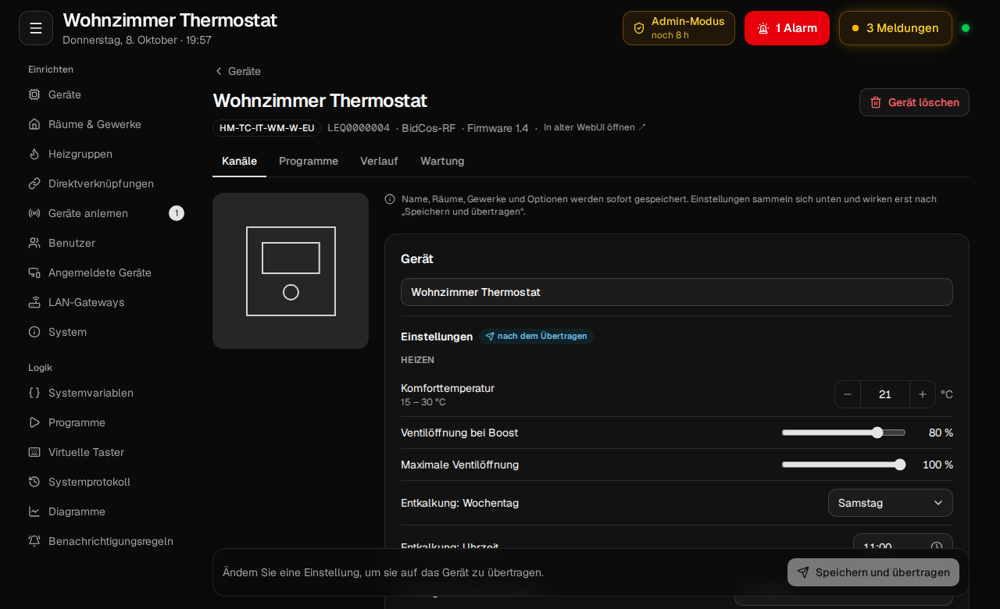
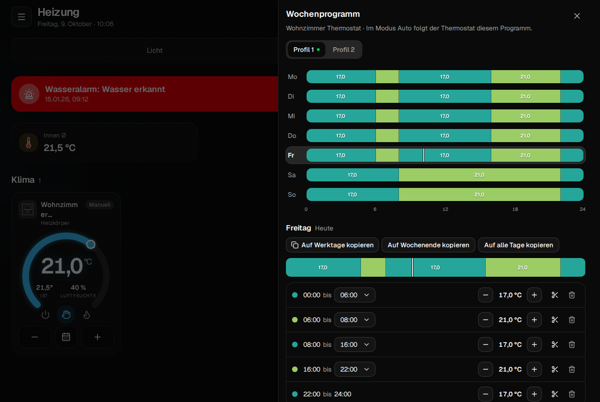
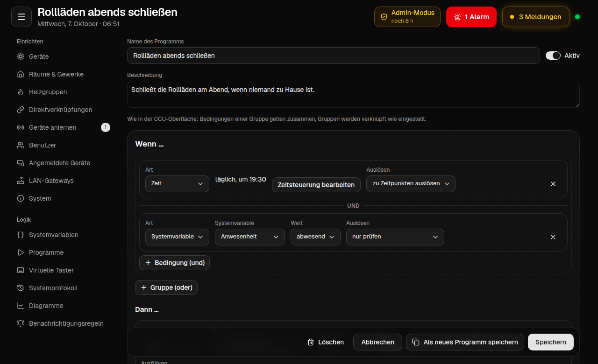
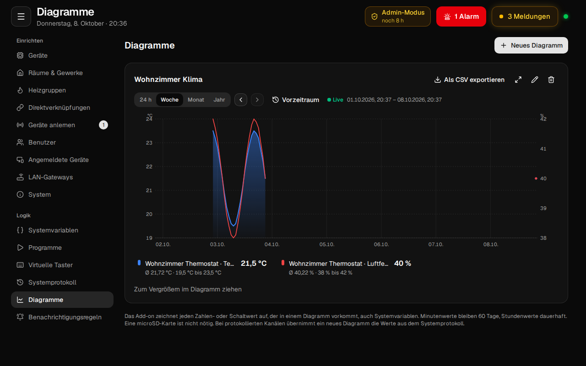
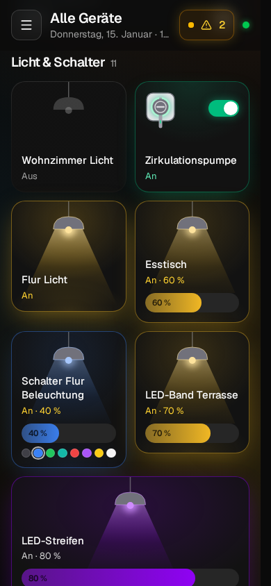
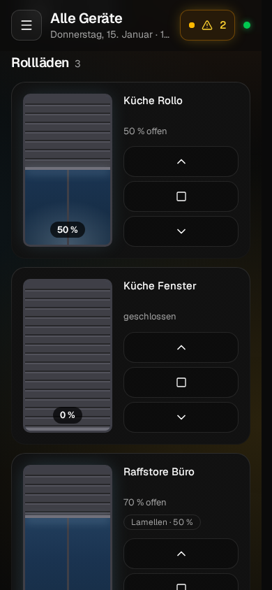
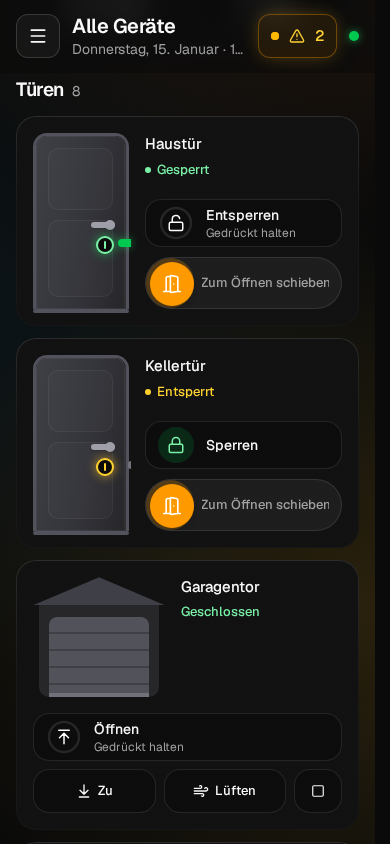
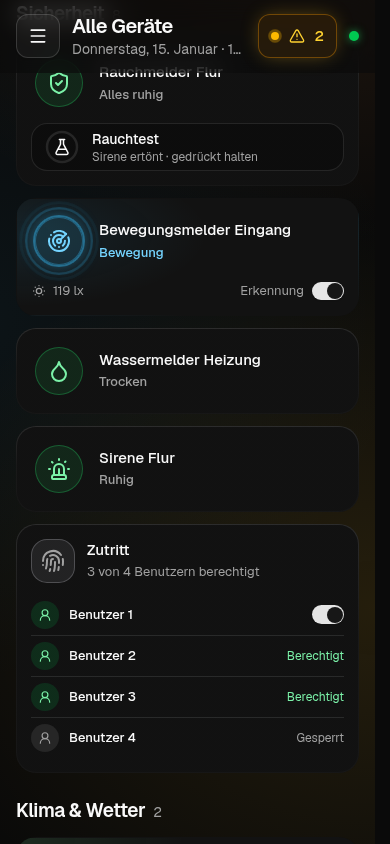

<div align="center">



**Die komplette WebUI deiner Homematic-Zentrale, neu gebaut.**<br>
Bedienen, einrichten, verknüpfen und programmieren, live und auf jedem Gerät:
ein Add-on für CCU3 und OpenCCU, das die alte WebUI im Alltag ersetzt.

[](https://github.com/firsttris/ccu-addon-mui/actions/workflows/build.yml)
[](https://github.com/firsttris/ccu-addon-mui/actions/workflows/go-unit-tests.yml)
[](https://github.com/firsttris/ccu-addon-mui/actions/workflows/playwright-e2e.yml)
[](https://github.com/firsttris/ccu-addon-mui/releases/latest)
[](https://github.com/firsttris/ccu-addon-mui/releases)
[](LICENSE)
<br>
[](docs/installation.md)
[](docs/geraete.md)
[](docs/architektur.md)
[](https://react.dev/)
[](https://www.typescriptlang.org/)
[](docs/installation.md#als-app-installieren)

[Warum?](#-warum) •
[Funktionen](#-funktionen) •
[Stand](#-stand-gegenüber-der-ccu3-webui) •
[Installation](#-installation) •
[Dokumentation](docs/README.md) •
[Entwicklung](#-entwicklung)



</div>

## 💡 Warum?

Die WebUI der CCU3 kann alles, sieht aber aus wie 2008: Tabellen, Popups, Seiten, die der Server bei
jedem Klick neu baut, und Werte, die nur alle paar Sekunden nachgeladen werden. Am Handy ist sie kaum
zu bedienen. Dieses Add-on ersetzt sie durch eine moderne App, die auf der Zentrale selbst läuft:

- **Alles an einem Ort**: Räume, Gewerke und Favoriten bedienen, und genauso Geräte anlernen,
  Einstellungen übertragen, Direktverknüpfungen anlegen, Programme schreiben, Backups ziehen, Firmware
  einspielen. Für den Alltag musst du die alte WebUI nicht mehr öffnen.
- **Live statt Abfrage**: Jede Änderung eines Geräts kommt über WebSocket in Millisekunden auf jedem
  offenen Gerät an. Die WebUI fragt dagegen jeden offenen Tab alle 3 Sekunden ab.
- **Für Hand und Wand gemacht**: Kacheln, die zeigen, was los ist (Lampe leuchtet, Rollladen fährt,
  Fenster steht offen), mit Gesten statt Formularen, hell oder dunkel, als App installierbar.
- **Genauso sicher wie die CCU**: Anmeldung mit den CCU-Benutzern und deren Rechten, kurzlebiges
  Admin-Token für Einstellungen, Protokoll jeder Änderung.
- **Nach dem Original gebaut**: Jede Funktion folgt den Quellen der WebUI aus
  [OpenCCU](https://github.com/OpenCCU/OpenCCU-Base). Datenpunkte, Skripte und Abläufe sind die der CCU.
  Das Add-on spricht nur deren eigene Schnittstellen und verändert nichts an der Zentrale.

## ✨ Funktionen

- **Dashboard**: Räume, Gewerke, Favoriten und *Alle Geräte*, mit Kennzahlen (Innentemperatur,
  eingeschaltete Lichter, offene Fenster), Abschnitten nach Art und eigenen Kacheln für Thermostate,
  Fußbodenheizung, Licht, Dimmer, Farblicht, Rollläden und Jalousien mit Lamellen, Fenster, Türschlösser,
  Garagentore, Rauch-, Wasser- und Bewegungsmelder, Sirenen, Klima- und Wettersensoren, Taster,
  Energiezähler und Zutrittskontrolle. Jedes andere Gerät bekommt eine passende Kachel aus seiner
  Gerätebeschreibung.
- **Kacheln anordnen** per Drag & Drop, gespeichert in der CCU und damit auf allen Geräten gleich.
- **Meldungen**: Alarme und Servicemeldungen live im Kopf der App, bestätigen mit einem Tipp, auf Wunsch
  als **Push-Benachrichtigung** aufs Handy.
- **Heizen**: Thermostat mit Drehregler, Boost, Modi und ein **Wochenprogramm-Editor** mit Zeitleiste,
  Kopieren auf Werktage und Profilen. Wochenprogramme für Schalt-, Dimm- und Rollladenaktoren.
  Heizgruppen anlegen und ändern.
- **Diagramme**, besser als in der WebUI: Jeder Datenpunkt und jede Systemvariable lässt sich aufzeichnen,
  ohne microSD-Karte, mit Zoom, Statistik, Kosten für Energiezähler, CSV-Export und als Kachel im Raum.
- **Programme**: Editor mit *Wenn / Sonst wenn / Sonst*, allen Zeitsteuerungen, Astro-Zeiten, Werten aus
  Systemvariablen und **Skript testen** mit Syntaxprüfung und Ausgabe.
- **Systemvariablen**, **virtuelle Taster** und das **Systemprotokoll**.
- **Geräte einrichten**: Anlernen (auch HmIP mit KEY/SGTIN und BidCos per Seriennummer), Posteingang,
  Einstellungen mit **passenden Bedienelementen** statt Zahlenfeldern und Übertragung aufs Gerät mit
  Statusanzeige, umbenennen, Räume und Gewerke, Funktionstest, Firmware-Updates, Gerätetausch, löschen.
- **Direktverknüpfungen** mit den Vorlagen der WebUI (722 Profile, z. B. *Dimmer: ein/aus & heller/dunkler*)
  oder im Expertenmodus mit allen Parametern.
- **Zentrale verwalten**: Benutzer und Rechte, Backup und Wiederherstellung, CCU-Firmware, Zusatzsoftware,
  Zeit und Standort, Netzwerk, Firewall, HTTPS-Zertifikat, SSH, Sicherheitsschlüssel, Sicherheitsstufe,
  LAN-Gateways, Protokollierung, Neustart und Werkseinstellungen.
- **Mehr als die WebUI**: angemeldete Geräte sehen und abmelden (verlorenes Tablet), Audit-Log aller
  Änderungen, Bildschirm bleibt an (WakeLock), Deutsch und Englisch, hell und dunkel.

## 📊 Stand gegenüber der CCU3-WebUI

| | Stand | |
|---|---|---|
| **Funktionen der WebUI** | **85 %** (56 von 66) | Was fehlt: [Vergleich mit der CCU3-WebUI](docs/vergleich-ccu3.md) |
| **Gerätetypen bedienbar** | **alle 465** an HmIP, HmIP Wired und BidCos-RF | jedes Gerät, das die CCU kennt |
| … mit eigener Kachel für jede Funktion | **328** (71 %) | |
| … mit eigener Kachel für die Hauptfunktion | **425** (91 %) | Rest: [generische Kachel](docs/geraete.md#generische-kachel) |
| **Direktverknüpfungs-Vorlagen** | 722 Profile für die 7 häufigsten Empfänger | alle anderen im Expertenmodus |
| **Automatisierte Tests** | über 470 | Unit, Go, End-to-End gegen eine Fake-CCU: [Tests](docs/tests.md) |

Noch nicht angebunden ist das klassische **BidCos-Wired** (HMW-Geräte am RS485-Bus). HmIP-Wired-Geräte
wie DRAP, DRS8 oder FALMOT laufen dagegen vollständig. Gezählt wird gegen den Gerätekatalog der WebUI
(`DEVDB.tcl`, 535 Typen). Wie, steht in [Geräteunterstützung](docs/geraete.md).

## ⚡ Schneller als die WebUI

| | CCU3-WebUI | ccu-addon-mui |
|---|---|---|
| Gerätewerte | jeder offene Tab fragt alle **3 s** ein ReGa-Skript ab (`iseRefresher`) | **Push**: die CCU meldet Änderungen per XML-RPC, der Server verteilt sie per WebSocket nur an die Geräte, die den Kanal anzeigen |
| Seitenwechsel | ReGa rendert jede Seite als HTML | App wechselt im Browser, lädt nur Daten |
| Beim Öffnen | 40 Dateien, 3,1 MB (Prototype, jQuery, Scriptaculous, jqPlot …) | 4 Dateien, 844 KB, danach aus dem Cache des Service Workers |
| Server | Tcl-CGIs und ReGa | ein statisches Go-Binary ohne Laufzeit und Abhängigkeiten |

Gemessen an den Quellen der WebUI (`rega/pages/index.htm`, `webui.js`) und am Build dieses Add-ons.
Hintergründe in der [Architektur](docs/architektur.md#warum-es-schnell-ist).

## 📸 Screenshots

<table>
  <tr>
    <td width="50%"><br><sub><b>Geräteeinstellungen</b>: passende Bedienelemente, Übertragung aufs Gerät</sub></td>
    <td width="50%"><br><sub><b>Wochenprogramm</b>: Zeitleiste, Kopieren auf Werktage</sub></td>
  </tr>
  <tr>
    <td width="50%"><br><sub><b>Programme</b>: Wenn, Sonst wenn, Sonst, wie in der WebUI</sub></td>
    <td width="50%"><br><sub><b>Diagramme</b>: jeder Datenpunkt, ohne microSD-Karte</sub></td>
  </tr>
</table>

<p align="center">
  
  
  
  
</p>

Mehr Bilder in [Bedienung](docs/bedienung.md) und [Einrichten](docs/einrichten.md).

## 🚀 Installation

1. `mui-<version>.tar.gz` von der [Releases-Seite](https://github.com/firsttris/ccu-addon-mui/releases/latest) laden.
2. In der WebUI unter *Einstellungen → Systemsteuerung → Zusatzsoftware* hochladen und installieren. Die CCU startet neu.
3. **http://&lt;IP-der-CCU&gt;/addons/mui** öffnen und mit einem Benutzer der CCU anmelden.

Danach als App auf den Startbildschirm legen. Updates meldet die CCU unter *Zusatzsoftware*. HTTPS,
Optionen wie `AUTH_MODE` und Deinstallation stehen in der [Installation](docs/installation.md).

> [!NOTE]
> Die Einrichten-Funktionen sind neu. Alle Abläufe sind End-to-End gegen eine Fake-CCU getestet, die
> die Schnittstellen der echten Zentrale nachbildet. Ein frisches Backup vor größeren Änderungen
> schadet trotzdem nie, und Rückmeldungen von echten Installationen sind sehr willkommen.

## 📚 Dokumentation

| | |
|---|---|
| [Installation](docs/installation.md) | Installieren, Update, Anmeldung, HTTPS, als App, Push, Optionen, Deinstallation |
| [Bedienung](docs/bedienung.md) | Dashboard, Kacheln, Meldungen, Favoriten, Diagramme, Programme, Systemvariablen |
| [Einrichten](docs/einrichten.md) | Anlernen, Geräteeinstellungen, Verknüpfungen, Benutzer, Backup, Firmware, Systemsteuerung |
| [Geräteunterstützung](docs/geraete.md) | Welche Geräte welche Kachel bekommen, Zahlen, was noch fehlt |
| [Vergleich mit der CCU3-WebUI](docs/vergleich-ccu3.md) | Funktion für Funktion: vorhanden, fehlt, besser |
| [Architektur](docs/architektur.md) | Aufbau, Datenfluss, Schnittstellen der CCU, Entscheidungen |
| [API: WebSocket-Protokoll](docs/protokoll.md) | die API des Add-ons: Nachrichten, Anmeldung, Events, Fehlercodes, alle 131 Nachrichtentypen |
| [Sicherheit](docs/sicherheit.md) | Anmeldung, Tokens, Rechte, Audit-Log |
| [Tests](docs/tests.md) | Unit, Go, Fake-CCU, End-to-End, Screenshots, CI |
| [Entwicklung](docs/entwicklung.md) | Lokale Umgebung, Befehle, Protokoll erweitern, Übersetzungen, Release |

## 🔧 Entwicklung

Voraussetzungen: Node.js 22.12+ und Go 1.27+.

```bash
git clone https://github.com/firsttris/ccu-addon-mui.git && cd ccu-addon-mui
npm install
npm run dev:fake   # Fake-CCU + Go-Server + App auf http://localhost:4200, Anmeldung Admin / secret
```

Ohne echte Zentrale läuft alles gegen eine Fake-CCU mit Demo-Daten. Gegen die eigene CCU geht es mit
`npm run dev`; `npm run build` baut das installierbare Archiv.

**Stack**: Go-Server (WebSocket, XML-RPC, ReGa, JSON-RPC der WebUI) · React 19 mit TanStack Router und
Query, Tailwind und shadcn/ui · Paraglide für Deutsch und Englisch · ein JSON-Schema als Vertrag zwischen
beiden, aus dem die TypeScript-Typen entstehen · Vitest, Go-Tests und Playwright.
Mehr in [Entwicklung](docs/entwicklung.md) und [Architektur](docs/architektur.md).

## 🤝 Mitwirken

Fehler, Ideen und vor allem Rückmeldungen von echten Zentralen gern als
[Issue](https://github.com/firsttris/ccu-addon-mui/issues). Fehlt einem Gerät eine eigene Kachel, hilft ein
Export der Gerätedaten (`npm run export:ccu -- -anonymize`, siehe [Entwicklung](docs/entwicklung.md)).
Vor einem Pull Request bitte `npm test`, `npm run typecheck` und `npm run test:go` laufen lassen.

---

<div align="center">
<sub>Lizenz: <a href="LICENSE">MIT</a> · <a href="README.en.md">English version</a><br>
Homematic und Homematic IP sind Marken der eQ-3 AG. Dieses Projekt steht in keiner Verbindung zu eQ-3 oder OpenCCU.</sub>
</div>
