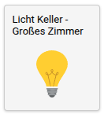

# Current Project State

Please note that this project is currently in an alpha stage and should be considered as a proof of concept. 
It aims to solve challenges in bridging the gap between the old and the new. 

# Motivation

Our aim is to craft a cutting edge, simple, yet fast, responsive Web UI as an add-on to your CCU3.

# Technology Stack

This project is built with a robust set of technologies to ensure high performance and maintainability:

- [React](https://reactjs.org/): A JavaScript library for building user interfaces.
- [TypeScript](https://www.typescriptlang.org/): A strongly typed superset of JavaScript that adds static types.
- [Emotion](https://emotion.sh/docs/introduction): A library designed for writing CSS styles with JavaScript.
- [Websocket](https://developer.mozilla.org/en-US/docs/Web/API/WebSockets_API): Websocket makes it possible to open a two-way interactive communication session between the user's browser and a server.

# Prerequisites

For this add-on to function properly, it is necessary to have rooms configured in your CCU3. Rooms should have channels assigned with appropriate names. This is because the add-on queries the rooms, their channels, and in turn, the datapoints of those channels. Without this setup, the add-on will not work.

For Communication with the ccu3 over Websocket this Addon requires [RedMatic](https://github.com/rdmtc/RedMatic)

# Installation

To install this add-on:
1. Install [RedMatic Node-Red](https://github.com/rdmtc/RedMatic/releases/latest).
2. Import the [node-red-flow.json](node-red-flow.json) file into Node-Red.
3. Download the latest `tar.gz` file from the [releases page](https://github.com/rdmtc/RedMatic/releases).
4. Install it as a plugin on your CCU3 via the settings page under "Additional Software".
5. After a reboot, the add-on will be available at `http://ccu3ip/addons/mui`.

# Adding the PWA to Your Home Screen

Progressive Web Apps (PWAs) can be installed on your device like native apps. Follow these steps to add our PWA to your home screen:

### On Android:
1. Open the PWA in your browser (e.g., Chrome, Firefox).
2. Tap the browser's menu (usually three dots in the top right corner).
3. Select "Add to Home screen".

### On iOS:
1. Open the PWA in Safari.
2. Tap the Share button (the box with an upward arrow).
3. Scroll down and select "Add to Home Screen".

After these steps, the PWA will appear as an icon on your home screen, and you can use it just like a native app.

### Use WakeLock to Prevent Screen from Standby

To display this app on a tablet in our kitchen and prevent it from going into standby, we use the WakeLock API.

The WakeLock API is still experimental in Chrome. To use it, you need to configure the following settings on your mobile device (tablet):

1. Open Chrome and go to `chrome://flags`.
2. Search for and enable `Experimental Web Platform features`.
3. Set your CCU3 IP as a secure origin:
   - Search for and enable `#unsafely-treat-insecure-origin-as-secure`.
   - Add the origin of your CCU3, e.g., `http://192.168.178.26` (replace with your IP).
4. Save and relaunch Chrome.

After these steps, the WakeLock API should be enabled, preventing your screen from going into standby while using the PWA.

# Development and Build

To develop and build this project, follow these steps:

1. Clone the repository: `git clone https://github.com/ccu-addon-mui.git`
2. Navigate into the project directory: `cd ccu-addon-mui`
3. Install the dependencies: `npm install`
4. Set your CCU3 IP in: [proxy.config.json](proxy.config.json)
5. Start the development server: `npm start`
6. To build the project, use: `npm run build`

# Issues

Want to start contributing to this project? 

Please visit our [issues page](https://github.com/firsttris/ccu-addon-mui/issues) for the latest issues and feature requests.

# Homematic API Summary

I have collected an API Summary, where you have an quick overview of all methods for the different homematic API's

[API Summary](/docs/api/README.md)

# Device Support

This project currently supports the following devices:

- [Switch](src/controls/SwitchControl.tsx)  
  

- [Thermostat](src/controls/ThermostatControl.tsx)  
  

- [Blinds](src/controls/BlindsControl.tsx)  
  

- [Door Operator](src/controls/DoorControl.tsx)  
  

- [Floor Heating](src/controls/FloorControl.tsx)  
  

We welcome pull requests to add support for new devices. Your contributions are appreciated!

# User Interface Overview

The current user interface represents a responsive version of the rooms view of the CCU3.

## Rooms View

Once you obtain a session ID, you'll be automatically redirected to the rooms view. Here you see all rooms configured in the ccu3, and you can select the room in which you want to see or modify channels.

## Channels View

This is the channels view.    
Here you can see and change the state of the channels associated with the selected room.

!todo screens from tablet
