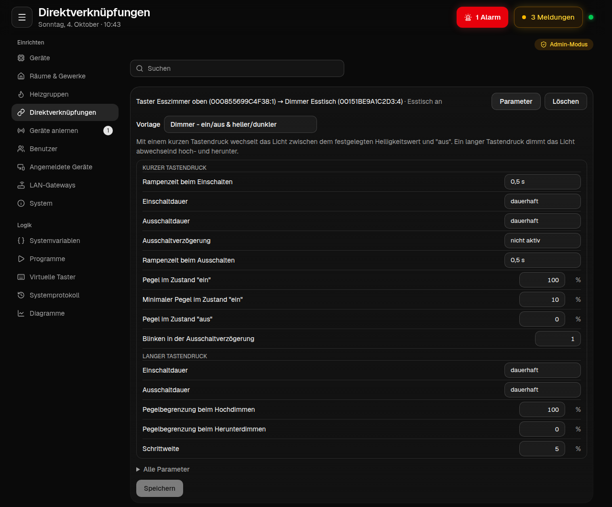
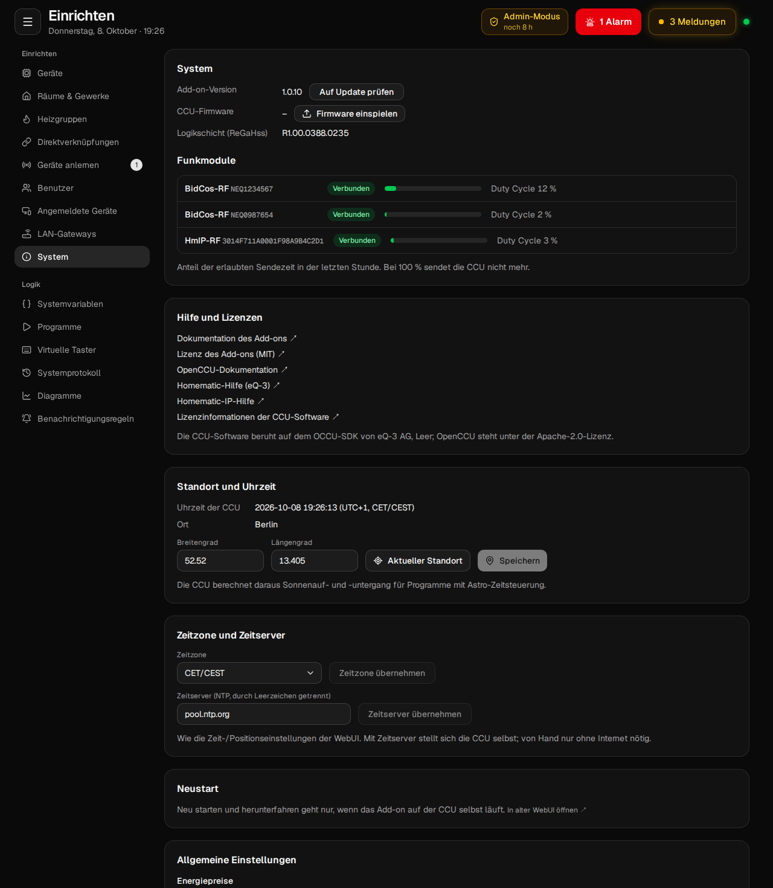

# Dokumentation

Hier steht alles über ccu-addon-mui im Detail: wie du es installierst und bedienst, was jede Seite macht,
wie weit es die WebUI der CCU3 schon ersetzt und wie es innen aufgebaut ist. Den schnellen Überblick gibt
die [README](../README.md).

## Für Anwender

| | |
|---|---|
| [Installation](installation.md) | Installieren und aktualisieren, Anmeldung, HTTPS, als App installieren, Push, WakeLock, Optionen in `mui.conf`, Deinstallation, häufige Probleme |
| [Bedienung](bedienung.md) | Startseite, Räume, Gewerke, Favoriten, Kacheln und Anordnen, Meldungen, Heizen, Diagramme, Systemprotokoll, Programme, Systemvariablen, virtuelle Taster, Darstellung |
| [Einrichten](einrichten.md) | Admin-Modus, Geräte und Einstellungen, Anlernen, Direktverknüpfungen, Räume und Gewerke, Heizgruppen, Benutzer, angemeldete Geräte, LAN-Gateways, System und Systemsteuerung |
| [Geräteunterstützung](geraete.md) | Welche Kachel welches Gerät bekommt, die generische Kachel, Zahlen je Gerätefamilie, was noch fehlt |
| [Vergleich mit der CCU3-WebUI](vergleich-ccu3.md) | Jede Funktion der WebUI: vorhanden, fehlt oder besser gelöst; Geschwindigkeit; was es nur hier gibt |

## Hintergrund

| | |
|---|---|
| [Architektur](architektur.md) | Aufbau auf der CCU, Go-Server und App, Schnittstellen der CCU, Datenfluss, Events, Entscheidungen, warum es schnell ist |
| [API: WebSocket-Protokoll](protokoll.md) | Die API des Add-ons: Nachrichtenhülle, Anmeldung, Abos und Events, Fehlercodes, alle 151 Nachrichtentypen, HTTP-Endpunkte, Schema |
| [Sicherheit](sicherheit.md) | Anmeldung mit CCU-Benutzern, Tokens, Rechte, Sperre, Audit-Log, was nie gespeichert wird |
| [Tests](tests.md) | Testpyramide, Vitest, Go, Fake-CCU, Playwright mit Mock und gegen den Stack, Screenshot-Vergleich, CI |
| [Entwicklung](entwicklung.md) | Lokale Umgebung, Befehle, Projektstruktur, Protokoll erweitern, Übersetzungen, Konventionen, Release |

## Screenshots

