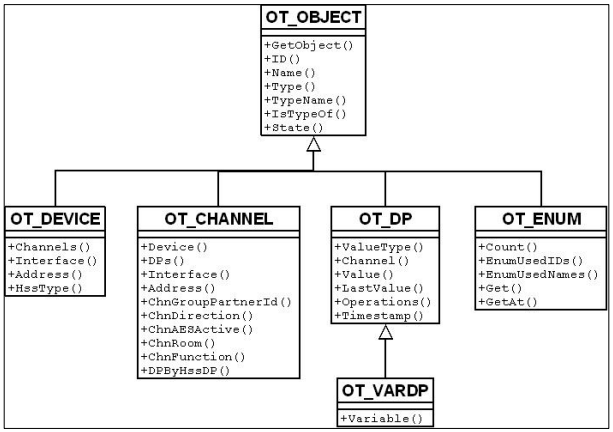

# ReGa (HM-Script)

ReGa („Residential Gateway“) ist die Logikschicht der CCU. Sie kennt alles, was über die reinen Funkgeräte
hinausgeht: Räume und Gewerke, die Namen von Geräten und Kanälen, Systemvariablen, Programme, Favoriten,
Benutzer und das Systemprotokoll. Angesprochen wird sie mit **HM-Script**, einer eigenen, objektorientierten
Skriptsprache.

## Aufruf

Ein Skript geht als Text per `POST` an `rega.exe`. Von außen ist das Port 8181, auf der CCU selbst nutzt das
Add-on Port 8183:

```bash
curl -s --data-binary $'string id;\nforeach (id, dom.GetObject(ID_ROOMS).EnumUsedIDs()) {\n  WriteLine(id # "\\t" # dom.GetObject(id).Name());\n}' \
  http://<CCU>:8181/rega.exe
```

```
1234	Wohnzimmer
1235	Küche
<xml><exec>/rega.exe</exec><sessionId></sessionId><httpUserAgent></httpUserAgent> …</xml>
```

- Alles, was das Skript mit `Write`/`WriteLine` ausgibt, kommt zurück, gefolgt von einem `<xml>`-Block mit den
  Variablen des Skripts. Das Add-on schneidet ihn ab.
- Antworten sind oft ISO-8859-1 statt UTF-8.
- Ist auf der CCU die Authentifizierung der Script-API eingeschaltet, braucht der Aufruf Basic Auth.

## Wie das Add-on HM-Script nutzt

- Alle Skripte liegen als Vorlagen in [`go-server/pkg/rega/scripts/`](../../../go-server/pkg/rega/scripts)
  (55 Dateien, Endung `.tcl` aus historischen Gründen). Platzhalter wie `{{ADDRESS}}` ersetzt der Server.
- Die Skripte geben **tabulatorgetrennte Zeilen** aus; JSON baut erst Go. So muss im Skript nichts maskiert werden.
- HM-Script kennt keine verlässlichen Escapes in Zeichenketten. Der Server lehnt daher alles ab, was ein Skript
  verändern könnte: Bezeichner nur `[a-zA-Z0-9_:.-]`, IDs nur Ziffern, Namen ohne `"`, `\`, Zeilenumbruch und Tab.
- Eigene Daten des Add-ons (Kachel-Layouts, Kachelart) hängen als Metadaten an ReGa-Objekten
  (`AddMetaData`, `MetaData`, `RemoveMetaData`), wie `Interface.setMetadata` in der WebUI.

Häufig gebrauchte Einstiegspunkte (`dom.GetObject(…)`):

| Konstante | Liste von |
|---|---|
| `ID_ROOMS` | Räumen |
| `ID_FUNCTIONS` | Gewerken |
| `ID_DEVICES` | Geräten |
| `ID_CHANNELS` | Kanälen |
| `ID_SYSTEM_VARIABLES` | Systemvariablen |
| `ID_PROGRAMS` | Programmen |
| `ID_FAVORITES` | Favoritenlisten |
| `ID_USERS` | Benutzern |
| `ID_SERVICES` | Servicemeldungen |

Ein Datenpunkt ist über seinen Namen erreichbar: `dom.GetObject("HmIP-RF.0001D3C99C3C93:3.STATE")`.

## Begriffe

- **Gerät**: ein physisches Gerät, z. B. ein Schaltaktor (`HmIP-RF.0001D3C99C3C93`).
- **Kanal**: eine Funktion des Geräts mit eigenen Datenpunkten (`…:3`). Kanal 0 ist der Wartungskanal mit
  Batterie, Erreichbarkeit und `CONFIG_PENDING`.
- **Datenpunkt**: ein Wert oder eine Funktion eines Kanals, z. B. `STATE` oder `ACTUAL_TEMPERATURE`.
- **Raum, Gewerk**: logische Gruppen von Kanälen.
- **ID**: Jedes Objekt in ReGa hat eine Zahl als ID (in der WebUI und der XML-API `ise_id`).

## Objektmodell

Alle Objekte erben von `OT_OBJECT`. Die wichtigsten Methoden nach dem offiziellen Objektmodell von eQ-3:



### System

| **Name** | **Prototyp** | **Kurzbeschreibung** |
|----------|--------------|---------------------|
| System.Date | `string system.Date(string format)` | Fragt die aktuelle Uhrzeit ab. |
| System.IsVar | `boolean system.IsVar(string name)` | Prüft, ob eine Variable definiert ist. |
| System.GetVar | `var system.GetVar(string name)` | Ermittelt den Wert einer Variable. |


### Allgemeine Objekte

| **Name** | **Prototyp** | **Kurzbeschreibung** |
|----------|--------------|---------------------|
| GetObject | `var object.GetObject(integer id)`<br>`var object.GetObject(string name)` | Liefert ein Objekt anhand seiner ID bzw. seines Namens. |
| ID | `integer object.ID()` | Liefert die ID eines Objekts. |
| Name | `string object.Name()` | Liefert den Namen eines Objekts. |
| Type | `integer object.Type()` | Liefert die ID des Objekttyps. |
| TypeName | `string object.TypeName()` | Liefert die Bezeichnung des Objekttyps. |
| IsTypeOf | `boolean object.IsTypeOf(integer typeId)` | Prüft, ob ein Objekt einen speziellen Typ implementiert. |
| State | `var object.State()`<br>`boolean object.State(boolean newState)`<br>`boolean object.State(integer newState)`<br>`boolean object.State(real newState)`<br>`boolean object.State(time newState)`<br>`boolean object.State(string newState)` | Ermittelt oder setzt den Zustand eines Objekts. |


### Geräte

| **Name** | **Prototyp** | **Kurzbeschreibung** |
|----------|--------------|---------------------|
| Channels | `object device.Channels()` | Liefert die Liste der Kanäle in dem Gerät. |
| Interface | `integer device.Interface()` | Liefert die ID der Schnittstelle, an der das Gerät angeschlossen ist. |
| Address | `string device.Address()` | Liefert die Seriennummer des Geräts. |
| HssType | `string device.HssType()` | Liefert die Kurzbeschreibung des HomeMatic Gerätetyps. |

### Kanäle

| **Name** | **Prototyp** | **Kurzbeschreibung** |
|----------|--------------|---------------------|
| Device | `integer channel.Device()` | Liefert die ID des Geräts, in dem der Kanal definiert ist. |
| DPs | `object channel.DPs()` | Liefert eine Liste der Datenpunkte des Kanals. |
| Interface | `integer channel.Interface()` | Liefert die ID der Schnittstelle, über die der Kanal angeschlossen ist. |
| Address | `string channel.Address()` | Liefert die Seriennummer des Kanals. |
| ChnGroupPartnerId | `integer channel.ChnGroupPartnerId()` | Liefert die ID des Partners in einer Kanalgruppe. |
| ChnDirection | `integer channel.ChnDirection()` | Ermittelt die Kategorie des Kanals. |
| ChnAESActive | `boolean channel.ChnAESActive()` | Ermittelt, ob der Kanal AES-verschlüsselt sendet. |
| ChnArchive | `boolean channel.ChnArchive()` | Ermittelt, ob der Kanal protokolliert wird. |
| ChnRoom | `string channel.ChnRoom()` | Ermittelt die Räume, denen der Kanal zugeordnet ist. |
| ChnFunction | `string channel.ChnFunction()` | Ermittelt die Gewerke, denen der Kanal zugeordnet ist. |
| DPByHssDP | `object channel.DPByHssDP(string name)` | Ermittelt einen Datenpunkt des Kanals anhand seines Namens. |


### Datenpunkte

| **Name** | **Prototyp** | **Kurzbeschreibung** |
|----------|--------------|---------------------|
| ValueType | `integer dp.ValueType()` | Ermittelt den Datentyp des Wertes, den der Datenpunkt repräsentiert. |
| Channel | `integer dp.Channel()` | Liefert die ID des Kanals, zu dem der Datenpunkt gehört. |
| Value | `var dp.Value()` | Liefert den aktuellen Wert des Datenpunktes. |
| LastValue | `var dp.LastValue()` | Liefert den Wert des Datenpunktes vor der letzten Aktualisierung. |
| Operations | `integer dp.Operations()` | Ermittelt, welche Operationen auf dem Datenpunkt ausgeführt werden können. |
| Timestamp | `time dp.Timestamp()` | Zeitstempel der letzten Aktualisierung. |


## Weiterlesen

- [HM-Script Teil 1: Sprachbeschreibung](official-eq3-documentation/HM-Skript_Teil_1_Sprachbeschreibung_V2.2.pdf) (eQ-3, PDF)
- [HM-Script Teil 2: Objektmodell](official-eq3-documentation/hm_script_teil_2_objektmodell_v1.2.pdf) (eQ-3, PDF)
- In [OpenCCU-Base](https://github.com/OpenCCU/OpenCCU-Base) zeigen `www/rega/esp/*.fn` und
  `www/rega/esp/controls/*.fn`, wie die WebUI selbst HM-Script verwendet.
