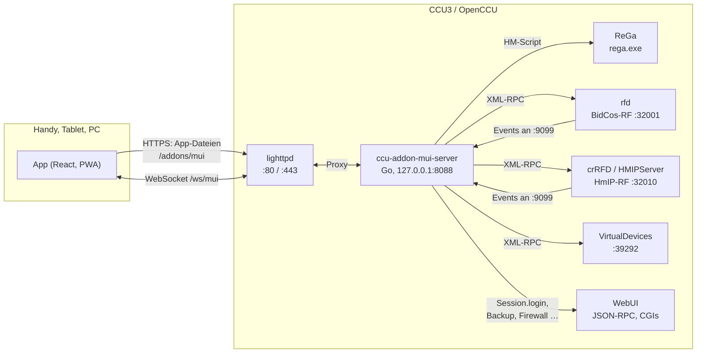
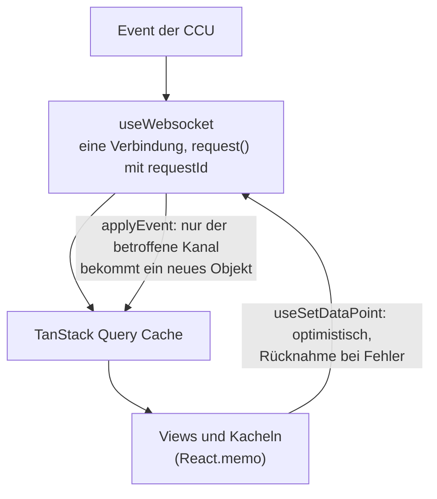
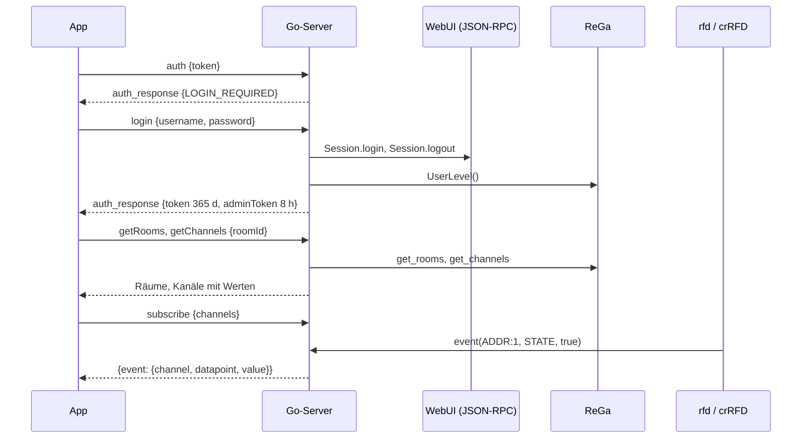

# Architektur

Das Add-on besteht aus zwei Teilen, die beide auf der CCU laufen: einer **App** im Browser (React) und
einem **Server** in Go, der für die App mit der CCU spricht. Zwischen beiden liegt eine einzige
WebSocket-Verbindung mit einem typisierten Protokoll.

## Überblick



- **lighttpd**, der Webserver der CCU, liefert die App aus (`/addons/mui/…`) und leitet `/ws/mui` an den
  Go-Server weiter. Damit gelten für das Add-on dieselbe Adresse, dasselbe Zertifikat und dieselbe Firewall
  wie für die WebUI.
- Der **Go-Server** lauscht nur auf `127.0.0.1`, ist also von außen nicht direkt erreichbar. Er spricht mit
  den Diensten der CCU über deren eigene Schnittstellen und meldet sich bei den Funkdiensten für Events an.
- Die **App** hält eine WebSocket-Verbindung, über die Anfragen, Antworten und Live-Events laufen.

## Auf der CCU

Das Archiv `mui-<version>.tar.gz` enthält die gebaute App, das Server-Binary und vier Dateien, die die CCU
für Add-ons erwartet:

| Datei | Aufgabe |
|---|---|
| `update_script` | wird von der WebUI bei der Installation ausgeführt: kopiert nach `/usr/local/addons/mui`, legt den Link `/usr/local/etc/config/addons/www/mui` an, installiert Startskript und lighttpd-Konfiguration |
| `rc.d/mui` | Startskript (start, stop, restart, info, uninstall); liest `mui.conf`, schreibt das Log, rotiert es ab 1 MB |
| `lighttpd.conf` | `^/ws/mui` → Proxy auf `127.0.0.1:8088` mit WebSocket-Upgrade; unter `/addons/mui/` jede unbekannte URL auf `index.html` (Routing der App) |
| `update-check.cgi` | meldet der WebUI die neueste Version auf GitHub |

Der Server ist ein **statisches ARMv7-Binary** (`CGO_ENABLED=0`, `-ldflags="-s -w"`, rund 8,6 MB). Er braucht
keine Laufzeit und keine Bibliotheken der CCU und läuft daher unabhängig von der Firmware-Version (auf ARM). Welche Dateien er
anlegt, steht in der [Installation](installation.md#dateien-auf-der-ccu).

## Der Go-Server

```
go-server/
  main.go              Start: Konfiguration, Dienste verdrahten, Shutdown
  pkg/websocket        WebSocket-Server, Dispatcher für 133 Nachrichtentypen, Rechte, Audit-Aufrufe,
                       HTTP-Endpunkte für Backup, Upload und Logs
  pkg/rega             ReGa: 55 HM-Script-Vorlagen (embed), Ausführen, Parsen, Validieren
  pkg/ccurpc           XML-RPC-Client zu BidCos-RF, HmIP-RF, VirtualDevices; Cache für Beschreibungen
  pkg/xmlrpc           XML-RPC-Server für die Events der CCU, Anmeldung und Überwachung
  pkg/subscriptions    welche Verbindung welche Kanäle sieht
  pkg/auth             Anmeldung über die WebUI, HMAC-Tokens, Sitzungen, Sperre
  pkg/audit            Protokoll jeder Änderung (JSON Lines)
  pkg/backup           alles, was über die WebUI selbst läuft: Backup, Restore, Firmware, Add-ons,
                       Werkseinstellungen, Admin-Aufrufe per JSON-RPC, Heizgruppen über den HMServer
  pkg/settings         Dateien in /etc/config: Netzwerk, Firewall, Zertifikat, LAN-Gateways, rega.conf …
  pkg/diagrams         eigene Diagramme: Definitionen, Aufzeichnung, Abfrage
  pkg/push             Web Push (RFC 8291/8292) nur mit der Standardbibliothek
  pkg/addons, logs, heatinggroups, config, logger, types
  pkg/fakeccu          eine nachgebaute CCU für Tests und Entwicklung
  cmd/fakeccu          startet die Fake-CCU mit einer Fixture
  cmd/ccu-export       liest eine echte CCU aus und schreibt eine Fixture
```

18.150 Zeilen Go, dazu 6.887 Zeilen Tests. Abhängigkeiten: `gorilla/websocket`, `kolo/xmlrpc` und für
ISO-8859-1 `go-charset` bzw. `x/text`, mehr nicht.

**Startablauf** (`main.go`): Konfiguration aus Umgebungsvariablen laden, ReGa-Client und WebSocket-Server
anlegen, Anmeldung (`AUTH_MODE=ccu`, ohne Schlüssel startet der Server nicht), Audit, Backup, XML-RPC-Client,
Einstellungen, Push und Diagramme einhängen, den Event-Server starten und bei BidCos-RF und HmIP-RF anmelden.
Beim Beenden meldet er sich wieder ab.

## Schnittstellen der CCU

Das Add-on verwendet ausschließlich die Schnittstellen, die auch die WebUI benutzt. Welche Funktion welche
Schnittstelle nimmt, folgt den Quellen der WebUI in OpenCCU.

### ReGa (HM-Script)

Die Logikschicht der CCU kennt Räume, Gewerke, Kanäle mit Namen, Systemvariablen, Programme, Favoriten,
Benutzer und das Systemprotokoll. Der Server schickt ihr HM-Script per `POST /rega.exe`:

- **55 Vorlagen** in `pkg/rega/scripts/*.tcl` (die Endung ist historisch, Inhalt ist HM-Script), ins Binary
  eingebettet. Platzhalter wie `{{ADDRESS}}` werden ersetzt.
- Die Skripte geben **tabulatorgetrennte Zeilen** aus, das JSON baut Go. So muss im Skript nichts maskiert
  werden.
- **Ablehnen statt maskieren**: HM-Script hat keine verlässlichen Escapes. Bezeichner müssen
  `^[a-zA-Z0-9_:.-]+$` entsprechen, IDs sind Zahlen, Namen dürfen keine Anführungszeichen, Backslashes oder
  Zeilenumbrüche enthalten. Alles andere lehnt der Server ab, bevor ein Skript entsteht.
- **Werte schreiben** läuft über ReGa (`State()`), wie in der WebUI. Das Skript prüft vorher, ob das Gerät
  erreichbar ist, und meldet den alten Wert fürs Audit-Log.
- Eigene Daten legt das Add-on als **Metadaten** an ReGa-Objekten ab, wie die WebUI mit
  `Interface.setMetadata`: das Kachel-Layout an Raum, Gewerk oder Favoritenliste, die Kachelart am Kanal.
  Dadurch gehören sie zur CCU, landen im Backup und gelten auf allen Geräten.

### XML-RPC zu den Funkdiensten

| Dienst | Port auf der CCU (aus dem LAN) | wofür |
|---|---|---|
| BidCos-RF (rfd) | 32001 (2001) | Gerätebeschreibungen, Paramsets, Anlernen, Verknüpfungen, LAN-Gateways, Gerätetausch, Log-Level; Events |
| HmIP-RF (crRFD) | 32010 (2010) | dasselbe für HmIP und HmIP Wired, dazu Anlernen mit KEY/SGTIN und Firmware-Updates (`installFirmware`; BidCos: `updateFirmware`); Events |
| VirtualDevices | 39292 (9292) | Heizgruppen und virtuelle Geräte |
| BidCos-Wired (hs485d) | 32000 (2000) | wie BidCos-RF für HMW-Geräte am RS485-Bus, dazu die Gerätesuche; nur mit Wired-Gateway, dann trägt `hs485dLoader` es in `InterfacesList.xml` ein |

Die Ports 2001, 2010, 9292 und 8181 sind Weiterleitungen von lighttpd an die Dienste (`webui_remoteapi.conf`),
je nach Einstellung mit Authentifizierung. Auf der CCU spricht der Server die Dienste direkt an, wie ReGa
selbst: Die Ports liest er aus `/etc/config/InterfacesList.xml`, ReGa erreicht er auf 8183. Das spart den
Umweg und funktioniert unabhängig von lighttpd und der Authentifizierung der Fernzugriffs-Ports.

Gerätebeschreibungen und Paramset-Beschreibungen ändern sich nur mit der Firmware. Der Server cacht sie je
Schnittstelle, Gerätetyp, Kanaltyp, Firmware und Paramset und verwirft den Cache, wenn die CCU
`updateDevice` oder `deleteDevices` meldet. Beim Schreiben eines Paramsets prüft er jeden Wert gegen die
Beschreibung (bekannt, schreibbar, im Bereich) und wandelt JSON-Zahlen in den richtigen Typ.

### Events

Der Server ist selbst ein XML-RPC-Server auf Port 9099 und meldet sich mit `init` bei rfd und crRFD an, mit
Wired-Gateway auch bei hs485d.
Ab dann schickt die CCU jede Wertänderung als `event` (meist gebündelt in `system.multicall`).

- Kommt eine Minute lang nichts, schickt der Server `ping`. Die Dienste antworten darauf mit einem
  `PONG`-Event. Bleibt es 15 Sekunden aus, hat der Dienst die Anmeldung vergessen (z. B. nach einem Neustart),
  und der Server meldet sich neu an. Eine verlorene Anmeldung fällt so nach gut einer Minute auf.
  Schlägt die Anmeldung fehl, versucht er es mit wachsendem Abstand (5 s bis 5 min) weiter.
- Jedes Event geht an die Diagramm-Aufzeichnung und an alle Verbindungen, die den Kanal abonniert haben.
- Die Reihenfolge bleibt erhalten, weil der Handler synchron arbeitet.

### JSON-RPC und Seiten der WebUI

Manche Funktionen bietet die CCU nur in der WebUI an. Dafür hält der Server eine WebUI-Sitzung des
Benutzers:

- **Anmeldung prüfen**: `Session.login` und sofort `Session.logout` (die CCU erlaubt nur wenige Sitzungen).
- **Admin-Aufrufe** über `/api/homematic.cgi`: Sicherheitsstufe, SSH, Authentifizierung, HTTPS-Umleitung,
  Firewall, LAN-Gateways, Prüfung des Sicherheitsschlüssels, Neustart von lighttpd.
- **CGI-Seiten**, genau wie die WebUI sie aufruft: Backup (`cp_security.cgi?action=create_backup`),
  Restore, Werkseinstellungen, Sicherheitsschlüssel, CCU-Firmware (`cp_maintenance.cgi`), Add-ons
  (`cp_software.cgi`), Uploads über `fileupload.ccc`.
- **HMServer** für Heizgruppen (`/pages/jpages/group/*`) und Geräte-Firmware
  (`/pages/jpages/system/DeviceFirmware/addFirmware`, `deleteFirmware`), danach
  `refreshDeployedDeviceFirmwareList` bei BidCos-RF und HmIP-RF.
- **CCU-Firmware direkt**: `CCU.downloadFirmware` (OpenCCU lädt das Release von GitHub nach
  `/usr/local/tmp/firmwareUpdateFile`), SHA256 gegen die `.sha256` des Releases wie
  `checkFirmwareUpdate.sh`, dann `cp_maintenance.cgi?action=firmware_upload&directDownload=true`.
- **eQ-3-Updateserver** (`ccu3-update.homematic.com`): Liste der neuesten Geräte-Firmware
  (`/firmware/api/firmware/search/DEVICE`) und Download, wie `webui.js` (`homematic.com`).

### Dateien und Befehle

Was die WebUI über eigene Tcl-Skripte erledigt, macht der Server direkt und auf dieselbe Weise: Uhr und
Zeitzone (`date`, `hwclock`, `updateTZ.sh`, `time.conf`, `ntpclient`), Netzwerk (`netconfig`), Syslog
(`/etc/config/syslog`, `monit restart syslogd`), Zertifikat (`server.pem`), Sitzungs-Timeout (`rega.conf`),
Neustart, Herunterfahren und abgesicherter Modus (nach `SaveSystem` in ReGa; für den abgesicherten Modus zusätzlich `/etc/config/safemode` wie `safemode/enter.tcl`), Zusatzsoftware über deren rc.d-Skripte.

## Die App

| | |
|---|---|
| Framework | React 19, TypeScript strict |
| Routing | TanStack Router, dateibasiert, mit Code-Splitting je Route |
| Daten | TanStack Query: jede Anfrage über den WebSocket ist eine Query oder Mutation |
| Oberfläche | Tailwind CSS 4, shadcn/ui-Komponenten auf Radix, Icons zur Build-Zeit einkompiliert |
| Tabellen, Raster | TanStack Table, react-grid-layout |
| Diagramme | eigene SVG-Zeichnung, ohne Chart-Bibliothek |
| Übersetzungen | Paraglide JS, Deutsch und Englisch, typisierte Funktionen (`m.KEY()`) |
| PWA | vite-plugin-pwa (Workbox), Push über einen eigenen Service-Worker-Teil |
| Build | Vite |

22.653 Zeilen TypeScript ohne Tests und generierten Code.

```
src/
  routes/       URLs (/, /room/:id, /trade/:id, /favorite/:id, /devices, /diagrams, /programs,
                /program/:id, /sysvars, /history, /virtual-keys, /setup/…, /device/:interface/:address)
  views/        Seiten: Dashboard, Räume, Favoriten, Diagramme, Programme, Einrichten (37 Dateien)
  controls/     Kacheln je Kanaltyp, registry.ts, generische Kachel und Einstellungen,
                Verknüpfungsvorlagen, Wochenprogramme
  components/   Kopfzeile, Meldungen, Dialoge, Gesten; ui/ mit den shadcn-Komponenten
  hooks/        useWebsocket (Verbindung, Anfragen, Events), channels (Events anwenden, sortieren)
  queries/      alle Queries und Mutationen
  contexts/     Theme, Effekte, Seitentitel, Hinweise
  types/        protocol.ts (aus dem Schema generiert), types.ts
```

### Datenfluss



- **Eine Verbindung**: `useWebsocket` öffnet `ws(s)://<host>/ws/mui`, meldet sich mit dem gespeicherten
  Token an und verbindet sich bei Abbruch alle 3 Sekunden neu. `request()` vergibt eine `requestId` und
  löst das Promise auf, wenn die Antwort mit derselben ID kommt (Timeout 20 s). Anfragen vor der Anmeldung
  werden gepuffert; Befehle wie Schalten werden nie gepuffert, damit ein Licht nicht Minuten später angeht.
- **Abos**: Jede Ansicht abonniert die Adressen der Kanäle, die sie zeigt. Nach jedem Neuverbinden schickt
  die App das Abo erneut und lädt alle Daten neu.
- **Events** schreibt die App direkt in die gecachten Kanallisten. Nur der geänderte Kanal bekommt ein
  neues Objekt, alle anderen Kacheln rendern nicht neu. Ändert sich ein Wartungswert (`UNREACH`, `LOW_BAT`,
  `CONFIG_PENDING` …), lädt sie zusätzlich Servicemeldungen und Geräteprobleme neu.
- **Schalten** ist optimistisch: Die Kachel zeigt den neuen Zustand sofort. Lehnt die CCU ab, nimmt die App
  ihn zurück, aber nur, wenn inzwischen kein Event einen neueren Wert gebracht hat.
- **Systemvariablen** melden keine Events. Der Server liest sie alle 5 s, einmal für alle Apps, die sie
  zeigen, und schickt die Liste nur bei einer Änderung (`sysvars`). Vorher fragte jede App selbst alle 10 s;
  ReGa arbeitet Skripte nacheinander ab, mit mehreren Tablets bremste das WebUI und Programme.
- **Was die CCU sonst nicht meldet**, fragt die App ab: Alarme alle 15 s, Servicemeldungen jede Minute,
  Geräteprobleme alle 5 Minuten.

### Kacheln

`src/controls/registry.ts` ordnet Kanaltypen Kacheln und Abschnitten zu, eine Kachel je Kanal oder eine je
Gerät (Taster, Energiezähler, Zutritt). Alles andere rendert `GenericControl` aus der Paramset-Beschreibung,
die der Server liefert. Einstellungen baut `SettingsView` ebenfalls aus der Beschreibung: `settingKinds.ts`
leitet aus Typ, Bereich, Einheit und Namen ab, ob ein Parameter Schalter, Segmente, Auswahl, Schieberegler,
Stepper, Dauer, Uhrzeit oder Monat wird, und fasst zusammengehörige Paare (`*_VALUE`/`*_UNIT`,
`*_FACTOR`/`*_BASE`) zu einem Feld zusammen. Das ist das Gegenstück zu den Easymodes der WebUI
(`uiElements.tcl`, `options.tcl`).

Die Verknüpfungsvorlagen stammen direkt aus den Easymodes der WebUI: `scripts/import-link-profiles.mjs`
liest `www/config/easymodes/*` aus OpenCCU-Base und schreibt `linkProfiles.json`. Die App lädt die Datei
erst, wenn jemand eine Verknüpfung öffnet.

## Das Protokoll als Vertrag

`protocol/schema.json` beschreibt jede Anfrage, jede Antwort und jedes Event als JSON-Schema. Daraus
entstehen die TypeScript-Typen der App (`npm run generate:protocol`), sodass `request('putParamset', …)` die
passenden Felder verlangt und die passende Antwort liefert. Auf der Go-Seite prüft der Integrationstest
**jede** Nachricht, die der echte Server sendet, gegen das Schema. Ändert eine Seite das Protokoll, ohne das
Schema anzupassen, schlägt die CI fehl. Details in [WebSocket-Protokoll](protokoll.md).

## Abläufe

### Öffnen, anmelden, live sehen



### Schalten

1. Die Kachel zeigt den neuen Zustand und sendet `setDatapoint`.
2. Der Server prüft die Rechte (Gäste dürfen nicht, Kanäle ohne *bedienbar* nur Administratoren), den Wert
   und den Bezeichner.
3. ReGa setzt den Wert, wenn das Gerät erreichbar ist, und meldet den alten Wert.
4. Audit-Eintrag, Antwort an die App. Bei Fehler (`UNREACH`, `FORBIDDEN` …) nimmt die App die Änderung zurück.
5. Das Gerät bestätigt, die CCU schickt das Event, alle anderen offenen Geräte sehen die Änderung.

### Geräteeinstellungen speichern

1. Die Geräteseite lädt Beschreibung und Werte des `MASTER`-Paramsets je Kanal.
2. *Speichern und übertragen* sendet `putParamset`. Der Server verlangt Administrator plus Admin-Token, prüft
   jeden Wert gegen die Beschreibung, liest die alten Werte fürs Audit-Log und schreibt per XML-RPC.
3. Die App beobachtet danach zwei Minuten lang `CONFIG_PENDING` am Wartungskanal: *wird gesendet*, *wartet
   auf das Gerät*, *übertragen*.

### Anlernen

`setInstallMode` startet den Anlernmodus (HmIP optional mit KEY/SGTIN als Whitelist). Die App fragt die
Restzeit jede Sekunde und den Posteingang alle 3 Sekunden ab. *Übernehmen* läuft über ReGa
(`accept_device`). Löschen geht per XML-RPC `deleteDevice`.

### Backup

1. `createBackup` mit Passwort: Der Server meldet sich bei der WebUI an und ruft
   `cp_security.cgi?action=create_backup` auf, wie der Knopf in der WebUI.
2. Die Datei landet im RAM der CCU (`/tmp`), die App bekommt eine einmalige URL `/ws/mui/backup/<id>`.
3. Der Browser lädt sie herunter; danach oder nach 5 Minuten wird sie gelöscht.

Wiederherstellen, CCU-Firmware und Add-ons laufen genauso über einmalige Upload-URLs und die Seiten der
WebUI.

## Entscheidungen

**Warum ein eigener Server und nicht direkt die WebUI-API?** Der Browser kann weder XML-RPC-Events
empfangen noch ReGa sicher ansprechen. Ein kleiner Server auf der CCU kann beides, prüft Rechte und Werte an
einer Stelle und verteilt Events an alle Geräte.

**Warum Go?** Das erste Add-on lief auf Node.js und brachte dafür eine Laufzeit von 71 MB mit, abhängig von
der GLIBC der Firmware. Go erzeugt ein einziges statisches Binary ohne Abhängigkeiten (rund 8,6 MB), das
unabhängig von den Bibliotheken der Firmware läuft. Für das, was der Server tut (viele kleine Netzwerkaufrufe,
nebenläufige Verbindungen), ist Go wie gemacht.

**Warum WebSocket?** Eine Verbindung für Anfragen und Events, ohne Polling, mit wenig Overhead pro Nachricht.
Anfragen bekommen eine `requestId`, Events kommen ohne.

**Warum nach den OpenCCU-Quellen?** Die WebUI ist die Referenz dafür, wie die CCU richtig bedient wird:
welche Datenpunkte, welche Reihenfolge, welche Skripte. Jede Funktion des Add-ons ist dort nachgeschlagen,
und der Code nennt die Quelldatei (z. B. „wie in der WebUI `door_opener.fn`“). So verhält sich das Add-on wie
die WebUI, und Änderungen der CCU lassen sich nachvollziehen.

**Warum zwei Tokens?** Ein Wandtablet soll dauerhaft angemeldet bleiben, aber wer es in der Hand hat, soll
nicht die Firewall abschalten können. Deshalb gilt das normale Token ein Jahr und erlaubt nur, was der
Benutzer auch in der WebUI darf; Einstellungen brauchen ein Admin-Token, das 8 Stunden gilt.

**Warum eine Fake-CCU?** Fast jede Funktion ändert etwas an der Zentrale. Die Fake-CCU bildet ReGa, XML-RPC,
die WebUI und den HMServer nach, sodass alle Abläufe End-to-End getestet werden können, ohne eine echte
Zentrale anzufassen (siehe [Tests](tests.md)).

**Warum eigene Diagramme?** Die Diagramme der WebUI zeichnen nur feste Werttypen auf und brauchen eine
microSD-Karte. Der Server bekommt ohnehin jedes Event; er fasst sie zu Minuten- und Stundenwerten zusammen
und schreibt alle 5 Minuten auf den Speicher der CCU.

## Warum es schnell ist

- **Push statt Polling**: Die WebUI ruft in jedem offenen Tab alle 3 Sekunden ein ReGa-Skript über alle
  angezeigten Kanäle auf. Beim Add-on meldet die CCU Änderungen von selbst, und der Server verteilt sie nur an
  die Verbindungen, die den Kanal anzeigen. ReGa wird für Gerätewerte nur beim Öffnen einer Ansicht gefragt.
- **Keine Seiten vom Server**: Die WebUI lässt ReGa jede Seite als HTML erzeugen. Die App wechselt Seiten im
  Browser und holt nur Daten.
- **Wenig zu laden, und nur einmal**: 4 Dateien mit 844 KB beim ersten Öffnen statt 40 Dateien mit 3,1 MB. Danach
  kommt die App aus dem Cache des Service Workers. Große Teile wie die Verknüpfungsvorlagen und die Seiten
  von *Einrichten* lädt sie erst bei Bedarf.
- **Caches, wo die CCU es erlaubt**: Gerätebeschreibungen ändern sich nur mit der Firmware und werden im Server
  gehalten. Auf der App-Seite hält TanStack Query die Daten, sodass ein Zurück sofort da ist.
- **Gezieltes Rendern**: Ein Event ändert genau ein Objekt im Cache; alle anderen Kacheln bleiben, wie sie sind.

## Codeumfang

| | Zeilen |
|---|---:|
| Go-Server | 18.150 |
| Go-Tests | 6.887 |
| App (TypeScript, ohne Tests und generierten Code) | 22.653 |
| Unit-Tests der App | 1.247 |
| End-to-End-Tests | 3.352 |
| Protokoll-Schema | 11.002 |
| HM-Script-Vorlagen | 1.383 |
