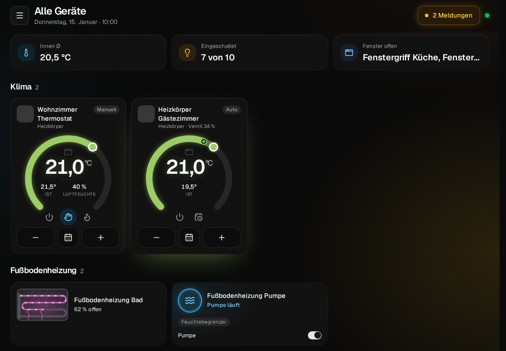
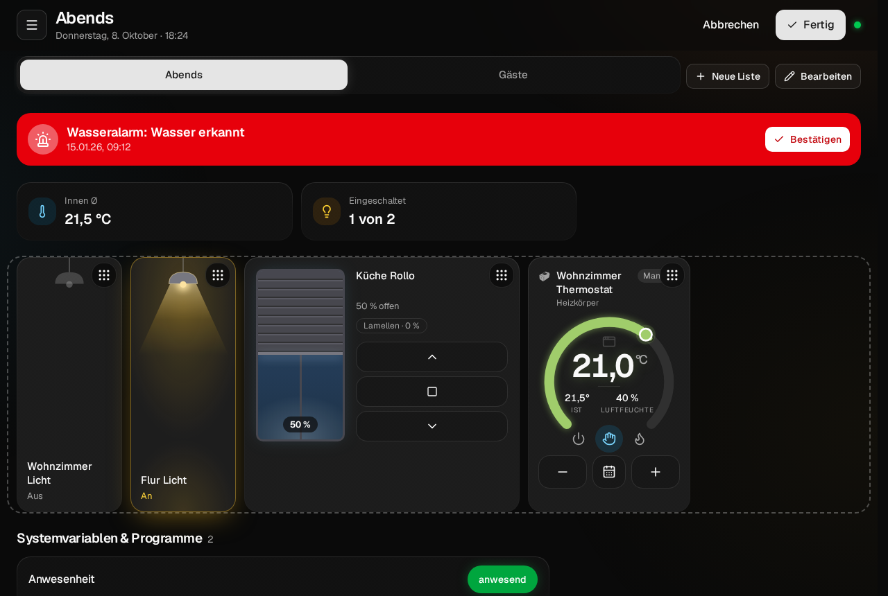
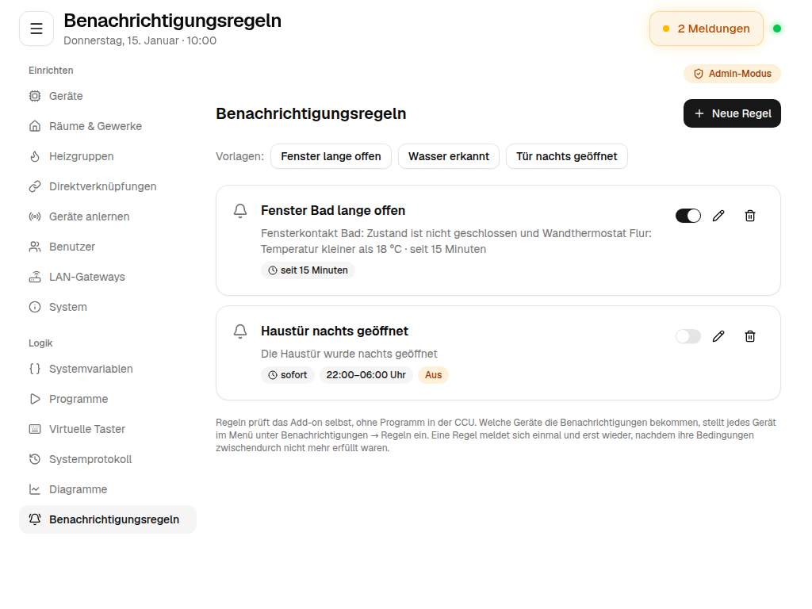
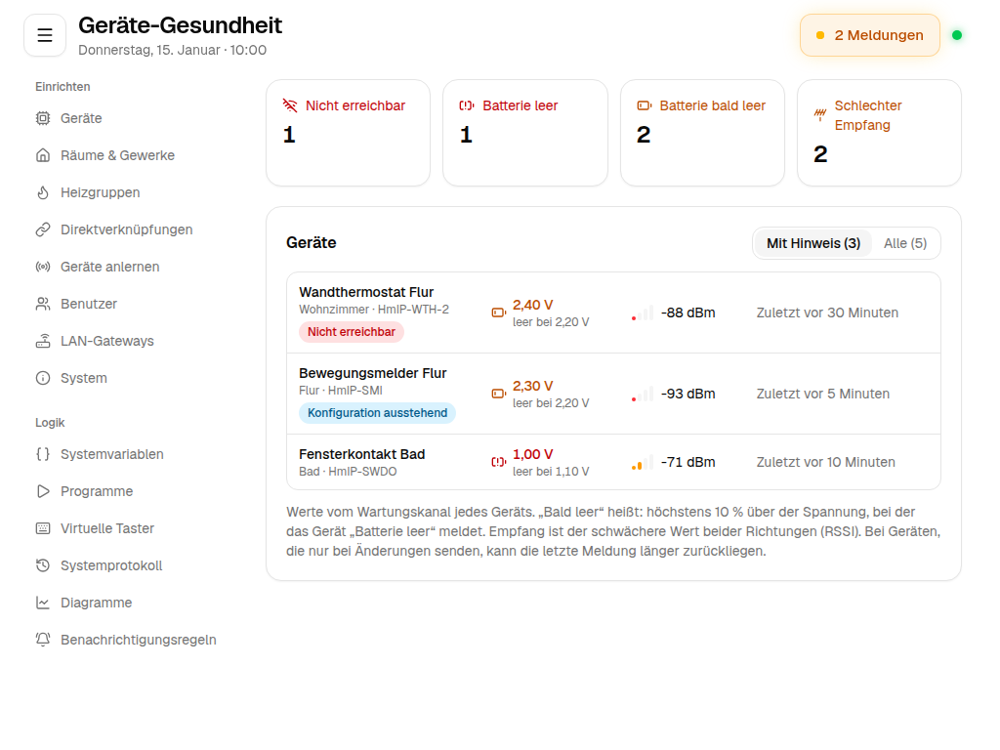
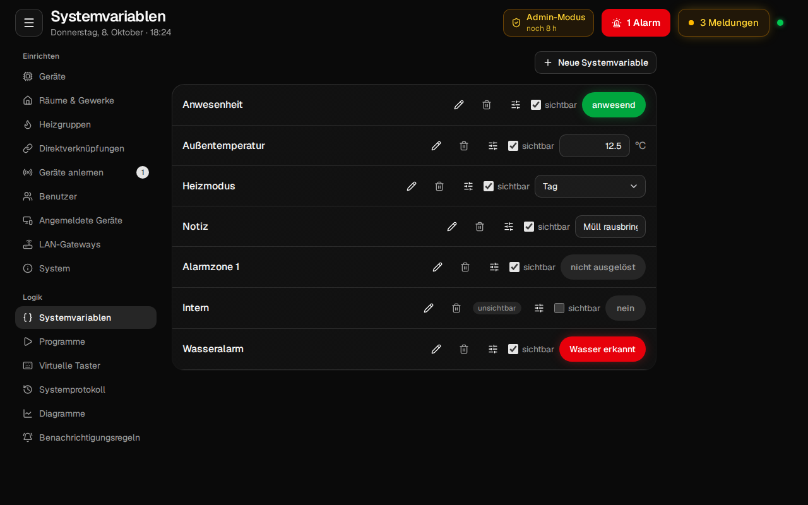

# Bedienung

So benutzt du das Add-on im Alltag: Geräte schalten, Meldungen bestätigen, Heizung einstellen, Diagramme
lesen und Programme ausführen. Wie man Geräte anlernt und einrichtet, steht in [Einrichten](einrichten.md).

## Aufbau

**Kopfzeile**: Menü, Titel der Ansicht mit Datum und Uhrzeit, rechts die Knöpfe für **Alarme** (rot,
pulsierend, solange ein Alarm unbestätigt ist) und **Meldungen** (Servicemeldungen, z. B. leere Batterie
oder nicht erreichbar) sowie der Verbindungspunkt (grün = mit der CCU verbunden). Reißt die Verbindung
ab, erscheint nach zwei Sekunden ein roter Balken, und die App verbindet sich von selbst neu.

**Menü**:

| Bereich | Inhalt |
|---|---|
| Navigation | Räume, Gewerke |
| Ansichten | Favoriten, Alle Geräte, Systemvariablen, Programme, Diagramme, Geräte-Gesundheit, Einrichten |
| Darstellung | Dunkles Design, Effekte (Aus, Dezent, Kräftig), Sprache (je Benutzer), Startseite (zuletzt geöffnet oder Favoriten) |
| Konto | Benachrichtigungen (Push für Alarme, Servicemeldungen und Regeln), Passwort ändern, Abmelden |

**Startseite**: die zuletzt geöffnete Ansicht, auf Wunsch immer die Favoriten. Gibt es noch keine Räume,
zeigt die App alle Geräte.

## Räume, Gewerke, Favoriten und Alle Geräte

Alle vier Ansichten sind gleich aufgebaut:

1. **Reiter** zum Wechseln zwischen Räumen, Gewerken oder Favoritenlisten.
2. **Übersicht**: Innentemperatur im Schnitt, eingeschaltete Lichter („5 von 6“), offene Fenster mit
   Namen.
3. **Abschnitte** nach Art: Klima, Fußbodenheizung, Licht & Schalter, Rollläden, Fenster, Türen,
   Sicherheit, Klima & Wetter, Bewässerung & Wasser, Taster, Eingänge, Energie, System. Was keine eigene Kachel hat, folgt alphabetisch
   nach Kanaltyp.
4. **Diagramme**, die als Kachel an diesem Ort hängen.

*Alle Geräte* zeigt jeden Kanal der CCU, auch ohne Raum oder Gewerk. Das ist nützlich, um Geräte zu
finden, die noch nirgends zugeordnet sind.

**Favoriten** sind die Favoritenlisten der CCU, also dieselben wie in der WebUI, und gehören zum
angemeldeten Benutzer. Neben Kanälen enthalten sie auch Systemvariablen und Programme. Mit *Neue Liste*
und *Bearbeiten* legst du sie direkt an.

### Kacheln anordnen

*Anordnen* schaltet die Ansicht in den Bearbeitungsmodus: Kacheln ziehen, an der rechten Kante die
Breite ändern, *Fertig*. Das Layout wird in der CCU am Raum, Gewerk oder an der Favoritenliste
gespeichert und gilt damit auf allen Geräten. Für Handy, Tablet und Desktop passt es sich an.
Ohne eigenes Layout zeigt die App die Abschnitte.

## Die Kacheln

Jede Kachel zeigt den Zustand so, dass man ihn ohne Lesen erkennt, und reagiert sofort. Die App schaltet
optimistisch und nimmt die Änderung zurück, wenn die CCU sie ablehnt, z. B. weil das Gerät nicht
erreichbar ist. Dann erscheint ein Hinweis.

| Kachel | Bedienung |
|---|---|
| **Thermostat** | Solltemperatur am Drehregler ziehen oder mit − und +; Modi Auto, Manuell, Boost, Aus; Ist-Temperatur, Luftfeuchte, Ventilöffnung, Fenster-offen; Kalender öffnet das Wochenprogramm |
| **Fußbodenheizung** | Ventilöffnung als Balken, Soll- und Ist-Temperatur |
| **Licht, Schalter** | Antippen schaltet; Lampen leuchten in der Kachel, Schalter (z. B. Pumpe) haben einen Kippschalter |
| **Dimmer** | Helligkeit am Balken ziehen, antippen schaltet ein und aus |
| **Farblicht** | Helligkeit, Farbton und Farbvorgaben (HmIP-RGBW, -LSC, -DRG-DALI) |
| **Rollladen, Jalousie** | Auf, Stopp, Ab; ins Fenster tippen setzt die Position; bei Jalousien auch die Lamellen |
| **Fenster** | Fensterkontakt und Fenstergriff: geschlossen, gekippt, offen, als Bild |
| **Fensterantrieb** | Öffnen, Schließen, Stopp; die Winmatic auch Verriegeln, dazu ihr Akku |
| **Türschloss** | Entsperren und Sperren durch **Gedrückthalten**, Öffnen durch **Schieben**, damit nichts versehentlich aufgeht |
| **Türschloss-Zusatzkanäle** | Türzustand (offen/geschlossen, kalibrieren), Auto-Relock an/aus, Riegelkontakt; Benutzer des Türschlossantriebs freigeben oder sperren |
| **Fußbodenheizung: Pumpe, Direktausgang** | läuft oder aus, schaltbar; Taupunkt-, Feuchte- und Notbetrieb-Warnungen, Frostschutz |
| **Displays** | HmIP-WRCD: 5 Zeilen mit Text, Ausrichtung, Farben und 31 Symbolen, dazu Ton und Zurücksetzen, mit Vorschau; HM-RC-19: bis zu 5 Zeichen mit Einheit, Symbolen, Beleuchtung und Ton |
| **Servos** (HmIP-WSC) | Position von links über neutral nach rechts in 0,5-%-Schritten, Fahrzeit 0–50 s; Ist-Position mit Fehlermeldung |
| **Status-LEDs, Hintergrundbeleuchtung** | Helligkeit, Farbe und Blinkverhalten (Blinken, Blitzen, Pulsieren) |
| **Garagentor** | Öffnen gedrückt halten, Zu, Lüften, Stopp |
| **Rauchmelder** | Zustand, Rauchtest gedrückt halten |
| **Bewegungs- und Präsenzmelder** | Bewegung als Radarwellen, letzte Bewegung, Helligkeit, Erkennung ein/aus |
| **Wassermelder** | trocken, feucht, Wasser erkannt |
| **Sirene** | ruhig, akustischer oder optischer Alarm |
| **Zutritt** | Berechtigungen der Benutzer eines Keypads oder Fingerabdrucklesers |
| **Erschütterung und Neigung** | je nach Betriebsart des Sensors Erschütterung, Lage oder Neigungswinkel |
| **Netzausfall** | Netzspannung vorhanden oder Stromausfall |
| **Klima und Wetter** | Temperatur, Taupunkt, Luftfeuchte mit Bewertung; Wind, Regen, Helligkeit, Sonnenscheindauer |
| **Regen, Helligkeit** | Regen ja oder nein mit Heizung und Temperatur; Helligkeit mit Durchschnitt, Minimum und Maximum |
| **CO₂, Feinstaub** | Messwert mit Bewertung (CO₂ nach Umweltbundesamt, Feinstaub nach dem Europäischen Luftqualitätsindex) |
| **Bodenfeuchte** | Feuchte in Prozent mit Bewertung, Bodentemperatur |
| **Abstand** (ELV-SH-DUSI) | Distanz, Höhe (Referenzhöhe minus Distanz) und Referenzhöhe |
| **Durchgang** (HmIP-SPDR) | erkannter und letzter Durchgang, Zähler je Richtung mit Überlauf |
| **Füllstand** (HM-Sen-Wa-Od) | Füllstand in Prozent und die Füllmenge in Litern aus der eingestellten Tankform |
| **Bewässerung** | Ventil öffnen und schließen, auch für 10, 30 oder 60 Minuten; Wasserzähler mit Durchfluss und Mengen |
| **Wasserschutz** | Absperrventil öffnen und schließen, Durchfluss und Wasserdruck |
| **Taster** | kurz antippen oder für einen langen Tastendruck halten |
| **Eingänge** | je nach Betriebsart: Tastendrücke leuchten auf, Kontakt offen oder geschlossen, Level |
| **Energiezähler** | Leistung und Zählerstände, Gas mit Durchfluss |
| **Zählersensor** (HM-ES-TX-WM) | Leistung und Zählerstand für den angeschlossenen Sensor (Strom, Gas oder IEC) |
| **Access Point / DRAP** | Busspannung und Strom der Wired-Busse |
| **Alle anderen** | generische Kachel aus der Gerätebeschreibung: Schalter, Auswahlfelder, Zahlen, Aktionen |

Batterie leer oder nicht erreichbar steht an der Kachel. Welche Geräte welche Kachel bekommen, steht in
[Geräteunterstützung](geraete.md).

  
  
  
  

## Meldungen und Alarme

- **Alarme** (z. B. Wasser erkannt, Alarmzone ausgelöst) erscheinen als roter Balken oben in der Ansicht
  und im Alarm-Knopf der Kopfzeile. *Bestätigen* quittiert sie in der CCU.
- **Servicemeldungen** (Batterie, nicht erreichbar, Konfiguration ausstehend, Sabotage …) zählt der Knopf
  *Meldungen*. Er öffnet die Liste, dort bestätigst du einzeln. Ändert sich ein Wartungswert, aktualisiert
  sich die Liste sofort.
- **Push**: Beides kann als Benachrichtigung aufs Handy kommen, auch wenn die App geschlossen ist
  (siehe [Installation](installation.md#push-benachrichtigungen)).

## Benachrichtigungsregeln

Eine Regel schickt eine Push-Benachrichtigung, sobald Geräte einen bestimmten Zustand haben, ohne dass
du dafür ein Programm in der CCU anlegen musst. Beispiele:

- Fenster länger als 15 Minuten offen und draußen kälter als 10 °C
- Wasser erkannt
- Haustür nachts zwischen 22 und 6 Uhr geöffnet

*Benachrichtigungsregeln* findest du unter *Logik* in der Seitenleiste, oder im Menü unter
*Benachrichtigungen* → *Regeln verwalten*. Administratoren legen Regeln an, auch aus einer Vorlage.
Eine Regel besteht aus:

- **Bedingungen**: Kanal, Datenpunkt, Vergleich und Wert, mit denselben Feldern wie im Programm-Editor.
  Alle Bedingungen müssen gleichzeitig erfüllt sein.
- **Dauer**: Wie lange die Bedingungen mindestens erfüllt sein müssen; 0 meldet sofort.
- **Zeitraum** (optional): Die Regel meldet nur zwischen zwei Uhrzeiten, auch über Mitternacht.
- **Text** (optional): Ohne eigenen Text beschreibt die Benachrichtigung die Bedingungen.

Eine Regel meldet sich einmal und erst wieder, nachdem ihre Bedingungen zwischendurch nicht mehr erfüllt
waren. Das Add-on prüft die Regeln bei jeder Änderung, die die CCU meldet, und zusätzlich alle 30 Sekunden.
Welche Geräte die Benachrichtigungen bekommen, stellt jedes Gerät im Menü unter *Benachrichtigungen* mit
dem Schalter *Regeln* ein.

## Geräte-Gesundheit

*Geräte-Gesundheit* im Menü zeigt Batterie, Empfang und Erreichbarkeit aller Geräte auf einer Seite.
Die Werte stammen vom Wartungskanal jedes Geräts (`:0`), aus dem auch die Servicemeldungen kommen.

- **Oben** steht, wie viele Geräte nicht erreichbar sind, eine leere Batterie haben, deren Batterie bald
  leer ist oder die schlechten Empfang haben.
- **Die Liste** zeigt zuerst die Geräte mit Hinweis, die dringendsten oben. *Alle* zeigt jedes Gerät.
- **Batterie**: Spannung (`OPERATING_VOLTAGE`) und bei HmIP die Spannung, bei der das Gerät „Batterie
  leer“ meldet (`LOW_BAT_LIMIT` aus den Geräteeinstellungen). *Bald leer* heißt höchstens 10 % darüber.
  Geräte ohne Spannungswert zeigen nur leer oder OK (`LOW_BAT`).
- **Empfang**: der schwächere der beiden Werte `RSSI_DEVICE` (wie das Gerät die CCU hört) und `RSSI_PEER`
  (wie die CCU das Gerät hört). Ab −70 dBm gut, ab −85 dBm mittel, darunter schlecht.
- **Zuletzt**: wann das Gerät zuletzt einen Wartungswert gemeldet hat. Batteriegeräte, die nur bei
  Änderungen senden, melden sich teils nur alle paar Stunden.
- **Hinweise** wie *War nicht erreichbar* (`STICKY_UNREACH`), *Konfiguration ausstehend* oder *Sabotage*.

Administratoren kommen per Klick auf das Gerät zur Geräteseite.

## Heizen

**Wochenprogramm** (Kalender auf der Thermostat-Kachel oder auf der Geräteseite): pro Tag eine Zeitleiste
mit den Temperaturen. Zeiten ziehen, Abschnitte teilen oder löschen, Temperatur mit − und +, einen Tag
auf Werktage, Wochenende oder alle Tage kopieren. Thermostate mit mehreren Profilen haben Reiter für
Profil 1, 2 … Gespeichert wird wie jede Geräteeinstellung: Die App überträgt es aufs Gerät und zeigt, wann
es angekommen ist.

Schalt-, Dimm- und Rollladenaktoren von HmIP haben ebenfalls Wochenprogramme. Die App zeigt sie auf der
Geräteseite als Karten mit den Schaltzeiten; Änderungen werden gesammelt und nach einer Bestätigung
gespeichert.

**Heizgruppen** fassen Thermostate eines Raums zusammen. Anlegen und ändern steht in
[Einrichten](einrichten.md#heizgruppen).

## Diagramme

*Diagramme* im Menü zeigt Verläufe über einen Tag, eine Woche, einen Monat oder ein Jahr, mit Blättern
in die Vergangenheit und Zoom durch Ziehen. Unter jedem Diagramm stehen der aktuelle Wert, Durchschnitt,
Minimum und Maximum, bei Energiezählern auch die Kosten zum hinterlegten Strom- oder Gaspreis. *Als CSV
exportieren* lädt die Werte herunter.

Anders als in der WebUI zeichnet das Add-on selbst auf und kann deshalb **jeden** Datenpunkt und jede
Systemvariable darstellen, ohne microSD-Karte:

- bis zu 12 Reihen pro Diagramm, als Linie, Fläche, Balken, Stufe oder Zustandsband (z. B. Fenster offen)
- Durchschnitt, Minimum, Maximum oder Verbrauch je Zeitraum (für Zählerstände)
- zwei Achsen, eigene Farben und Einheiten
- als Kachel in Räumen, Gewerken und Favoriten
- ältere Werte übernimmt ein neues Diagramm aus dem Systemprotokoll der CCU

Anlegen und ändern dürfen Administratoren, ansehen alle. Gespeichert werden Minutenwerte 60 Tage lang
und Stundenwerte unbegrenzt. Wie viel Platz noch frei ist, zeigt *Einrichten → System → Allgemeine Einstellungen*.

## Systemprotokoll

*Einrichten → Systemprotokoll* (für alle Benutzer sichtbar) listet die Änderungen der Kanäle, die in der
CCU als *protokolliert* markiert sind, die neuesten zuerst, mit Suche. Auf der Geräteseite steht der
Verlauf des Geräts zusätzlich als kleine Diagramme.

## Programme

*Programme* listet die Programme der CCU mit *aktiv*, *bedienbar* und *sichtbar*. *Ausführen* startet ein
Programm sofort, für Benutzer ohne Admin-Rechte nur, wenn es als *bedienbar* markiert ist.
Administratoren öffnen mit einem Klick den Editor (siehe [Einrichten](einrichten.md#programme)).

## Systemvariablen

*Systemvariablen* zeigt alle Variablen mit ihrem Wert: Logikwerte als Schalter, Werte-Listen als
Auswahl, Zahlen mit Einheit, Alarme mit Zustand. Ändern geht direkt in der Liste. Administratoren legen
hier auch neue an und bearbeiten Beschreibung, Einheit, Bereich und Werte.

## Virtuelle Taster

*Virtuelle Taster* sind die Taster der CCU selbst (BidCos-RF und HmIP), mit denen Programme ausgelöst
werden. Die Liste zeigt die benannten oder in Programmen verwendeten Taster mit *Kurz* und *Lang*;
Administratoren können sie umbenennen.

## Darstellung

- **Dunkles Design**: folgt der Systemeinstellung, bis du es im Menü umstellst. Gilt pro Gerät.
- **Effekte**: Leuchten und Animationen (z. B. die leuchtende Lampe, die Radarwellen des Bewegungsmelders)
  in drei Stufen. *Aus* schont schwache Tablets.
- **Sprache**: *Automatisch* (nach der Sprache des Browsers), Deutsch oder Englisch. Mit Anmeldung gilt die Wahl für
  den CCU-Benutzer auf allen Geräten und auch in der alten WebUI (wie dort unter *Benutzerverwaltung*), ohne
  Anmeldung für dieses Gerät.
