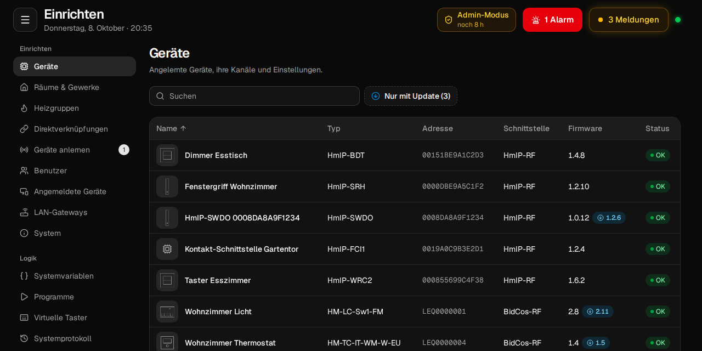
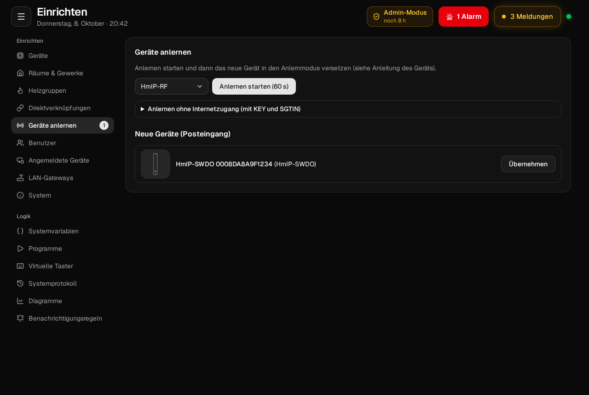
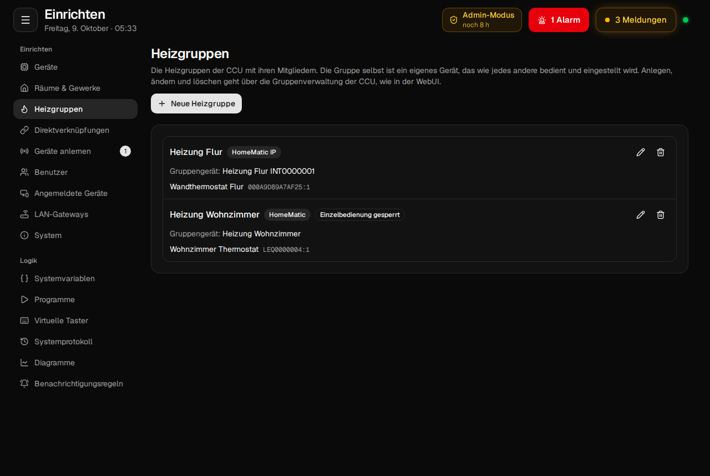

# Einrichten

Der Bereich *Einrichten* im Menü ersetzt die Seiten *Einstellungen* und *Systemsteuerung* der WebUI.
Geräte anlernen und konfigurieren, Verknüpfungen, Räume, Benutzer, Backups, Firmware und die
Zentrale selbst: Alles geht ohne die alte WebUI. Bei jeder Funktion steht im Code, nach welcher Datei der
WebUI sie gebaut ist.

## Admin-Modus

Einrichten dürfen nur **Administratoren** der CCU. Ändern geht nur mit einem gültigen **Admin-Token**:
Nach der Anmeldung gilt es 8 Stunden, danach fragt die App beim nächsten Speichern einmal nach dem
Passwort. Solange es gilt, zeigt die Kopfzeile auf jeder Seite *Admin-Modus* mit der Restzeit.

Wer nur kurz etwas ändert, beendet die Admin-Rechte danach mit einem Klick darauf (oder mit
*Admin-Rechte beenden* in Einrichten). Das Admin-Token wird dabei auch auf dem Server ungültig, das
Gerät bleibt angemeldet und kann weiter bedienen. Für die nächste Änderung reicht wieder das Passwort.

Einige Aktionen brauchen zusätzlich eine Sitzung der WebUI, weil die CCU sie nur dort anbietet, zum
Beispiel Backup, Firewall und Sicherheitsstufe. Dann fragt die App das Passwort einmal ab und hält die
Sitzung danach.

Benutzer ohne Admin-Rechte sehen im Seitenmenü nur die Gruppe *Logik*: Systemvariablen, Programme,
virtuelle Taster, Systemprotokoll und Diagramme.

Jede Änderung landet im Audit-Log, mit Benutzer, Zeit, altem und neuem Wert (siehe [Sicherheit](sicherheit.md)).

## Geräte

*Geräte* listet alle Geräte der CCU mit Name, Typ, Adresse, Schnittstelle, Firmware und Status, durchsuchbar
und sortierbar. Die Filter zeigen nur Geräte mit Problemen oder nur die mit verfügbarem Firmware-Update.

### Die Geräteseite

Geräteliste, Posteingang und Geräteseite zeigen die Zeichnungen der Geräte aus der WebUI (`DEVDB.tcl`,
im dunklen Modus hell gezeichnet). Zeigst du auf der Geräteseite auf einen Kanal, markiert das Bild,
wo er am Gerät sitzt, z. B. welche Taste eines Wandtasters. Geräte ohne Zeichnung bekommen ein Symbol.

Ein Klick auf ein Gerät öffnet seine Seite. Sie hat die Reiter *Kanäle*, *Direktverknüpfungen*,
*Programme*, *Verlauf* und *Wartung*.

**Kanäle** zeigt eine Karte für das Gerät und je eine für jeden Kanal. Alles, was zu einem Kanal gehört,
steht in seiner Karte: Name, Typ und Adresse, Räume und Gewerke als Chips (mit × entfernen, mit
*+ Raum* / *+ Gewerk* hinzufügen), bei Schaltaktoren die Kachel, die Optionen der CCU *sichtbar*,
*bedienbar (nicht nur Admins)*, *protokolliert* und *gesichert (AES)* und darunter seine Einstellungen. Die
Karte *Gerät* enthält den Gerätenamen und die geräteweiten Einstellungen. Selten gebrauchte Kanäle (der 2.
und 3. virtuelle Kanal eines HmIP-Aktors, Kanäle ohne Zustand und Einstellungen) stehen eingeklappt unter
*Weitere Kanäle*. Auf breiten Bildschirmen bleibt links das Gerätebild stehen, darunter eine Liste zum
Springen zu den Kanälen.

Name, Räume, Gewerke, Kachel und Optionen werden sofort gespeichert. Einstellungen (die mit *nach dem
Übertragen* markiert sind) sammelt die Leiste unten, bis du sie überträgst:

- **Einstellungen** von Gerät und Kanälen (die MASTER-Parameter), in Gruppen mit verständlichen Namen:
  *Bedienung & Anzeige*, *Heizen*, *Schalten & Fahren*, *Funk & System*, *Weitere Einstellungen*.
  Selten gebrauchte Gruppen (*Experten-Einstellungen*, die Rohwerte des Wochenprogramms) sind eingeklappt. Jeder Parameter bekommt das passende Bedienelement:

  | Parameter | Bedienelement |
  |---|---|
  | Ein/Aus | Schalter |
  | wenige Werte | Segmente |
  | Werte-Liste | Auswahl mit verständlichen Namen |
  | Prozent | Schieberegler |
  | Zahl mit Bereich | Stepper mit − und + und Einheit |
  | Dauer (Wert + Einheit, Faktor + Basis) | ein Feld in Sekunden, Minuten oder Stunden |
  | Uhrzeit, Monat | Uhrzeit- bzw. Monatsauswahl |

  Abweichungen vom Standardwert sind markiert und lassen sich mit einem Klick zurücksetzen.

- **Speichern und übertragen**: Die Leiste unten sammelt alle Änderungen. Vor dem Speichern zeigt sie alt
  und neu. Danach verfolgt sie die Übertragung aufs Gerät: *wird gesendet*, *wartet auf das Gerät*
  (batteriebetriebene Geräte holen Einstellungen erst beim nächsten Aufwachen, die CCU meldet dann
  `CONFIG_PENDING`), *übertragen*.
- **Wochenprogramm bearbeiten** bei Thermostaten und HmIP-Aktoren (siehe [Bedienung](bedienung.md#heizen)).

Die anderen Reiter:

- **Direktverknüpfungen** des Geräts.
- **Programme** und **Systemvariablen**, die das Gerät verwenden.
- **Verlauf**: die protokollierten Werte als kleine Diagramme.
- **Wartung**:
  - **Firmware**: installierte und verfügbare Version, Update starten wie in der WebUI: HmIP, sobald die Firmware auf dem Gerät liegt (auch bei „wartet auf das Gerät“), BidCos in einem Schritt, Access Points (HAP, DRAP) als Live-Update. Hat eQ-3 neuere Firmware, die noch nicht auf der CCU liegt, lädt ein Klick sie dorthin. Bei zu hohem Duty Cycle sperrt der Server das Update; ist das Gerät nicht erreichbar, sagt die App, dass es mit der Systemtaste geweckt werden muss.
  - **Funktionstest**: prüft, ob das Gerät antwortet, wie in der WebUI.

Im Kopf der Seite stehen **Gerät löschen** (mit oder ohne Zurücksetzen auf Werkseinstellungen) und *In alter
WebUI öffnen*, das zur Seite des Geräts in der WebUI führt, falls doch einmal etwas fehlt. **Gerät
ersetzen** (BidCos): Ein neues Gerät übernimmt Verknüpfungen, Programme und Einstellungen eines alten.

## Geräte anlernen

1. Schnittstelle wählen (HmIP-RF oder BidCos-RF) und **Anlernen starten**. Die CCU sucht 60 Sekunden lang,
   die App zählt herunter.
2. Das Gerät in den Anlernmodus versetzen (siehe Anleitung des Geräts).
3. Neue Geräte erscheinen im **Posteingang** (die Zahl steht auch im Seitenmenü). *Übernehmen* nimmt sie
   in die CCU auf, danach benennen und Räumen zuordnen.

Sonderfälle wie in der WebUI:

- **HmIP ohne Internetzugang**: mit KEY und SGTIN vom Aufkleber des Geräts.
- **BidCos per Seriennummer**: für Geräte, die sich nicht in den Anlernmodus versetzen lassen.
- **BidCos mit fremdem Schlüssel**: Meldet die CCU ein Gerät mit anderem Sicherheitsschlüssel, fragt die
  App nach dem temporären Schlüssel.

## Direktverknüpfungen

Direktverknüpfungen schalten Geräte ohne die CCU, z. B. ein Taster einen Dimmer. *Direktverknüpfungen*
zeigt alle Verknüpfungen der CCU als „wer steuert wen“: gruppiert nach dem sendenden Gerät, jede Zeile
Sender → Empfänger mit Gerätebild (der Kanal markiert), Kanalname, Raum und Adresse. Darunter steht in
Worten, was die Verknüpfung tut, also die Vorlage, zu der ihre Werte passen (z. B. *Verhalten: Dimmer –
ein/aus & heller/dunkler*, sonst *Eigene Einstellungen*), und ihr Name. Suche und Raumfilter grenzen die
Liste ein. Auf der Geräteseite (Reiter *Direktverknüpfungen*) steht getrennt, was das Gerät steuert und
wovon es gesteuert wird.

- **Vorlagen**: die Profile der WebUI, z. B. *Dimmer – ein/aus & heller/dunkler*, mit Beschreibung und nur
  den Parametern, die die Vorlage vorsieht, getrennt nach kurzem und langem Tastendruck. 722 Profile für
  Schalt-, Dimm- und Rollladenaktoren (HmIP und BidCos) sind übernommen.
- **Alle Parameter** (Experte): jede Verknüpfung, auch für Empfänger ohne Vorlage, mit allen Parametern.
- **Verknüpfung anlegen**: Sender- und Empfängerkanal wählen, Name, Vorlage. **Löschen** entfernt sie aus
  beiden Geräten.

## Räume und Gewerke

Räume und Gewerke anlegen, umbenennen, löschen und Kanäle zuordnen, aufklappbar je Raum oder Gewerk. *Kanäle hinzufügen*
öffnet eine Auswahl mit den Geräten und ihren Bildern, nach Gerätetyp sortiert. Die Suche findet Name,
Gerät, Typ, Raum und Adresse, auch mit Tippfehlern oder Abkürzungen („wzlicht“ für „Wohnzimmer Licht“).
Mehrere Kanäle oder ein ganzes Gerät lassen sich auf einmal anhaken; *Nur Kanäle ohne Raum* zeigt, was
noch fehlt.
Einzelne Kanäle lassen sich auch auf ihrer Geräteseite zuordnen.

## Heizgruppen

Heizgruppen der CCU (HmIP) fassen Thermostate und Wandthermostate eines Raums zu einem virtuellen Gerät
zusammen. Die Seite zeigt Gruppen und Mitglieder, legt neue an und ändert sie. Passende Mitglieder schlägt
die CCU selbst vor, wie im Gruppen-Editor der WebUI.

## Programme

Der Editor folgt dem der WebUI:

- **Wenn …** mit Bedingungen aus Geräten, Systemvariablen und Zeit. Bedingungen einer Gruppe gelten
  zusammen (UND), Gruppen werden mit ODER verknüpft. Je Bedingung *bei Änderung auslösen*, *bei
  Aktualisierung auslösen* oder *nur prüfen*.
- **Zeitsteuerung** wie in der WebUI: Zeitpunkt oder Zeitraum, tagsüber und nachts (Sonnenauf- und
  -untergang aus dem Standort der CCU), einmalig, periodisch, täglich, werktags, wöchentlich, monatlich,
  jährlich, mit Gültigkeit von – bis.
- **Dann … / Sonst …** mit Aktivitäten: Gerät schalten, Systemvariable setzen oder ein Skript ausführen,
  sofort oder verzögert, mit festem Wert oder dem Wert einer Systemvariable.
- **Sonst, wenn …** für weitere Zweige.
- **Skript testen**: Syntaxprüfung und Ausführen mit Ausgabe, wie *Skript testen* in der WebUI.
- *Als neues Programm speichern* kopiert ein Programm.

## Systemvariablen

Anlegen und bearbeiten (Typ, Beschreibung, Einheit, Bereich, Werte), einem Kanal
zuordnen (dann steht die Variable auch auf dessen Geräteseite), *sichtbar* und *bedienbar* einstellen,
löschen.

## Benutzer

Die Benutzer der CCU mit Berechtigung (Administrator, Benutzer, Gast): anlegen, Passwort setzen, Stufe
ändern, löschen. Sich selbst löschen oder die eigene Stufe ändern geht nicht. Wird Passwort, Stufe oder
Name eines Benutzers geändert, meldet das Add-on ihn auf allen Geräten ab. Das eigene Passwort ändert jeder
Benutzer im Menü.

**Automatisch anmelden** (Häkchen beim Benutzer, in der Liste markiert): Wer die App öffnet, ist ohne
Passwort als dieser Benutzer angemeldet, z. B. ein Gast für ein Wandtablet. Es ist dieselbe Einstellung wie
die automatische Anmeldung der WebUI, deshalb kann es nur einen solchen Benutzer geben. Für Administratoren
wird das Häkchen nicht angeboten; steht in der WebUI ein Administrator, meldet das Add-on ihn trotzdem nicht
automatisch an. Nach dem Abmelden erscheint im selben Browser-Tab die Anmeldung.

## Angemeldete Geräte

Alle Geräte, die im Add-on angemeldet sind, mit Benutzer, Gerät (z. B. „iPad · Safari“) und letzter Nutzung.
*Abmelden* sperrt ein Gerät sofort, etwa ein verlorenes Tablet; offene Verbindungen werden getrennt.

## LAN-Gateways

Die LAN-Gateways der BidCos-Schnittstelle (HM-CFG-LAN, HmLGW2, RS485-Gateway): anlegen, ändern, entfernen,
Verbindungsstatus, Sicherheitsschlüssel des Gateways ändern. Darunter die **Interface-Zuordnung**: über
welches Funkmodul die Zentrale mit welchem BidCos-Gerät spricht, mit *Roaming*.

## System

*System* sammelt die Systemsteuerung der WebUI auf einer Seite:

| Bereich | Inhalt |
|---|---|
| **Versionen** | Add-on, Firmware der Zentrale, Produkt, ReGaHss-Version; auf der CCU Hardware, Seriennummer, Speicher, Laufzeit, Last, Temperatur, Betriebssystem, freier Platz und Netzwerkstatus (wie die Hilfe-Seite der WebUI); Funkmodule mit Status und **Duty Cycle**. **CCU-Firmware**: nach neuer Version suchen (OpenCCU oder eQ-3); bei OpenCCU **„Herunterladen und installieren“**: die CCU lädt das Release selbst von GitHub, der Server prüft die SHA256-Prüfsumme; der freie Speicher steht nur zur Info dabei (die 2,8 GB der WebUI sind mehr als die ganze Partition einer CCU3, ob das Update passt, prüft das Recovery-System); alternativ wie in der WebUI die Datei vom neuesten GitHub-Release selbst laden und mit *Firmware einspielen* hochladen; die Datei landet direkt auf dem Speicher der CCU statt im knappen RAM; vor dem Installieren wie in der WebUI auf Wunsch ein Backup; Lizenz bestätigen, installieren |
| **Hilfe und Lizenzen** | Dokumentation und Lizenz des Add-ons, OpenCCU-Dokumentation, Hilfe von eQ-3 (Homematic, Homematic IP), Lizenzinformationen der CCU-Software |
| **Standort und Uhrzeit** | Koordinaten für Astro-Zeiten, Zeitzone, Zeitserver, Uhr stellen; **Neustart**, **Herunterfahren** und **Neustart im abgesicherten Modus** (Zusatzsoftware startet einmalig nicht, auch dieses Add-on nicht; die alte WebUI bleibt erreichbar); auf der eQ-3-Firmware die **Version der Logikschicht** (Standard oder Kompatibilitätsmodus) |
| **Allgemeine Einstellungen** | Strom- und Gaspreise (für Diagramme), Info-LED, Beta-Firmware für Geräte, Meldungen „nicht erreichbar“ ausblenden, Speicherplatz der Diagramme |
| **Netzwerk** | Hostname, DHCP oder feste IP, DNS; Tailscale (OpenCCU). Wirkt nach dem nächsten Neustart |
| **Sicherheit** | Sicherheitsschlüssel, SSH (mit Passwort), Authentifizierung der Script-API, Umleitung auf HTTPS, Sitzungs-Timeout der WebUI, **SNMP** (SNMPv3-Benutzer, öffnet den Dienst in der Firewall), **Sicherheitsstufe**, **Werkseinstellungen** (mit Prüfung des Schlüssels und Bestätigungswort) |
| **Firewall** | Richtlinie, Zugriff auf XML-RPC, Script-API und mediola, erlaubte Adressen und Ports |
| **HTTPS-Zertifikat** | eigenes Zertifikat hochladen (wird geprüft) oder zurück zum Standard |
| **Zusatzsoftware** | installierte Add-ons mit Version und Updates, öffnen, neu starten, deinstallieren; neues Add-on installieren |
| **Geräte-Firmware** | alle Geräte, für die die CCU ein Update bereit hat, mit Update-Knopf (wie die Firmware-Übersicht der WebUI, auch ohne Internet); welche Geräte bei eQ-3 neuere Firmware haben, mit einem Klick direkt auf die CCU laden (ohne Umweg über den Rechner); Firmware auf der CCU mit Version, Mindestversion der CCU und Änderungen; Datei hochladen (für CCUs ohne Internet), entfernen |
| **Protokollierung** | Log-Level von HmIP, BidCos und ReGa, Syslog-Server, Logdateien herunterladen |
| **Backup** | Backup (`.sbk`) erstellen und herunterladen; ein Backup einspielen (hochladen, prüfen, mit Schlüssel falls nötig, Neustart) |

Wo die CCU neu startet oder ihren Webserver neu lädt, fragt die App vorher nach und verbindet sich danach
von selbst neu.
