# Geräteunterstützung

Kurz gesagt: **Jedes Gerät, das deine CCU über HmIP, HmIP Wired, BidCos-RF oder BidCos-Wired kennt, lässt sich im
Add-on bedienen und einrichten.** Die häufigen Geräte haben dafür eigene, gestaltete Kacheln. Alle anderen
bekommen eine Kachel, die das Add-on aus der Gerätebeschreibung der CCU baut.

## Zahlen

Gezählt wird gegen den Gerätekatalog der WebUI (`www/config/devdescr/DEVDB.tcl` in
[OpenCCU-Base](https://github.com/OpenCCU/OpenCCU-Base)): 535 Gerätetypen. Welche Kanäle ein Gerätetyp hat,
steht nicht in der WebUI, sondern in den Gerätebeschreibungen, die OpenCCU mitliefert (HmIP:
`HMIPServer.jar`, BidCos: `firmware/rftypes`, `firmware/hs485types`).

| Familie | im Katalog | bedienbar | alle Kanäle mit eigener Kachel | Hauptfunktion mit eigener Kachel | nur generisch |
|---|---:|---:|---:|---:|---:|
| HomeMatic IP (Funk, inkl. ELV-SH) | 244 | 221 | 206 | 14 | 1 |
| HomeMatic IP Wired (HmIPW) | 38 | 36 | 36 | 0 | 0 |
| BidCos-RF (HM-) | 186 | 168 | 148 | 11 | 9 |
| BidCos-RF, ältere und OEM-Typen | 41 | 36 | 31 | 1 | 4 |
| BidCos-Wired (HMW-) | 15 | 11 | 6 | 0 | 5 |
| **Summe** | **524** | **472** | **427 (90 %)** | **26 (6 %)** | **19 (4 %)** |
| virtuelle Typen (VIR-) | 11 | nicht geprüft | | | |

- **BidCos-Wired** ist angebunden, sobald ein Wired-Gateway (HMW-LGW) eingerichtet ist, aber noch nicht an
  echter Wired-Hardware getestet.
- **bedienbar**: Gerätetypen mit Beschreibung und mindestens einem Kanal mit Werten. Nicht mitgezählt sind
  Access Points, Repeater und Funkmodule ohne bedienbaren Kanal sowie Typen, zu denen OpenCCU keine
  Beschreibung mitliefert (z. B. die -644-Dimmer und WS550). Ebenso die Wandtafeln HmIP(W)-WGD: Ihre Kacheln
  und Wetterdaten blendet schon die WebUI aus (`functions.fn`), sie werden in den Geräteeinstellungen und
  Direktverknüpfungen eingerichtet.
- **alle Kanäle mit eigener Kachel**: Jeder sichtbare Kanal des Geräts hat eine gestaltete Kachel.
- **Hauptfunktion mit eigener Kachel**: Der Hauptkanal ist gestaltet, ein Nebenkanal generisch, z. B. das
  Display eines Wandthermostats.
- **nur generisch**: kein Kanal hat eine eigene Kachel. Das Gerät ist trotzdem voll bedienbar.

Zusammen haben **453 von 472 Gerätetypen (96 %)** eine eigene Kachel für ihre Hauptfunktion.

Die Zählung ist reproduzierbar. Die Skripte vergleichen die Gerätebeschreibungen mit
`src/controls/registry.ts`, gegengeprüft an einem Export einer echten CCU (`fixtures/my-ccu.json`).
Mehrere Firmware-Versionen eines Typs werden zusammengefasst. „Eigene Kachel“ heißt, dass es eine
gestaltete Kachel gibt, nicht, dass sie jede Funktion des Geräts abdeckt.

## Eigene Kacheln

Welche Kachel ein Kanal bekommt, entscheidet sein Kanaltyp (`src/controls/registry.ts`). Die Bilder zeigen
jede Kachel im Demo-Zuhause der Tests, wie sie auf Meldungen der CCU reagiert (aufgenommen mit
`npm run docs:tiles`):

| Kachel | Kanaltypen und Beispielgeräte |
|---|---|
| **Thermostat**<br>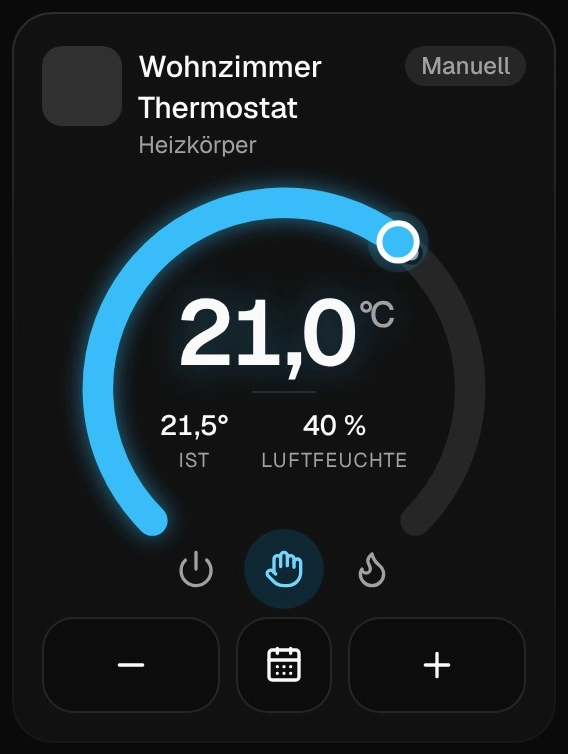 | `HEATING_CLIMATECONTROL_TRANSCEIVER`, `CLIMATECONTROL_RT_TRANSCEIVER`, `THERMALCONTROL_TRANSMIT`<br><br>**Beispiele:** HmIP-eTRV, -WTH, -STHD, -BWTH, HmIPW-STHD, HM-CC-RT-DN, HM-TC-IT-WM-W-EU |
| **Fußbodenheizung**<br>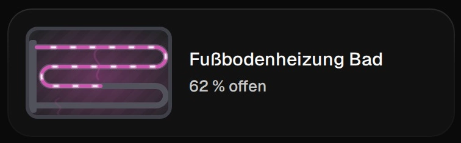 | `CLIMATECONTROL_FLOOR_TRANSCEIVER`<br><br>**Beispiele:** HmIP-FALMOT-C12, HmIPW-FALMOT-C12 |
| **Licht und Schalter**<br>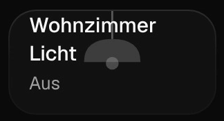 | `SWITCH_VIRTUAL_RECEIVER`, `SWITCH`<br><br>**Beispiele:** HmIP-PS, -PSM, -BSM, -FSM, -FS6, HmIPW-DRS8, HM-LC-Sw1-FM |
| **Dimmer**<br>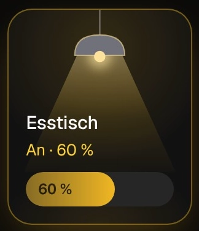 | `DIMMER_VIRTUAL_RECEIVER`, `DIMMER`, `DUAL_WHITE_BRIGHTNESS`<br><br>**Beispiele:** HmIP-PDT, -BDT, -WUA, HmIPW-DRD3, HM-LC-Dim1T, HM-LC-DW-WM |
| **Farblicht**<br>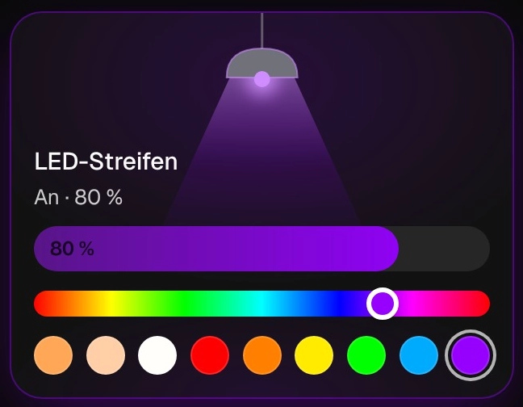 | `UNIVERSAL_LIGHT_RECEIVER`; bei BidCos `RGBW_COLOR` (Farbe oder Weiß), `RGBW_AUTOMATIC` (Farbprogramme wie Lagerfeuer, TV-Simulation) und `DUAL_WHITE_COLOR` (Mischung der beiden Weiß), wie `rgbw.fn` und `dual_white_controller.fn`<br><br>**Beispiele:** HmIP-RGBW, -LSC, -DRG-DALI, HM-LC-RGBW-WM, HM-LC-DW-WM |
| **Rollladen und Jalousie**<br>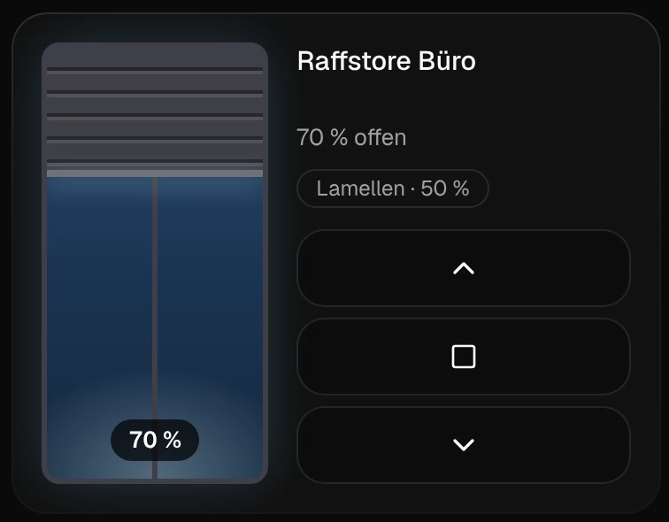 | `BLIND_VIRTUAL_RECEIVER`, `SHUTTER_VIRTUAL_RECEIVER`, `BLIND`, `JALOUSIE`<br><br>**Beispiele:** HmIP-BROLL, -FROLL, -BBL, -FBL, HmIPW-DRBL4, HM-LC-Bl1-FM, HM-LC-Ja1PBU-FM |
| **Fenster**<br>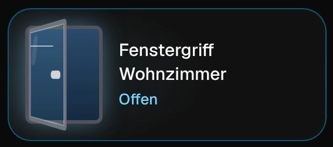 | `SHUTTER_CONTACT`, `ROTARY_HANDLE_SENSOR`, `ROTARY_HANDLE_TRANSCEIVER`<br><br>**Beispiele:** HmIP-SWDO, -SCI, -SRH, HM-Sec-SCo, HM-Sec-RHS |
| **Fensterantrieb**<br>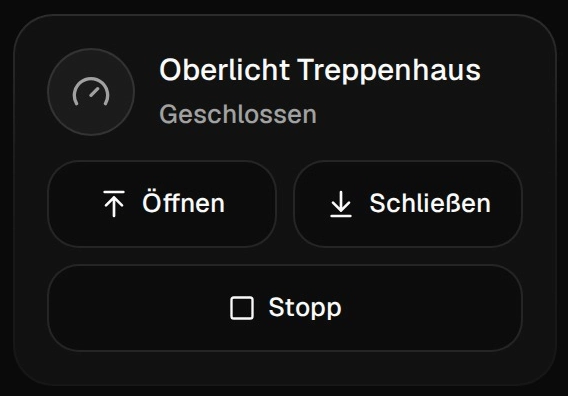 | `WINDOW_DRIVE_RECEIVER`: öffnen, schließen, Stopp; `WINMATIC` zusätzlich verriegeln, `AKKU` mit Ladezustand<br><br>**Beispiele:** HmIP-MOD-WD-VK, HM-Sec-Win |
| **Türschloss**<br>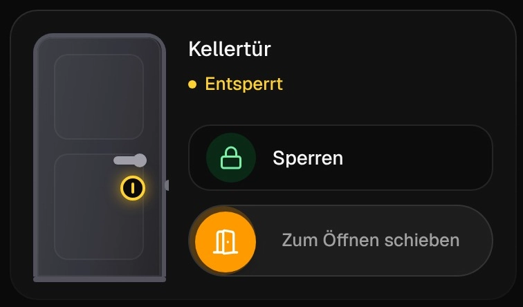 | `KEYMATIC`, `DOOR_LOCK_TRANSCEIVER`, `DOOR_LOCK_STATE_TRANSMITTER`<br><br>**Beispiele:** HM-Sec-Key, HmIP-DLD |
| **Garagentor**<br>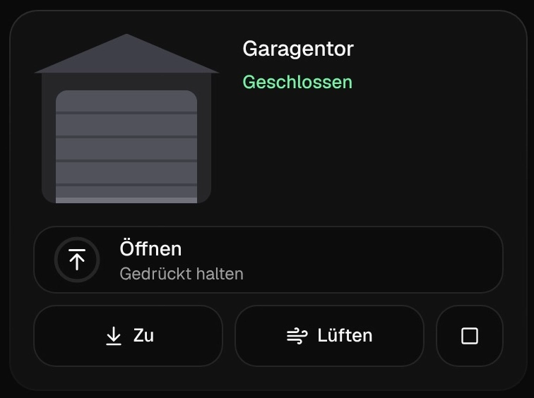 | `DOOR_RECEIVER`<br><br>**Beispiele:** HmIP-MOD-HO, -MOD-TM |
| **Rauchmelder**<br>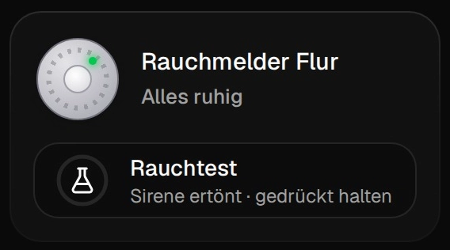 | `SMOKE_DETECTOR`<br><br>**Beispiele:** HmIP-SWSD, HM-Sec-SD-2 |
| **Bewegung und Präsenz**<br>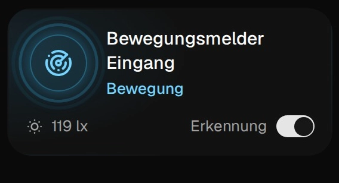 | `MOTION_DETECTOR`, `MOTIONDETECTOR_TRANSCEIVER`, `MOTIONDETECTOR_VIRTUAL_TRANSCEIVER`, `PRESENCEDETECTOR_TRANSCEIVER`<br><br>**Beispiele:** HmIP-SMI, -SMO, -SPI, HmIPW-SMI55, HM-Sen-MDIR-O |
| **Wassermelder**<br> | `WATER_DETECTION_TRANSMITTER`, `WATERDETECTIONSENSOR`<br><br>**Beispiele:** HmIP-SWD, HM-Sec-WDS |
| **Sirene**<br> | `ALARM_SWITCH_VIRTUAL_RECEIVER`<br><br>**Beispiele:** HmIP-ASIR, -ASIR-2, -ASIR-O |
| **Gong und MP3**<br>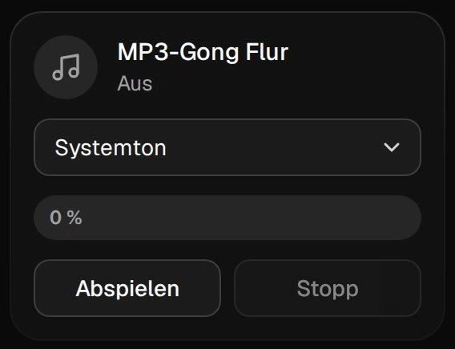 | `ACOUSTIC_SIGNAL_VIRTUAL_RECEIVER`: Ton (Systemton oder Datei 1–252), Lautstärke, abspielen und stoppen wie `acoustic_signal.fn`; `SIGNAL_CHIME`, `SIGNAL_LED`: Gong und Blitzlicht auslösen (Melodien und Blinkmuster werden in Programmen gewählt)<br><br>**Beispiele:** HmIP-MP3P, HM-OU-CFM-Pl, -CFM-TW, -CF-Pl, -CM-PCB |
| **Zutritt**<br>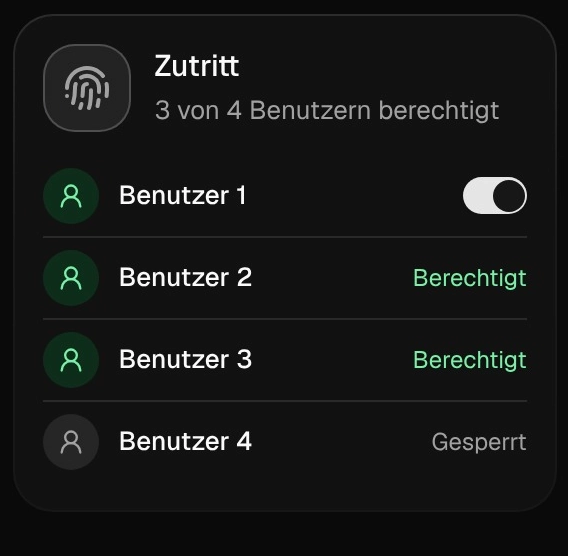 | `ACCESS_TRANSCEIVER` (eine Kachel je Gerät)<br><br>**Beispiele:** HmIP-WKP, -FWI |
| **Klima und Wetter**<br>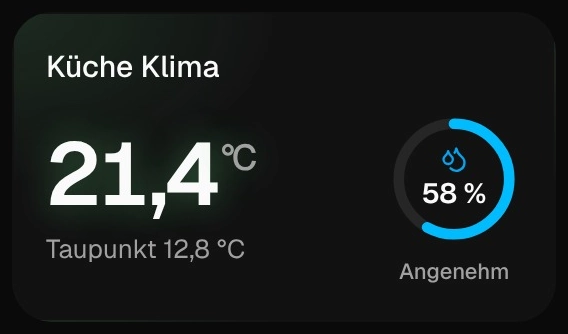 | `CLIMATE_TRANSCEIVER`, `WEATHER_TRANSMIT`, `WEATHER`<br><br>**Beispiele:** HmIP-STHO, -SWO, HM-WDS10-TH-O, HM-WDS100 |
| **Regen**<br>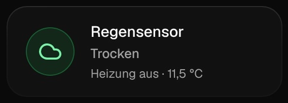 | `RAIN_DETECTION_TRANSMITTER`: Regen, Heizung, Temperatur<br><br>**Beispiele:** HmIP-SRD |
| **Helligkeit**<br>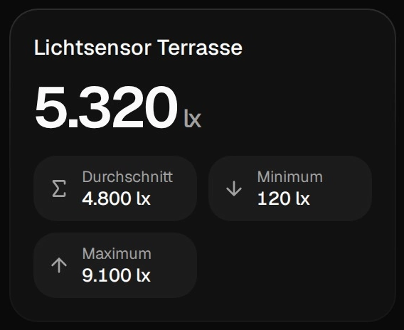 | `BRIGHTNESS_TRANSMITTER`, `LUXMETER`: aktuell, Durchschnitt, Minimum, Maximum<br><br>**Beispiele:** HmIP-SLO, HM-Sen-LI-O |
| **CO₂**<br>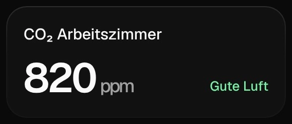 | `CARBON_DIOXIDE_RECEIVER` (ppm, bewertet nach Umweltbundesamt), `SENSOR_FOR_CARBON_DIOXIDE` (Stufe)<br><br>**Beispiele:** HmIP-SCTH230, HM-CC-SCD |
| **Feinstaub**<br>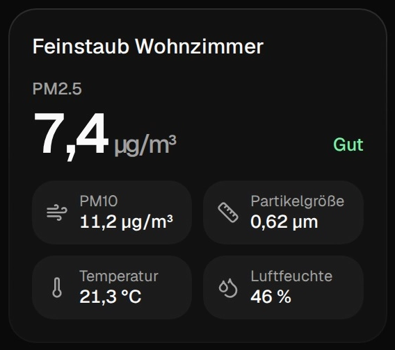 | `TEMP_HUMIDITY_PARTICULATE_MATTER_TRANSMITTER`: PM2.5 (bewertet nach dem Europäischen Luftqualitätsindex), PM10, Partikelgröße, Temperatur, Luftfeuchte<br><br>**Beispiele:** HmIP-SFD |
| **Bodenfeuchte**<br>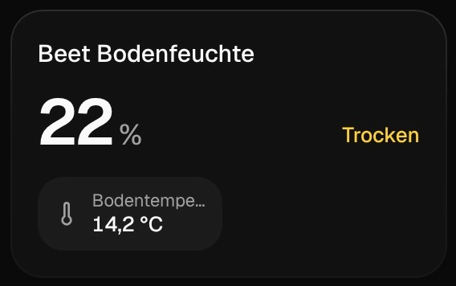 | `SOIL_MOISTURE_TRANSMITTER`: Feuchte, Bodentemperatur<br><br>**Beispiele:** ELV-SH-SMSI |
| **Erschütterung und Neigung**<br>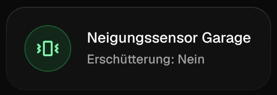 | `ACCELERATION_TRANSCEIVER`, je nach Betriebsart Erschütterung, Lage oder Neigung<br><br>**Beispiele:** HmIP-SAM, -STV, ELV-SH-CTV, -TACO |
| **Netzausfall**<br> | `POWER_MAINS_TRANSMITTER`<br><br>**Beispiele:** HmIP-PMFS |
| **Bewässerung**<br>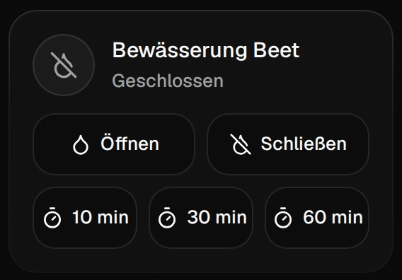 | `WATER_SWITCH_VIRTUAL_RECEIVER`: Ventil auf und zu, mit `ON_TIME` auch für 10, 30 oder 60 Minuten; `FLOW_METER_TRANSMITTER`: Durchfluss, Menge seit dem Öffnen, Gesamtmenge<br><br>**Beispiele:** HmIP-WSM, ELV-SH-WSM |
| **Wasserschutz**<br>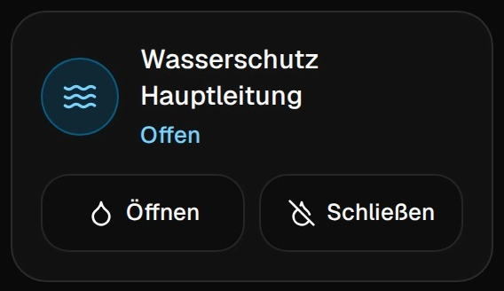 | `VALVE_ACTUATOR_RECEIVER` (Absperrventil), `WATER_FLOW_TRANSMITTER`, `WATER_PRESSURE_TRANSMITTER`<br><br>**Beispiele:** HmIP-WSS |
| **Taster**<br>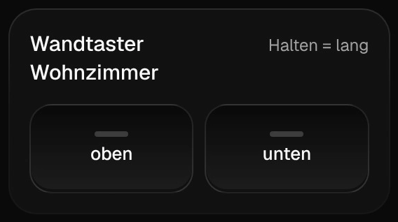 | `KEY_TRANSCEIVER`, `KEY`, `VIRTUAL_KEY` (eine Kachel je Gerät)<br><br>**Beispiele:** HmIP-WRC2, -WRC6, -BRC2, HM-PB-2-WM55, Fernbedienungen |
| **Eingang**<br> | `MULTI_MODE_INPUT_TRANSMITTER`, je nach Betriebsart Taster, Schalter, Kontakt oder Level<br><br>**Beispiele:** HmIP-FCI1, -FCI6, -DSD-PCB, die Eingänge von HmIP-BSL, -DRSI4, HmIPW-DRI16 |
| **Energiezähler**<br>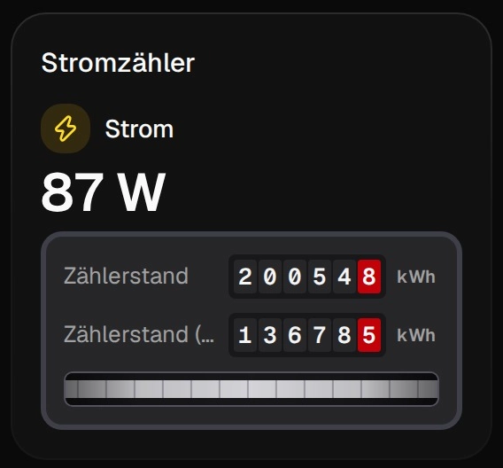<br>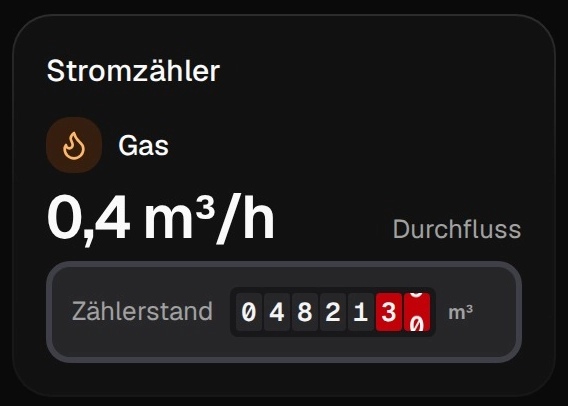 | `ENERGIE_METER_TRANSMITTER`, `POWERMETER` (eine Kachel je Gerät)<br><br>**Beispiele:** HmIP-ESI, HmIP-PSM, HM-ES-PMSw1 |
| **Access Point / Bus**<br>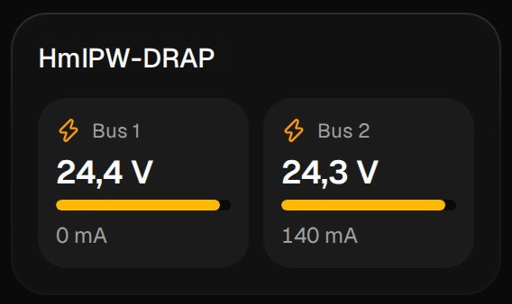 | `ACCESSPOINT_GENERIC_RECEIVER` (eine Kachel je Gerät)<br><br>**Beispiele:** HmIPW-DRAP |

Eingänge zeigen, wofür sie in den Einstellungen eingerichtet sind (Betriebsart): Tastendrücke leuchten auf,
ein Kontakt zeigt offen oder geschlossen, ein Level seinen Wert. Die Betriebsart merkt sich die CCU wie
bei der WebUI als Metadatum `channelMode`; das Add-on setzt es beim Speichern der Einstellungen mit.
Bedienen lassen sich Eingänge nicht, auch die WebUI hat dafür kein Bedienelement.

Nicht jeder Kanal erscheint als Kachel. Ausgeblendet werden Wartungskanäle (Batterie, Erreichbarkeit
stehen an der Kachel selbst), Kanäle ohne Werte, die Rohwerte von Wochenprogrammen und bei HmIP die
Statuskanäle (`*_TRANSMITTER`) neben ihrem virtuellen Empfänger.

## Generische Kachel

Alles ohne eigene Kachel rendert `GenericControl` aus der Beschreibung der Werte (`VALUES`-Paramset), die
die CCU für jeden Kanal liefert:

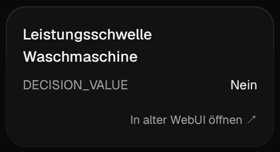

| Parametertyp | Element |
|---|---|
| Ein/Aus (`BOOL`) | Schalter, oder Anzeige, wenn nur lesbar |
| Aktion (`ACTION`) | Knopf |
| Werte-Liste (`ENUM`) | Auswahl |
| Zahl (`FLOAT`, `INTEGER`) | Eingabefeld mit Einheit und Grenzen, Prozent als 0–100 % |
| Sonderwerte (z. B. „nicht verwendet“) | als Text |

Die generische Kachel hat einen Link *In alter WebUI öffnen*, falls ein Gerät dort mehr kann.
Gleiches gilt für die Einstellungen (`MASTER`-Paramset): Die bekommt **jedes** Gerät der drei
angebundenen Schnittstellen, mit passenden Bedienelementen (siehe [Einrichten](einrichten.md#die-geräteseite)).

## Was noch fehlt

Nach Bedeutung:

1. **Verknüpfungsvorlagen** gibt es für die 7 häufigsten Empfänger (Schalt-, Dimm- und Rollladenaktoren, 722
   Profile). Für die übrigen 59 Empfängertypen der WebUI (2065 Profile) geht nur der Expertenmodus mit allen
   Parametern.
2. **Ohne eigene Kachel** sind noch diese Gerätetypen (Stand: Zählung oben). Sie sind trotzdem voll
   bedienbar, über die generische Kachel.

   *Nur generisch (19):*

   | Gerätetyp | Kanaltyp |
   |---|---|
   | HM-SwI-3-FM und OEM-Varianten | `SWITCH_INTERFACE` |
   | HM-CC-VD und OEM-Variante | `CLIMATECONTROL_VENT_DRIVE` |
   | HM-Sec-Sir-WM | `ARMING`, `SWITCH_PANIC`, `SWITCH_SENSOR` |
   | HM-Sen-RD-O | `RAINDETECTOR`, `RAINDETECTOR_HEAT` |
   | HM-Sec-TiS, HM-Sec-SFA-SM, HM-Sen-EP, HM-LC-DDC1-PCB, HM-Dis-TD-T | je ein eigener Kanaltyp |
   | HmIP-STE2-PCB | `COND_SWITCH_TRANSMITTER_TEMPERATURE` |
   | HMW-IO-12-FM, -IO-4-FM, -IO-12-Sw14-DR, -Sen-SC-12-FM/-DR | Ein- und Ausgänge (BidCos-Wired) |
   | 263 149/263 150 (OEM) | `ACTOR_SECURITY`, `ACTOR_WINDOW`, `SENSOR_WINDOW` |

   *Hauptfunktion mit eigener Kachel, ein Nebenkanal generisch (26):*

   | Gerätetyp | generischer Nebenkanal |
   |---|---|
   | HM-ES-PMSw1 (8 Varianten) | Schwellwerte `CONDITION_POWER/CURRENT/VOLTAGE/FREQUENCY` |
   | HmIP-SWO-B, -SWO-PL, -SWO-PR, HmIP-SFD | Schwellwert `COND_SWITCH_TRANSMITTER_TEMPERATURE` |
   | HM-CC-TC und OEM-Variante | `CLIMATECONTROL_REGULATOR` |
   | HmIP-FDC, -FLC | `SWITCH_TRANSCEIVER` |
   | HmIP-MOD-TM, -MOD-HO | `SIMPLE_SWITCH_RECEIVER` |
   | HmIP-ASIR, -ASIR-B1 | Statuskanal `SWITCH_TRANSMITTER` |
   | HmIP-WRCR | Drehregler `ROTARY_CONTROL_TRANSCEIVER` |
   | HmIP-MIOB, -MIO16-PCB | analoge Ein- und Ausgänge |
   | HM-TC-IT-WM-W-EU, HM-MOD-EM-8Bit, ELV-SH-BM-S | je ein Nebenkanal |

## Ein Gerät fehlt oder sieht falsch aus?

Am meisten hilft ein Export der Gerätedaten deiner CCU:

```bash
npm run export:ccu -- -o ../fixtures/meine-ccu.json -anonymize
```

Der Export liest nur (Räume, Kanäle, Gerätebeschreibungen) und ersetzt Namen durch Platzhalter.
Mit der Datei lässt sich das Gerät gegen die Fake-CCU nachbauen und eine Kachel dafür entwickeln, siehe
[Entwicklung](entwicklung.md#eine-kachel-für-ein-neues-gerät). Gegen alle Fixtures läuft außerdem ein Test,
der jede Gerätebeschreibung durch die generische Kachel schickt.
