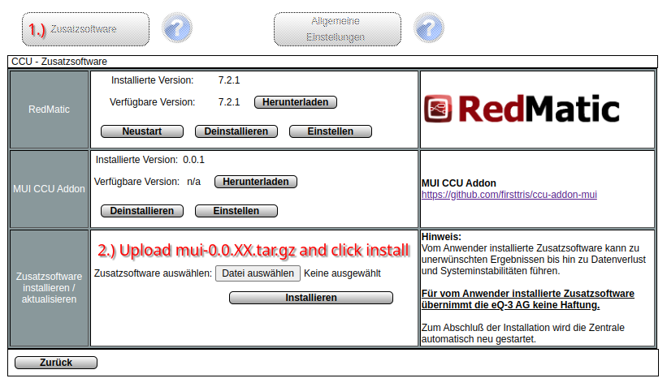
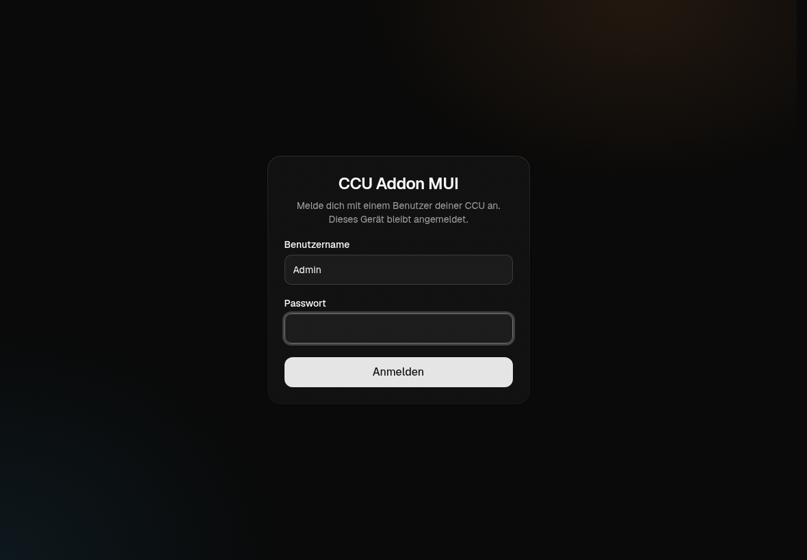

# Installation

ccu-addon-mui ist ein Add-on („Zusatzsoftware“) für die Homematic-Zentrale. Es läuft auf der Zentrale
selbst: Die App liegt unter `/addons/mui`, ein kleiner Server daneben spricht mit der CCU. Ein zusätzlicher
Rechner, Docker oder eine Cloud werden nicht gebraucht.

## Voraussetzungen

- **Zentrale**: CCU3 oder OpenCCU (früher RaspberryMatic) auf ARM, also z. B. auf einem Raspberry Pi. Der
  Server ist ein statisches ARMv7-Binary.
- **Räume oder Gewerke**: Das Dashboard zeigt Kanäle nach Raum und Gewerk. Ohne Zuordnung erscheint ein
  Gerät nur unter *Alle Geräte*. Zuordnen kannst du direkt im Add-on (siehe [Einrichten](einrichten.md)).
- **Browser**: aktuelle Versionen von Chrome, Edge, Firefox oder Safari, auf Desktop, Tablet und Handy.

## Installieren

1. Die neueste Datei `mui-<version>.tar.gz` von der
   [Releases-Seite](https://github.com/firsttris/ccu-addon-mui/releases/latest) laden. Das Archiv nicht
   entpacken.
2. In der WebUI der CCU *Einstellungen → Systemsteuerung → Zusatzsoftware* öffnen, die Datei auswählen und
   *Installieren* klicken. Hochladen und Neustart dauern ein paar Minuten.

   

3. **http://&lt;IP-der-CCU&gt;/addons/mui** öffnen.

Das Add-on taucht danach in der Liste der Zusatzsoftware auf, mit *Einstellen* (öffnet die App), *Neustart*
und *Deinstallieren*.

Ab dann geht es auch ohne die alte WebUI: Weitere Add-ons installierst du unter *Einrichten → System →
Zusatzsoftware* im Add-on selbst.

## Aktualisieren

Die CCU prüft unter *Zusatzsoftware* selbst, ob es eine neue Version gibt (das Add-on fragt dazu die
neueste Release auf GitHub ab). Aktualisiert wird wie bei der Installation: neue `tar.gz` hochladen,
installieren. Einstellungen, angemeldete Geräte, Diagramme und Push-Abos bleiben erhalten, weil sie
außerhalb des Add-on-Verzeichnisses liegen (siehe [Dateien auf der CCU](#dateien-auf-der-ccu)).

## Anmelden

Beim ersten Öffnen meldest du dich mit einem **Benutzer der CCU-WebUI** an, also demselben Namen und
Passwort wie in der WebUI. Das Add-on prüft das Passwort bei der CCU und speichert es nicht.

- **Einmal pro Gerät**: Danach bleibt das Gerät angemeldet, auch nach einem Neustart von App oder CCU.
  Die Anmeldung verlängert sich bei jeder Nutzung (gültig ein Jahr ab der letzten Verbindung).
- **Rechte wie in der CCU**: Gäste sehen nur, Benutzer bedienen, Administratoren dürfen zusätzlich
  einrichten. Kanäle, die in der CCU nicht als *bedienbar* markiert sind, schalten nur Administratoren.
- **Admin-Modus**: Für Einstellungen braucht ein Administrator ein Admin-Token. Es gilt 8 Stunden ab
  der Anmeldung. Danach fragt die App beim nächsten Speichern noch einmal nach dem Passwort.
- **Abmelden**: im Menü. Ein verlorenes Tablet meldest du unter *Einrichten → Angemeldete Geräte* ab.

Details zu Tokens und Rechten stehen in [Sicherheit](sicherheit.md).

## HTTPS

Einige Funktionen gibt der Browser nur in einem sicheren Kontext frei, also über HTTPS oder `localhost`:

| Funktion | ohne HTTPS |
|---|---|
| Als App installieren (PWA, Service Worker) | nicht möglich, die App läuft nur im Browser-Tab |
| Push-Benachrichtigungen | nicht möglich |
| Bildschirm bleibt an (WakeLock) | nicht möglich |

Die CCU kann HTTPS selbst: **https://&lt;IP-der-CCU&gt;/addons/mui**. Mit dem Zertifikat ab Werk warnt der
Browser einmalig. Besser ist ein eigenes Zertifikat, das deine Geräte kennen. Hochladen kannst du es unter
*Einrichten → System → HTTPS-Zertifikat*. Die Umleitung von HTTP auf HTTPS schaltest du unter
*Einrichten → System → Sicherheit* ein.

Nur zum Ausprobieren gibt es in Chrome einen Ausweg ohne Zertifikat:

1. `chrome://flags` öffnen.
2. *Insecure origins treated as secure* suchen.
3. Die Adresse der CCU eintragen, z. B. `http://192.168.178.111`.
4. Chrome neu starten.

## Als App installieren

Über HTTPS lässt sich das Add-on wie eine App auf den Startbildschirm legen. Es startet dann ohne
Browserleiste, mit eigenem Icon, dunklem Startbildschirm und aus dem Cache. Nach dem ersten Laden kommen
die App-Dateien aus dem Service Worker; über das Netz gehen nur noch die Daten.

- **Android (Chrome)**: Menü (drei Punkte) → *App installieren* bzw. *Zum Startbildschirm hinzufügen*.
- **iOS / iPadOS (Safari)**: Teilen → *Zum Home-Bildschirm*.
- **Desktop (Chrome, Edge)**: Installieren-Symbol rechts in der Adressleiste.

Updates des Add-ons holt sich die installierte App beim nächsten Start selbst.

### Wandtablet

Für ein Tablet an der Wand:

- **Startseite** im Menü auf *Favoriten* stellen und dort eine Liste nur für das Tablet anlegen.
- Den Bildschirm hält die App über **WakeLock** an, solange sie im Vordergrund ist (nur mit HTTPS).
- **Effekte** im Menü auf *Dezent* oder *Aus* stellen, wenn das Tablet schwach ist.
- Ein eigener CCU-Benutzer mit Stufe *Benutzer* für das Tablet verhindert, dass dort jemand einrichtet.

## Push-Benachrichtigungen

Im Menü unter *Benachrichtigungen* aktivierst du Push für **Alarme** und **Servicemeldungen**, getrennt pro
Gerät. Die Zentrale schickt sie über den Push-Dienst des Browsers (Web Push mit VAPID); ein Konto bei
einem Drittanbieter ist nicht nötig. Voraussetzungen:

- HTTPS (siehe oben).
- Die CCU erreicht das Internet, denn die Nachricht geht über den Push-Dienst des Browsers (Google, Apple,
  Mozilla).
- Unter iOS muss die App auf dem Home-Bildschirm installiert sein.

*Test senden* prüft die ganze Kette. Die CCU prüft alle 30 Sekunden auf neue Alarme und
Servicemeldungen.

## Optionen (`mui.conf`)

Für Sonderfälle liest der Server beim Start `/usr/local/etc/config/mui.conf`. Die Datei liegt außerhalb des
Web-Verzeichnisses und überlebt Updates. Eine Zeile pro Option, `NAME=Wert`:

| Option | Standard | Wirkung |
|---|---|---|
| `AUTH_MODE` | `ccu` | `none` schaltet die Anmeldung ab. Dann ist **jeder im Netz Administrator**: bedienen, einrichten, Backups ziehen. Nur für Netze, in denen das gewollt ist. Was eine WebUI-Session braucht (Backup, Firewall …), fragt trotzdem das Passwort des Benutzers `Admin` ab |
| `DEBUG` | `false` | `true` schreibt ausführliche Meldungen ins Log |
| `PUSH_SUBJECT` | GitHub-URL des Projekts | Kontaktadresse in den Push-Anfragen (VAPID `sub`), z. B. `mailto:du@example.com` |
| `DIAGRAMS_DIR` | `/usr/local/mui-diagrams` | Wo die Diagrammwerte liegen, z. B. auf einem USB-Stick |

Die übrigen Variablen (Ports, Dateipfade) braucht man nur zur Entwicklung, siehe
[Entwicklung](entwicklung.md#umgebungsvariablen). Nach einer Änderung das Add-on neu starten: in der WebUI
unter *Zusatzsoftware → Neustart* oder per SSH mit `/usr/local/etc/config/rc.d/mui restart`.

## Dateien auf der CCU

| Pfad | Inhalt |
|---|---|
| `/usr/local/addons/mui/` | App und Server (`go-server/ccu-addon-mui-server`) |
| `/usr/local/etc/config/rc.d/mui` | Startskript |
| `/usr/local/etc/config/lighttpd/mui.conf` | Weiterleitung von `/ws/mui` an den Server |
| `/usr/local/etc/config/mui.conf` | deine Optionen (optional) |
| `/usr/local/etc/config/mui-auth.key` | Schlüssel, mit dem die Anmeldungen signiert sind. Löschen meldet alle Geräte ab |
| `/usr/local/etc/config/mui-sessions.json` | angemeldete Geräte |
| `/usr/local/etc/config/mui-audit.log` | Protokoll aller Änderungen über das Add-on |
| `/usr/local/etc/config/mui-push.json` | Push-Schlüssel und Abos |
| `/usr/local/etc/config/mui-diagrams.json` | Diagramme |
| `/usr/local/mui-diagrams/` | aufgezeichnete Werte (Minutenwerte 60 Tage, Stundenwerte unbegrenzt) |
| `/var/log/mui-websocket-server.log` | Log des Servers (im RAM, ab 1 MB rotiert) |

Die Dateien unter `/usr/local/etc/config` sind Teil jedes CCU-Backups. Die Minutenwerte der Diagramme
sind davon ausgenommen, damit Backups klein bleiben.

## Deinstallieren

In der WebUI unter *Zusatzsoftware → Deinstallieren*. Das entfernt App, Server, Startskript, Log,
`mui.conf` und `mui-auth.key`. Liegen bleiben `mui-sessions.json`, `mui-push.json`, `mui-audit.log`,
`mui-diagrams.json` und `/usr/local/mui-diagrams`, damit eine Neuinstallation Diagramme und Verlauf
behält. Wer alles entfernen will, löscht sie per SSH.

## Häufige Probleme

**Roter Balken „Keine Verbindung zur CCU, verbinde neu …“**: Die App erreicht den Server nicht. Die App verbindet sich alle
3 Sekunden neu. Bleibt der Balken, läuft der Server nicht: Add-on unter *Zusatzsoftware* neu starten und
das Log ansehen (`/var/log/mui-websocket-server.log`).

**Werte ändern sich nicht live**: Der Server meldet sich bei den Funkdiensten der CCU für Events an und
prüft die Verbindung jede Minute. Nach einem Neustart der Funkdienste dauert es bis zu 6 Minuten, bis er
sich neu anmeldet. Ein Neustart des Add-ons geht schneller.

**„Zu viele Versuche“ bei der Anmeldung**: Nach 5 falschen Passwörtern in einer Minute ist die Anmeldung
eine Minute gesperrt.

**Einrichten fragt nach dem Passwort**: Das Admin-Token ist nach 8 Stunden abgelaufen. Einmal das Passwort
eingeben, dann geht es weiter.

**Push lässt sich nicht einschalten**: Die Seite ist nicht über HTTPS geöffnet, oder der Browser hat
Benachrichtigungen für die Seite gesperrt.

**Ein Gerät fehlt auf dem Dashboard**: Es ist keinem Raum und keinem Gewerk zugeordnet, oder in der CCU
als *unsichtbar* markiert. Unter *Alle Geräte* steht es trotzdem.
