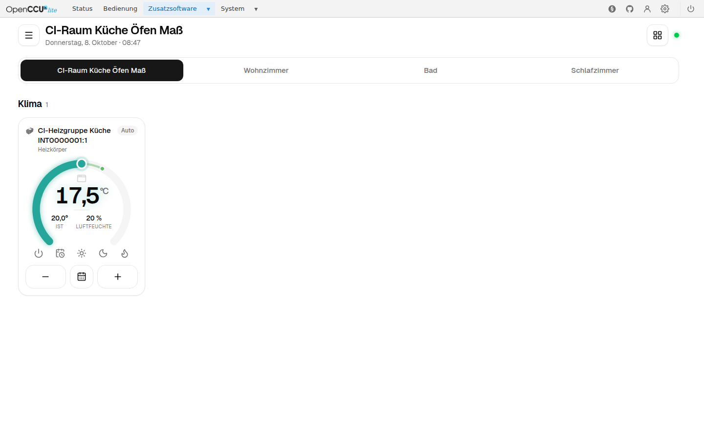
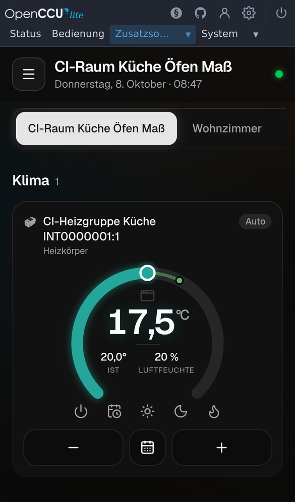

# Plan: openccu-lite unterstützen

Stand: Oktober 2026, openccu-lite `v1.0.0-dev.42`. Dieser Plan beschreibt, wie das Add-on neben CCU3 und
OpenCCU auch auf [openccu-lite](https://github.com/hobbyquaker/openccu-lite) läuft, aus einem Branch und
einer Codebasis.

## Stand der Umsetzung

So sieht MUI in openccu-lite aus (Menü *Zusatzsoftware → MUI*, aufgenommen vom VM-Test auf
1.0.0-dev.43; der Thermostat ist das virtuelle Gerät einer Heizgruppe, die VM hat kein Funkmodul):




Die Schritte 1 bis 8 sind umgesetzt, der Branch baut beide Pakete. Getestet ist es auf zwei Wegen:

- **Gegen die Fake-Lite** (`go test -tags lite ./...`, `e2e/lite.spec.ts`): was MUI aus occulites APIs
  macht, Fall für Fall.
- **Auf einem echten openccu-lite** (`lite-vm.yml`): das Release-Image in einer VM, das Paket über occulites
  Add-on-API installiert, dann Anmeldung über das Gate, Lesen, Raum, Layout und Sprache über Neustart und
  Update und Neustart des Systems, die Stufen *configure* und *operate* mit ihrer eigenen Sitzung, eine
  Heizgruppe, Wert setzen mit Event zurück und eine Einstellung über lite-rpc (`VirtualDevices`), die App
  im Browser, Umlaute, unsere Daten im Backup, Deinstallieren und neu Installieren, Journal und Abmelden. Ohne Funkmodul, also ohne Funkgeräte ([tests.md](tests.md#auf-einer-openccu-lite-vm)).

Offen:

- [ ] Ein Test mit Funk-Hardware nach der Checkliste unten (Abschnitt *Tests*): Anlernen, Schalten, Werte,
  Heizgruppen.
- [ ] Release mit den Lite-Paketen und ihren `.sha256` (der Build erzeugt beides).
- [ ] Pull Request auf occulites [`catalog/catalog.json`](https://github.com/hobbyquaker/occulited/blob/master/catalog/catalog.json)
  mit dem Eintrag
  `{"git": "https://github.com/firsttris/ccu-addon-mui", "manifest": "addon_installer/openccu-lite.json"}`.
  Das System liest das Manifest an der neuesten Release, also erst nach einer Release mit dieser Datei.
- [x] Die Fragen an Sebastian sind beantwortet und umgesetzt (unten), auch seine Empfehlungen: `lite-rpc`
  statt der lokalen Ports, Änderungen mit der Sitzung des Nutzers, `import` und `resync` im Change-Stream.
  Die Favoriten bleiben bewusst MUIs eigene (Antwort 2).

Wie sich MUI auf openccu-lite verhält, wo es anders ist als auf der CCU:

- **Anmeldung:** über occulites Sitzung. Offene Verbindungen prüfen sie jede Minute neu, ein Abmelden in
  openccu-lite beendet sie. Ist die Sitzung abgelaufen, schickt die App zu occulites `/login`.
  Administratoren müssen ihr Passwort nicht noch einmal eingeben, alle anderen dürfen keine Einstellungen
  ändern.
- **Räume** gehören zum Kanal. Räume am Geräteobjekt gelten nicht für dessen Kanäle, wie in occulites
  eigener Bedien-App.
- **Servicemeldungen:** occulites Meldungen sind ein Abbild der Wartungsdatenpunkte. Bestätigen lassen sich
  nur `STICKY_UNREACH` und `STICKY_SABOTAGE` (per `setValue`, wie auf der CCU); die anderen enden, wenn das
  Gerät es meldet, und die App bietet dafür kein Bestätigen an.
- **Diagramme:** neue Reihen beginnen mit dem aktuellen Wert, ohne Import aus einem Systemprotokoll.
- **HmIP anlernen:** Im lokalen Schlüsselmodus (`hmip.keyserver_mode` LOCAL) fragt das System den Keyserver
  von eQ-3 nie; der Anlerndialog sagt das und öffnet gleich das Anlernen mit SGTIN und KEY vom Aufkleber.
- **Eigene Daten** (Layouts, Favoriten, Sprache, Diagramme) liegen in `DATA_DIR`. Die Layouts hängen am Pfad
  eines Raums; verschiebt man ihn in openccu-lite, zieht MUI sie über occulites Change-Stream mit
  (`node.moved`), für die Räume darunter auch, und löscht sie mit dem Raum (`node.deleted`).
- **lighttpd-Fragment:** occulited übernimmt es nur, wenn jede Direktive auf einer Zeile steht (seine
  Prüfung liest einen Wert bis zum Zeilenende). Das hat erst der Test auf der echten VM gezeigt; ein Test
  im Repo hält es jetzt so.

Abweichungen vom Plan:

- **Favoriten** liegen vorerst in der eigenen Datei `mui-lite.json`, nicht im `favorite`-Enum von
  occulited: Dort hat jedes Konto genau eine Liste, MUI kennt mehrere benannte Listen.
- **Gerätefirmware** verwaltet occulites Update-Seite; MUI zeigt dort nur den Link. Das Update eines
  einzelnen Geräts aus seiner Geräteseite geht weiter.
- **Gerätebilder** bringt openccu-lite seit 1.0.0-dev.45 selbst mit, an den Pfaden der CCU
  (`/www/config/img/devices/`, `/www/config/devdescr/DEVDB.tcl`, im Browser unter `/config/img/devices/`),
  auf unsere Bitte in [openccu-lite#10](https://github.com/hobbyquaker/openccu-lite/issues/10). Der Server
  liest `DEVDB.tcl` wie auf der CCU, die App lädt die Bilder von dort, wo openccu-lite sie ausliefert
  (`getDeviceImages` sagt es mit `base`). Auf älteren Images bleibt der Platzhalter.
- **Im Lite-Binary** steckt noch der ReGa-Client, weil `websocket.Server` ihn als Feld kennt. Erreichbar ist
  er dort nicht: Der Verteiler schickt keine Anfrage an die CCU-Handler, deren Dateien gar nicht mitgebaut
  werden. Ganz heraus käme er erst, wenn auch die übrigen gemeinsamen Handler hinter Schnittstellen liegen.

## Weitere Module auf openccu-lite

Die Idee von MUI ist eine komplette Oberfläche für die Zentrale. Auf der CCU ersetzt es die WebUI fast
ganz; auf openccu-lite fehlen bisher Module, teils weil wir sie noch nicht gebaut haben, teils weil
openccu-lite sie einem Add-on nicht erlaubt. Was ein Add-on dort darf, legen die Rechte (Scopes) seines
Tokens fest: Es bekommt, was sein Manifest unter `runtime.api_scopes` verlangt, aber **nie** `auth:admin`,
`power`, `backup`, `radio:keys` oder `*` (occulited `docs/system-api.md`, „Scopes“).

### Ginge mit Add-on-Rechten, ist aber nicht geplant

Diese Module gingen mit Rechten, die ein Add-on bekommen kann. Wir haben sie bisher weggelassen, weil
openccu-lite dafür eigene Seiten hat und wir dorthin verlinken. Für eine komplette Oberfläche ließen sie
sich nachrüsten:

| Modul | occulites API | Recht | Hinweis |
|---|---|---|---|
| Netzwerk, Firewall, Zeit, SSH | `/api/system/v1/network`, `/firewall`, `/time`, … | `system:write` | Fernzugriff (klassisches RPC) ebenso |
| Zertifikat, HTTPS | `/api/system/v1/certificate` | `system:write` | inkl. ACME |
| Gerätefirmware laden und verteilen | `/api/system/v1/firmware` | `system:write` | heute nur Link auf occulites Update-Seite |
| Zusatzsoftware: Liste, Installieren, Updates, Katalog | `/api/system/v1/addons` | `addons:write` | |
| Protokoll (Journal) | `/api/system/v1/log` | `logs:read` | auch das eigene Log des Add-ons |
| LAN-Gateways, Funkmodul-Einstellungen | `/api/system/v1/radio/…` | `system:write` | ohne die Firmware des Funkmoduls (`power`) |
| Statusleuchte | `/api/system/v1/led` | `led` | |
| Diagramme aus der Historie | `/api/rpc/v1/history` | `rpc:read` | letzte 500 Werte je Datenpunkt, nur für occulites Liste von Datenpunkten |
| Kanaloptionen (sichtbar, bedienbar) | eigener Namensraum `meta.mui` | `meta:write` | gibt es auf openccu-lite nicht, MUI müsste sie selbst führen |
| Favoriten gemeinsam mit occulites Bedien-App | Enum `favorite` | `meta:write` | dort eine Liste je Konto, MUI kennt mehrere |

### Bleibt bei openccu-lite

Diese APIs gibt es, ein Add-on-Token bekommt das Recht dafür aber nie. Technisch ginge es mit der Sitzung
des angemeldeten Administrators, Sebastian möchte es aber bei den Seiten des Systems lassen: Dort hängen die
Sicherheitsschritte (Bestätigungen, Prüfung vor dem Wiederherstellen, das Warten auf den Neustart), die man
nicht an zwei Stellen pflegen soll. MUI verlinkt dorthin.

| Modul | occulites API | Recht |
|---|---|---|
| Benutzerverwaltung (Konten, Stufen, Passkeys, OIDC, API-Tokens) | `/api/auth/v1/users`, `/tokens`, `/config` | `auth:admin` |
| Backup erstellen und herunterladen | `/api/system/v1/backup` | `backup` |
| Wiederherstellen, Firmware-Update der Zentrale, Neustart, Herunterfahren | `/api/system/v1/…` | `power` |
| HmIP-Geräteschlüssel, lokaler Schlüsselmodus | `/api/system/v1/radio/hmip/…` | `radio:keys` |

### Gibt es auf openccu-lite nicht

Ohne ReGa fehlen die Grundlagen; keine API, auch keine gesperrte:

- **Programme und Systemvariablen**, **Alarme** und das **Systemprotokoll** der ReGa. Ein Ersatz wäre eine
  eigene Automatisierung in MUI: Die Benachrichtigungsregeln laufen schon ohne ReGa (Bedingungen auf
  Datenpunkten, geprüft bei jedem Event) und könnten um Aktionen erweitert werden, etwa „schalte Kanal X“.
  Das wäre ein eigenes, größeres Modul.
- **Funktest** (`Device.startComTest` der ReGa); zu prüfen, ob ihn die Funkdienste direkt anbieten.
- **Servicemeldungen bestätigen**, außer den Sticky-Meldungen: occulites Meldungen sind ein Abbild der
  Wartungsdatenpunkte, sie enden, wenn das Gerät es meldet. `STICKY_UNREACH` und `STICKY_SABOTAGE` setzt
  MUI wie die CCU per `setValue` zurück.

## Worum es geht

openccu-lite ist ein Fork von OpenCCU ohne ReGaHSS. Der Funk-Stack (`rfd`, `hs485d`, `HMIPServer`) bleibt,
die Systemverwaltung übernimmt der Go-Dienst [occulited](https://github.com/hobbyquaker/occulited). Es gibt
eine Bedien-App für Kacheln, aber keine Verwaltung der Homematic-Geräte: kein Anlernen, keine
Geräteeinstellungen, keine Direktverknüpfungen. Dafür gibt es bisher nur Homematic Manager und OpenCCU-Loom.
Genau diese Lücke füllt unser Add-on, und der Maintainer hat ausdrücklich darum gebeten.

Was wegfällt: Systemvariablen, Programme, HM-Script, die Alarm- und Servicemeldungs-Variablen der ReGa,
`/api/homematic.cgi` und `/config/*.cgi`. Was dazukommt, ist eine ordentliche API:

| API | Wofür wir sie brauchen |
| --- | --- |
| Metadata API `/api/meta/v1` | Namen, Räume, Gewerke, Favoriten, mit Änderungs-Events (SSE) |
| lite-rpc `/api/rpc/v1` | `/state` (alle wichtigen Werte in einem Aufruf), `/history`, Event-Stream mit Nachholen |
| System API `/api/system/v1` | Servicemeldungen, Heizgruppen, Gerätefirmware, Add-on-Liste, Journal |
| Auth API `/api/auth/v1` | Wer angemeldet ist und mit welcher Stufe |

Quellen: `docs/11-openccu-lite.md` und `docs/12-porting-to-openccu-lite.md` im
[ccu-addon-howto](https://github.com/homematic-community/ccu-addon-howto), `docs/porting-from-rega.md` und
`docs/addons.md` in openccu-lite, `docs/meta-api.md`, `docs/meta-format.md`, `docs/system-api.md` und
`docs/manifest-format.md` in occulited.

## Grundidee: ein Branch, zwei Pakete

Alles bleibt in `main`. Was sich unterscheidet, liegt hinter einer Schnittstelle im Go-Server, und
Go-Build-Tags entscheiden, welche Umsetzung ins Binary kommt:

```text
go build ./              → CCU-Paket: mit ReGa, ohne Lite-Code
go build -tags lite ./   → Lite-Paket: mit Lite-API, ohne ReGa-Code
```

```text
pkg/backend/backend.go   gemeinsam: die Schnittstelle(n)
pkg/backend/ccu.go       //go:build !lite   → pkg/rega, homematic.cgi, /etc/config
pkg/backend/lite.go      //go:build lite    → pkg/occulite (Metadata-, System-, Auth-API)
```

`pkg/rega` wird nur von `ccu.go` importiert und fällt im Lite-Build damit komplett raus, umgekehrt genauso.
Handler, die es nur auf der CCU gibt (Programme, Systemvariablen, Systemeinstellungen), registrieren sich in
Dateien mit `//go:build !lite`. Im Lite-Binary existieren sie nicht.

Gemeinsam bleibt der größte Teil: das WebSocket-Protokoll, XML-RPC zu den Funk-Diensten (Anlernen,
Paramsets, Direktverknüpfungen, Schalten), Kachel-Logik, Regeln, Push, Diagramme und die Auslieferung der
App.

### Der Lite-Teil wird schlanker, nicht dicker

Vieles, was wir heute selbst bauen, weil ReGa und XML-RPC es nicht können, bringt Lite fertig mit. Diese
Umwege wandern hinter die Schnittstelle in den CCU-Teil, der Lite-Teil nutzt die API:

| Heute (CCU) | Auf Lite |
| --- | --- |
| HM-Script `get_channels.tcl` liefert Namen, Räume und Werte, Parsen der Ausgabe | `GET /api/meta/v1/snapshot` plus `GET /api/rpc/v1/state` |
| Räume und Namen erneut abfragen, wenn sich etwas ändert | `GET /api/meta/v1/events/sse` mit `?since=<revision>` |
| Servicemeldungen aus ReGa-Variablen pollen | `GET /api/system/v1/service-messages/stream` |
| Heizgruppen über HMServer-Seiten mit WebUI-Sitzung | `/api/system/v1/groups` |
| Gerätefirmware über HMServer mit WebUI-Sitzung | `/api/system/v1/firmware` |
| Passwort über `Session.login` prüfen, Stufe aus ReGa | Header `X-Occulite-Session` und `GET /api/auth/v1/state` |

### Frontend: ein Build für beide

Es gibt heute keine Feature-Flags, nur `userLevel` und `elevated`. Neu schickt der Server in der
`auth_response` mit, was er kann:

```json
{ "platform": "lite", "capabilities": { "programs": false, "sysvars": false, "system": false, "alarms": false } }
```

Die App blendet danach Menüpunkte (`src/components/Header.tsx`), die Einrichten-Navigation
(`src/views/setup/SetupShell.tsx`), die System-Panels (`src/views/setup/SystemInfo.tsx`) und Geräte-Tabs
(`src/views/setup/deviceTabs.ts`) aus. Die Seiten selbst werden erst beim Öffnen geladen, ihr Code im Paket
kostet also nichts.

## Was aus jeder Funktion wird

Von den 151 Aufrufen in `protocol/schema.json`:

| Klasse | Anzahl | Bedeutung |
| --- | --- | --- |
| A | 39 | läuft unverändert über XML-RPC oder eigene Dateien |
| B | 41 | braucht eine Lite-Umsetzung über die neue API |
| C | 28 | gibt es auf Lite nicht, wird ausgeblendet |
| D | 43 | macht occulited selbst, wird ausgeblendet |

**Läuft weiter (A):** Paramsets, Anlernen (`setInstallMode`, `addDeviceBySerial`, Wired-Suche), Gerät
löschen und ersetzen, Direktverknüpfungen, Gerätefirmware installieren, Regeln, Push, Diagramme (ohne
Systemvariablen-Reihen und ohne Import aus der ReGa-Historie), Sitzungen.

**Neu für Lite (B):**

- Räume, Gewerke, Kanäle, Umbenennen, Gruppen anlegen und befüllen: Metadata API. Räume und Gewerke sind
  dort Pfad-Bäume (`room/eg/wohnzimmer`), Kanäle heißen `BidCos-RF.ADRESSE:1` statt numerischer IDs.
- Schalten (`setDatapoint`): heute über ReGa `.State()`, auf Lite direkt `setValue` per XML-RPC, mit dem
  Typ aus der Paramset-Beschreibung.
- Geräteliste mit Namen: XML-RPC `listDevices` plus Namen aus der Metadata API. **Neu angelernte Geräte
  haben dort keinen Namen**, occulited legt keine Objekte an. Wir zeigen Typ und Adresse und legen das
  Objekt beim ersten Umbenennen per `PATCH` an.
- Posteingang (`getInbox`, `acceptDevice`): aus den `newDevices`-Events selbst führen, statt aus ReGa.
- Servicemeldungen und Gerätegesundheit: System API bzw. die Wartungskanäle `:0` per XML-RPC.
- Heizgruppen, Gerätefirmware-Verwaltung: System API.
- Kachel-Layouts (`muiLayout`), Kachelwahl (`muiTile`), Kanalmodus: heute als ReGa-Metadaten, auf Lite in
  einer eigenen Datei unter `/usr/local/etc/config/addons/mui/`. Die Metadata API kann pro Objekt nur 16 KiB
  für alle Add-ons zusammen speichern und hat keine Daten an Räumen. Für Layouts pro Raum ist eine eigene
  Datei sauberer.
- Favoriten: Lite hat ein Enum `favorite` mit einem Knoten pro Benutzerkonto und die Reihenfolge in
  `meta.occulite.order`. Das nutzen wir, dann sieht der Nutzer in occulites App und bei uns dieselben
  Favoriten.
- Sprache pro Benutzer: aus `/etc/config/userprofiles` in unser eigenes Verzeichnis
  (`DATA_DIR/userprofiles`).
- Systeminfo: `/VERSION` plus `GET /api/meta/v1/version`, ohne ReGa-Build.
- Selbst-Update: auf Lite ausblenden und auf die Add-on-Seite von occulited verweisen (`/addons`).

**Gibt es nicht (C):** Systemvariablen, Programme, Skript ausführen, Alarme, Kanal-Optionen der ReGa
(Sichtbarkeit, Archiv), Sitzungs-Timeout der ReGa, die ReGa-Historie (`getHistory`). Lite hat eine eigene
Historie mit den letzten 500 Werten je Datenpunkt, die können wir später für Diagramme nutzen.

**Macht occulited (D):** Firewall, Netzwerk, Zeit, Zertifikate, SSH und Sicherheit, Benutzer, Backup und
Wiederherstellung, Firmware der Zentrale, Add-ons, Logging, LAN-Gateways, Neustart. Statt der Seiten zeigen
wir einen Link auf die jeweilige Seite von occulited.

### Programme auf Lite

Ohne ReGa gibt es keine Programme. Statt die Seite einfach zu verstecken, zeigen wir einen kurzen Hinweis:
Automationen laufen auf openccu-lite in einem eigenen System. Ist RedMatic oder ein anderes
Automations-Add-on installiert (Add-on-Liste der System API), verlinken wir direkt darauf, sonst auf den
Katalog. Direktverknüpfungen bleiben, die laufen zwischen den Geräten und decken viele einfache Fälle ab.

## Anmeldung auf Lite

- Jede Anfrage unter `/addons/` geht durch occulites Sitzungs-Gate. Ohne Anmeldung leitet lighttpd auf
  `/login` um, wir brauchen also keinen eigenen Login-Dialog.
- Das Gate hängt den Header `X-Occulite-Session` an jede Anfrage, auch an den WebSocket-Upgrade. Der Server
  prüft ihn mit `GET http://127.0.0.1/api/auth/v1/state` (`Authorization: Bearer <Wert>`) und übernimmt
  Benutzer und Stufe.
- Stufen von Lite auf unsere: `read` → guest, `operate` → user, `configure` und `administer` → admin.
  Geräte löschen, ersetzen und aktualisieren sowie Heizgruppen ändern bleibt `administer` vorbehalten, wie im
  System (`rpc:admin`, `system:write`; laut Sebastian in #191). Die
  Admin-Bestätigung per Passwort („elevate“) entfällt auf Lite, das regelt occulites Stufe: Administratoren
  sind immer bestätigt, alle anderen bekommen `FORBIDDEN`.
- Offene Verbindungen prüfen die Sitzung jede Minute neu; ein Abmelden in openccu-lite beendet sie. Ohne
  gültige Sitzung antwortet der Server `SESSION_REQUIRED`, und die App schickt zu occulites `/login`
  statt ihr eigenes Login-Formular zu zeigen.
- **Wessen Rechte:** Was ein Nutzer auslöst (Schalten, Umbenennen, Räume, Paramsets, Anlernen, Heizgruppen),
  schickt der Server mit dessen Sitzung an occulited, also an `lite-rpc` und die Metadaten- und System-API.
  So prüft das System selbst, was das Konto darf, und sein Journal nennt den Nutzer statt des Add-ons. Das
  Add-on-Token `/run/occulite/addon-tokens/mui.api` braucht der Server nur für das, was er selbst tut:
  Metadaten, Zustandsspeicher, Events und Servicemeldungen lesen, Sticky-Meldungen zurücksetzen. Darum
  verlangt das Manifest nur `meta:read`, `rpc:operate` und `system:read`.
- Dem Header trauen wir nur auf Lite. Auf der CCU kann ihn jeder Client selbst setzen.

## Paket für Lite

- **Erkennung:** `LITE=` in `/VERSION` oder ausführbares `/usr/bin/occulited`. Das Lite-Binary verweigert
  den Start auf einer CCU und umgekehrt, mit klarer Meldung im Log.
- **Architekturen:** aarch64 (Pi 3/4/5) und x86_64 (OVA). Wir bauen heute ARMv7 und amd64, aarch64 kommt
  dazu.
- **Manifest** `openccu-lite.json` im Paket, geprüft gegen occulites `manifest.schema.json`:

  ```json
  {
    "format": 1,
    "id": "mui",
    "name": "MUI",
    "description": { "de": "Geräte verwalten und bedienen", "en": "Manage and operate devices" },
    "homepage": "https://github.com/firsttris/ccu-addon-mui",
    "licence": "MIT",
    "release": { "github": "firsttris/ccu-addon-mui", "asset": "mui-{version}-{arch}-lite.tar.gz" },
    "requires": { "architectures": ["aarch64", "x86_64"] },
    "ui": { "session_header": true },
    "runtime": {
      "daemon": true,
      "needs": ["rfd", "hmipserver", "hs485d"],
      "start": "early",
      "api_scopes": ["meta:read", "rpc:operate", "system:read"],
      "note": { "de": "Spricht mit rfd, HMIPServer und hs485d über lite-rpc …", "en": "Talks to rfd, HMIPServer and hs485d through lite-rpc …" }
    }
  }
  ```

- **Ohne Root:** Das Add-on läuft als `addon-mui` und darf nur in sein eigenes Verzeichnis,
  `/usr/local/etc/config/addons/mui/` und `/run/addon-mui/` schreiben. PID-Datei nach `/run/addon-mui/`,
  Logs auf stdout (landen im Journal), Daten (`mui-*.json`, Diagramme) nach
  `/usr/local/etc/config/addons/mui/`.
- **rc.d:** Daemon in `start` starten, nie in `init`. `stop` muss auch funktionieren, wenn der Prozess
  schon weg ist.
- **lighttpd:** Die Proxy-Konfiguration liegt als `etc/lighttpd.conf` im Add-on, occulited prüft und
  übernimmt sie. Nur `proxy.server` auf 127.0.0.1, Rewrites und Header, alles unter `/addons/mui/`.
  WebSockets gehen durch.
- **Einbettung:** occulites Oberfläche zeigt uns im iframe und hängt `?theme=…&lang=…` an. Wir übernehmen
  Hell/Dunkel und Sprache daraus und hören auf `postMessage` `openccu-lite:theme`.
- **Interfaces:** Die Funkdienste erreicht der Server über occulites `lite-rpc`
  (`/api/rpc/v1/xmlrpc/<Interface>`), nicht über ihre lokalen Ports; welche es gibt, steht in
  `/etc/config/InterfacesList.xml`. Ein `init` als Callback-Server braucht es nicht: Werte und Events kommen
  aus occulites Zustandsspeicher und Event-Stream. Das spart den eQ-3-Prozessen einen Subscriber, und occulited
  sieht jeden Aufruf mit dem Nutzer, der ihn auslöst.
- **Katalog:** ein PR auf occulites `catalog/catalog.json` mit unserem Repository und dem Pfad zum Manifest.

## Tests

- **Go:** `go test ./...` und `go test -tags lite ./...` laufen beide in CI.
- **Fake-Lite:** Die XML-RPC-Seite der Fake-CCU bleibt, ReGa und WebUI fallen weg, dazu kommt eine
  nachgebaute Metadata-, Auth- und System-API. Alternativ läuft occulited selbst als Testgegenstelle
  (`go build ./cmd/occulited`, Metadaten per `PUT /api/meta/v1/import`), dann nur für die API ohne Funk.
- **E2E:** die Stack-Tests einmal gegen die Fake-CCU und einmal gegen die Fake-Lite. Der WebSocket-Mock
  bekommt eine Lite-Variante (`capabilities`), damit das Ausblenden in der App geprüft wird.
- **Echtes System:** vor dem ersten Release auf einer Lite-VM (OVA) die Checkliste aus Kapitel 12 des
  Howto durchgehen: Installation ohne Root, keine EROFS/EACCES-Fehler im Journal, Start/Stop, Update behält
  die Daten, Neustart, Deinstallation, Wiederherstellung eines OpenCCU-Backups.

## Schritte

Jeder Schritt ist ein eigener PR. Die ersten drei ändern nichts am Verhalten auf der CCU und lassen sich mit
den bestehenden Tests absichern.

1. **Backend-Schnittstelle.** Die Handler sprechen nicht mehr direkt mit `pkg/rega`, sondern mit
   `pkg/backend`. Nur die CCU-Umsetzung, gleiches Verhalten.
2. **Capabilities.** `auth_response` bekommt `platform` und `capabilities`, die App blendet danach aus. Auf
   der CCU ist alles an, es ändert sich also nichts Sichtbares.
3. **Eigene Daten pfadunabhängig.** Datenverzeichnis, PID-Datei und Log über die Konfiguration, damit Lite
   andere Pfade nutzen kann.
4. **Lite-Grundgerüst.** Build-Tag `lite`, Erkennung, Anmeldung über `X-Occulite-Session`, Paket mit
   Manifest für aarch64 und x86_64, Fake-Lite und CI für beide Varianten. Ergebnis: Das Add-on startet auf
   Lite und zeigt Geräte mit Namen.
5. **Bedienen auf Lite.** Räume, Gewerke, Favoriten und Namen aus der Metadata API, Werte aus `/state`,
   Schalten per `setValue`, Layouts in eigener Datei.
6. **Geräteverwaltung auf Lite.** Anlernen mit Posteingang, Umbenennen und Räume zuweisen, Löschen,
   Heizgruppen und Gerätefirmware über die System API.
7. **Servicemeldungen, Gesundheit, Push und Regeln** mit den Lite-Quellen.
8. **Hinweise statt Lücken.** Programme mit Link auf das Automations-Add-on, Systemseiten mit Link auf
   occulited, Selbst-Update ausgeblendet.
9. **Release und Katalog.** Test auf einer echten Lite-VM, Release mit Lite-Paketen und `.sha256`, PR in
   occulites Katalog.

## Fragen an Sebastian und seine Antworten

Beantwortet im Kommentar zu [#191](https://github.com/firsttris/ccu-addon-mui/pull/191). Wünsche an
openccu-lite und occulited gehen als Issue in dessen Repository.

1. **Layouts pro Raum:** Knoten haben kein `meta`, das Format ist für Version 1 fest; die eigene Datei ist
   richtig. Verschiebt man einen Raum, meldet der Change-Stream `node.moved` mit `from` und `to`.
   *Umgesetzt:* MUI zieht die Layouts damit mit. Die letzte Revision steht in `mui-lite.json`, nach einem
   Neustart holt der Server so die Verschiebungen nach, die er verpasst hat. Bei `resync` (so alte Events
   hat occulited nicht mehr) und `import` (ein Backup ersetzt den Speicher) lässt sich nichts nachholen; die
   Layouts bleiben dann, wo sie sind, denn ein zurückgespieltes Backup bringt die alten Pfade mit.
2. **Favoriten:** Das `favorite`-Enum hat genau einen Knoten pro Konto, die Reihenfolge steht in
   `meta.occulite.order`; eigene Knoten dort anlegen geht nicht. Mehrere benannte Listen kennt das Format
   nicht. *Entschieden:* MUI behält seine eigene Datei. In MUI pflegt jeder Bediener seine Listen, im
   Metadaten-Speicher dürfte er das nicht: Mitgliedschaften sind Änderungen am Objekt und brauchen
   `configure`. Die erste Liste dort abzubilden, hieße also, sie mit dem Add-on-Token für den Nutzer zu
   schreiben, und genau das soll MUI nach Antwort 3 nicht. Gäbe occulited einem Konto das Schreiben am
   eigenen `favorite`-Knoten frei, wäre das Teilen eine kleine Änderung.
3. **Stufe für Namen und Räume:** `configure` (der Satz in `meta-api.md` war veraltet). Aber `configure` hat
   weder `rpc:admin` noch `system:write`. *Umgesetzt:* Geräte löschen, ersetzen, aktualisieren und
   Heizgruppen ändern nur für `administer`. Und alles, was ein Nutzer ändert, geht mit dessen Sitzung an
   die API: Das System prüft die Stufe selbst, und sein Journal nennt den Nutzer (Abschnitt *Anmeldung*).
4. **Servicemeldungen bestätigen:** aus occulites Doku geklärt; die Meldungen sind nur lesbar, Sticky-Meldungen
   per `setValue`, die anderen enden von selbst.
5. **HmIP-Anlernen über die lokalen Ports:** keine Freigabe nötig. Der Schlüsselmodus steht in
   `GET /api/meta/v1/version` (`hmip`). *Umgesetzt:* Der Anlerndialog richtet sich danach. Sebastian rät,
   statt der lokalen Ports `lite-rpc` zu nutzen, das spart Subscriber auf den eQ-3-Prozessen. *Umgesetzt:*
   Alle Aufrufe an die Funkdienste gehen über `lite-rpc`.
6. **Stabile Version und CI:** Termin gibt es noch keinen; ein Image in QEMU wie in `lite-vm.yml` empfiehlt
   er selbst.
7. **Benutzer, Backup, Neustart über die Sitzung eines Administrators:** soll bei den Seiten des Systems
   bleiben (Abschnitt *Bleibt bei openccu-lite*).
8. **Heizgruppen-Mitglieder:** IDs von hmipserver, nicht durchweg Kanaladressen; so zurückschicken, wie die
   API sie liefert. *Geprüft:* Server und App reichen sie unverändert durch.
9. **Räume am Geräteobjekt:** Sie gelten in occulites App nicht für die Kanäle. *Umgesetzt:* MUI liest
   ebenfalls nur die Räume am Kanal.
10. **Mehrzeilige Direktiven im lighttpd-Fragment:** ein Bug in occulited, er behebt ihn und meldet eine
    Ablehnung künftig bei der Installation. Die einzeilige Fassung bleibt richtig.

Zum Manifest: `"start": "early"`, `hs485d` in `needs` und nur die Rechte, die MUI ruft (`meta:write`,
`rpc:read`, `system:write`). *Umgesetzt*, und seit die Änderungen mit der Sitzung des Nutzers gehen, braucht
das Token noch weniger: `meta:read`, `rpc:operate`, `system:read`. Den Katalog-PR nimmt er, sobald die Release mit
`openccu-lite.json` draußen ist.

## Fehler und Eigenheiten von openccu-lite

Was wir beim Testen an openccu-lite selbst finden, nicht an MUI. Neue Funde kommen hierher, mit der
Stelle, an der sie auffielen, und ob sie gemeldet sind. Fehler in occulited gehen als Issue an
[hobbyquaker/openccu-lite](https://github.com/hobbyquaker/openccu-lite/issues) (Sebastians Wunsch in
#191); Fehler in hmipserver oder rfd stammen von eQ-3 und lassen sich dort nur melden.

| Was | Wo | Gefunden | Stand |
|---|---|---|---|
| Ein mehrzeiliger Wert einer Direktive im lighttpd-Fragment eines Add-ons wird abgelehnt, die Installation meldet es nicht | occulited | VM-Test (1.0.0-dev.42) | Sebastian behebt es (#191, Antwort 8); unser Fragment ist einzeilig |
| `setValue` von `INHIBIT` an Kanal 0 des virtuellen Geräts einer Heizgruppe: `Fault -321`, eine NullPointerException (`BidCosVirtualChannelParameter.getParameterMappings()`) | hmipserver (eQ-3) | VM-Test (1.0.0-dev.43, Gruppe `HomeMatic.heating` ohne Mitglieder) | nicht gemeldet; nachzuprüfen, ob es mit Mitgliedern auch so ist |
| `MIN`, `MAX` und `DEFAULT` der Parameter und die Werte aus `getParamset` am virtuellen Gerät einer Heizgruppe kommen ohne Typ (`<value>4.5</value>`), also als Text statt als Zahl | hmipserver (eQ-3) | VM-Test (1.0.0-dev.43) | umgangen: MUI gibt ihnen den Typ des Parameters (`ccurpc.parseParamsetDescription`, `Client.typeValues`); sonst fehlten der App Bereich und Begrenzung, und ein unveränderter Wert ließ sich nicht zurückschreiben |
| `getParamset VALUES` und `setValue` (z. B. `SET_TEMPERATURE`) am Kanal einer frisch angelegten Heizgruppe ohne Mitglieder bekamen in einigen Läufen keine Antwort, occulited meldet `503 down`; in anderen ging es, das Event kam zurück | hmipserver (eQ-3), oder occulited, falls es zu früh aufgibt; wohl Timing direkt nach dem Anlegen | VM-Test (1.0.0-dev.43) | nicht gemeldet; zu klären, wer nicht antwortet (Journal von hmipserver). Der VM-Test überspringt „Wert setzen, Event zurück“ nur in diesem Fall |

Keine Fehler, aber gut zu wissen:

- lite-rpc nimmt die Sitzung eines Browsers nur als `Authorization: Bearer`, nicht über das Cookie allein
  (`403 forbidden`). So dokumentiert, MUI macht es so.
- Ohne HmIP-Funkmodul bietet hmipserver nur den Heizgruppen-Typ `HomeMatic.heating` an
  (`GET /api/system/v1/groups/types`); `hmip.heating.group` wird mit `422` abgelehnt.

## Risiken

- **Lite ist noch in Entwicklung** (`dev.42`). Die Metadata API ist für Version 1 eingefroren, andere Teile
  können sich noch ändern. Deshalb erst die Schritte 1 bis 3, die auch ohne Lite etwas taugen.
- **Doppelte Pflege** bei Funktionen der Klasse B: Jede Änderung an Räumen, Namen oder Servicemeldungen
  braucht beide Umsetzungen. Die Schnittstelle und Tests für beide Varianten halten das im Rahmen.
- **Neue Geräte ohne Namen** wirken auf Lite zunächst unfertig. Ein guter Vorschlag beim Anlernen (Typ und
  Raum) gleicht das aus.
