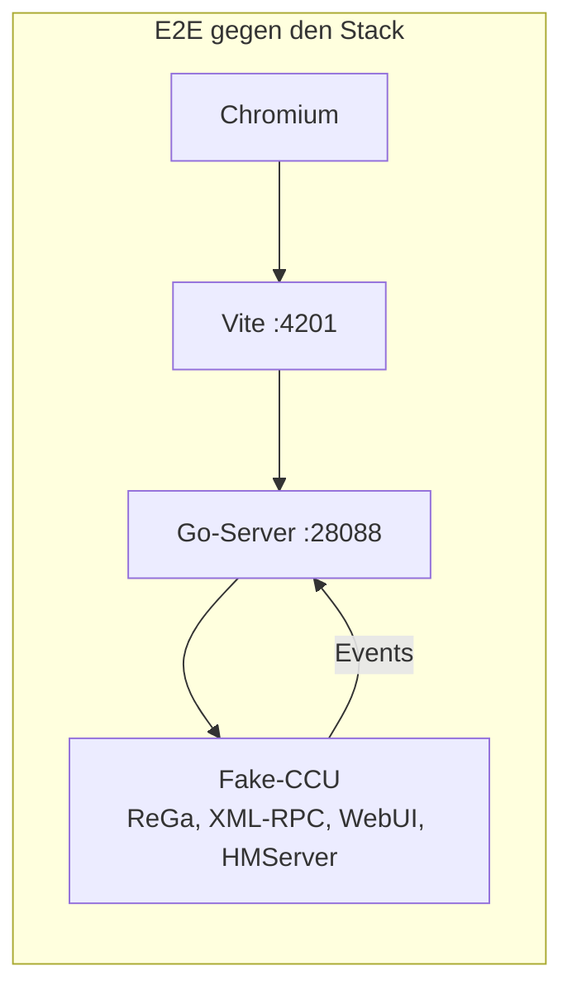

# Tests

Das Add-on ändert Dinge an einer Zentrale, die ein Haus steuert. Deshalb ist fast jede Funktion
automatisch getestet, und zwar auf mehreren Ebenen, bis hin zu Durchläufen im echten Browser gegen den
echten Server und eine nachgebaute CCU.

## Überblick

| Ebene | Was echt ist | Was nachgebaut ist | Tests | in der CI |
|---|---|---|---:|:---:|
| **Unit (Vitest)** | Funktionen und einzelne Komponenten der App | – | 309 in 58 Dateien | ✅ |
| **Go** | Server-Pakete; Integration: der ganze Server | die CCU (Fake-CCU), openccu-lite (Fake-Lite) | 335 Testfunktionen in 81 Dateien | ✅ |
| **Protokoll** | jede Nachricht des Servers in den Go-Tests, jede Nachricht des Mocks an die App in den E2E-Tests | – | gegen `protocol/schema.json` | ✅ |
| **E2E mit Mock** | App im Browser | der WebSocket (im Browser) | 35 + 2 + 2 + 1 | ✅ |
| **E2E gegen den Stack** | Browser, App, Go-Server, WebSocket, XML-RPC, ReGa-Aufrufe | nur die CCU (Fake-CCU) | 74 | ✅ |
| **openccu-lite-VM** | openccu-lite aus seinem Release-Image (QEMU), occulited, lighttpd, Sitzungs-Gate, Installation des Pakets | nichts; aber ohne Funkmodul, also ohne Geräte | 3 Phasen | ✅ bei Lite-Änderungen, wöchentlich, vor Releases |
| **Screenshot-Vergleich** | Darstellung in 3 Größen, hell und dunkel | der WebSocket | 72 | ✅ |

Zusammen über 600 Tests, dazu 72 Screenshot-Vergleiche.



## Die Fake-CCU

Herzstück der Tests ist `go-server/pkg/fakeccu`, eine CCU zum Mitnehmen (gut 3.700 Zeilen Go). Sie lädt
eine **Fixture** (`fixtures/demo-ccu.json`: 3 Räume, 2 Gewerke, 36 Kanäle, Benutzer `Admin`/`secret` und
`Gast`/`gast`, Gerätebeschreibungen und Paramsets für BidCos-RF und HmIP-RF, Systemvariablen, Programme,
Favoriten, ein Gerät im Posteingang) und startet fünf Server:

- **ReGa**: erkennt jedes Skript des Servers an seiner Vorlage, denn sie macht aus jeder der 58 Vorlagen
  einen regulären Ausdruck, liest die eingesetzten Werte heraus und antwortet wie `rega.exe`. Einen
  HM-Script-Interpreter braucht es dafür nicht.
- **XML-RPC** für BidCos-RF, HmIP-RF, VirtualDevices und BidCos-Wired: Gerätebeschreibungen, Paramsets, Anlernen,
  Verknüpfungen, Firmware, Gerätetausch … Änderungen schickt sie wie die echte CCU als Events an die
  angemeldeten Callbacks. Nach einem `putParamset` steht `CONFIG_PENDING` drei Sekunden auf `true`.
- **WebUI**: `Session.login`, die Admin-Aufrufe per JSON-RPC, die CGI-Seiten für Backup, Restore, Firmware,
  Add-ons und Werkseinstellungen, `fileupload.ccc`.
- **HMServer** für Heizgruppen.
- **Steuerung für Tests**: `POST /fake/set` lässt ein Gerät einen Wert melden (z. B. ein Fenster öffnet sich),
  `POST /fake/reset` setzt alles auf die Fixture zurück.

Konfigurationsdateien wie `rfd.conf`, `netconfig`, `firewall.conf` und `groups.gson` kopieren die Tests in
ein frisches Verzeichnis, damit jeder Lauf sauber beginnt.

Eine Fixture lässt sich aus der eigenen CCU erzeugen (`npm run export:ccu`). `fixtures/my-ccu.json` ist ein
anonymisierter Export einer echten Zentrale mit 482 Kanälen; er dient als Prüfstein für Gerätebeschreibungen
aus der Praxis.

## Unit-Tests (Vitest)

`npm test` · Konfiguration `vitest.config.mts` (jsdom, Testing Library)

Getestet werden vor allem reine Logik und kritische Komponenten:

- **Generische Kachel gegen alle Fixtures** (`ParamsetView.test.tsx`): jede Paramset-Beschreibung aus
  `fixtures/*.json`, auch aus dem Export der echten CCU, muss sich rendern lassen. 89 Fälle.
- Einstellungen: welcher Parameter welches Bedienelement bekommt (`settingKinds.test.ts`)
- Wochenprogramme von Thermostaten und Aktoren, Programmmodell, Verknüpfungsvorlagen
- Events in den Cache einspielen, Kanäle sortieren und ausblenden (`channels.test.ts`)
- Diagramme: Skalen, Ticks, CSV (`chart.test.ts`), Kachel-Layout
- Validierungen der Einrichten-Seiten: Firewall, Netzwerk, LAN-Gateways, Zertifikat, Anlernen, Benutzer
- Zuordnung der Kanaltypen zu Kacheln (`registry.test.ts`)
- Übersetzungen: Deutsch und Englisch haben dieselben Schlüssel, keiner ist leer

## Go-Tests

`npm run test:go` · Coverage: `npm run test:go:coverage`

- **Pakete**: ReGa (Skripte, Parser, Validierung, Programm-Code), XML-RPC-Client und -Server, Anmeldung und
  Tokens, Einstellungen, Diagramme, Push, Audit, Add-ons, Logs …
- **Integration** (65 Tests): `go-server/integration_test.go` baut den Stack auf, die Tests stehen nach
  Domänen in `stack_devices_test.go`, `stack_logic_test.go` und `stack_system_test.go`. Jeder Test startet
  die Fake-CCU auf freien Ports und den **echten** Server mit temporären Dateien, wartet auf die Anmeldung
  für Events und spricht dann über einen WebSocket-Client mit ihm: anmelden, schalten, Events, Rechte, Admin-Token, Paramsets, Anlernen,
  Verknüpfungen, Programme, Backup …
- **openccu-lite** (`go test -tags lite ./...`): Dieselbe Fake-CCU im Lite-Modus (`fakeccu.CCU.Lite`) hat
  keine ReGa und keine WebUI, sondern beantwortet occulites APIs aus derselben Fixture: Metadaten (Namen,
  Räume, Gewerke, auch verschachtelt mit Verschieben und Löschen), den Change-Stream der Metadaten,
  Sitzungen, Zustandsspeicher, Event-Stream mit `resync`, Servicemeldungen und
  Heizgruppen. Die
  Integrationstests in `go-server/lite_integration_test.go` starten den Lite-Server dagegen: Anmeldung über
  das Gate, Räume und Kanäle, Schalten mit dem Event aus dem Stream, Umbenennen, Layouts, Favoriten,
  Posteingang, Heizgruppen, virtuelle Taster, Servicemeldungen, Gesundheit, Regeln und Push, dazu von
  Geräten geerbte Räume (`TestLiteInheritedRooms`) und was dort anders geht (`TestLiteLimits`: Diagramm
  ohne Systemprotokoll, Sprache in `DATA_DIR`, nur Sticky-Meldungen bestätigen, `elevate` nur für
  Administratoren). `TestLiteCallsWithTheUsersSession` prüft, dass die Funkdienste über `lite-rpc` gehen und
  Änderungen mit der Sitzung des Nutzers. `TestLiteLayoutsFollowRoomsMovedInOpenccuLite` verschiebt einen Raum
  in openccu-lite und löscht den darüber, `TestLiteResync` liest nach `resync` den Zustandsspeicher neu.
- **Protokoll-Vertrag**: Die Hilfsfunktion, die Nachrichten des Servers liest, prüft **jede** gegen
  `protocol/schema.json`. Ein eigener Test stellt sicher, dass das Schema unbekannte Felder ablehnt.

## E2E mit gemocktem WebSocket

`npm run test:e2e` · Konfiguration `playwright.config.ts`

Die App läuft im Vite-Dev-Server und in echtem Chromium; nur `window.WebSocket` ist durch einen Mock ersetzt
(`e2e/helpers/websocketMock.ts`), der Anfragen im Browser beantwortet und über `window.__wsMock` steuerbar
ist: Events auslösen, das nächste Schalten scheitern lassen, Alarme setzen, gesendete Nachrichten prüfen.

Damit der Mock nicht unbemerkt vom echten Server abweicht, zeichnet er jede Nachricht an die App auf, und
nach jedem Test prüft `e2e/helpers/protocol.ts` sie gegen `ServerMessage` in `protocol/schema.json`, wie die
Go-Tests die Nachrichten des Servers. Weicht eine Antwort oder Push-Nachricht ab, schlägt der Test fehl und
nennt die Nachricht.

Abgedeckt sind die Kacheln (Licht, Dimmer, Farblicht, Rollladen, Türschloss nur mit Geste, Fenster, Melder,
Sirene, Zutritt, Eingänge, Sensoren für Regen, Licht, CO₂, Feinstaub, Boden, Neigung und Netzausfall, Bewässerung, Fensterantriebe, Thermostate, Energie), Events und Event-Schübe, Rücknahme bei Fehlern, Batterie und
Erreichbarkeit, Meldungen, Alarme, Favoriten, Startseite, Kacheln anordnen, die generische Kachel und
*Alle Geräte*. `auth.spec.ts` prüft Anmeldung, Token über einen Neustart hinweg und Abmelden. `lite.spec.ts`
lässt den Mock als openccu-lite antworten (`installWebSocketMock(page, { lite: true })`) und prüft, dass
die App Programme, Systemvariablen, Alarme und die Systemeinstellungen ausblendet, nicht danach fragt und
stattdessen auf Automationen und die Seiten von openccu-lite verweist. `lite-session.spec.ts` prüft, dass eine
abgelaufene Sitzung zur Anmeldung von openccu-lite führt statt ins eigene Login-Formular.

`npm run test:e2e:coverage` misst dabei die Abdeckung des Frontend-Codes (nyc, Bericht unter
`coverage/playwright`).

## E2E gegen den Stack

`npm run test:stack` (braucht Go) · Konfiguration `playwright.stack.config.ts`

Playwright startet drei Prozesse: die Fake-CCU, den echten Go-Server (mit allen Dateipfaden in einem
temporären Verzeichnis) und Vite. Jeder Test setzt die Fake-CCU zurück, meldet sich über die Anmeldemaske an
und bedient die App wie ein Mensch. Die Kette ist echt: Browser → Vite-Proxy → Go-Server → Fake-CCU und die
Events zurück.

Die 74 Tests decken praktisch jede Funktion von *Einrichten* ab, zum Beispiel:

- Licht schalten und Live-Events von einem anderen „Gerät“, Geräteprobleme, Dimmer
- Geräteeinstellungen mit Vorschau und Übertragungsstatus, Gastrechte, abgelaufenes Admin-Token
- Umbenennen, Räume und Gewerke, Anlernen, Posteingang, Löschen, Anlernen mit KEY/SGTIN, Wired-Gerätesuche
- Systemvariablen, Programm-Editor, Skript testen, *Als neues Programm speichern*
- Direktverknüpfungen mit Vorlage und mit allen Parametern
- Wochenprogramme für Thermostat und Schaltaktor, Heizgruppen
- Firmware-Update, Backup erstellen und einspielen, CCU-Firmware mit Lizenz, Add-ons installieren
- Benutzer, Passwort ändern, angemeldete Geräte abmelden
- Zeitzone und Zeitserver, Standort, Netzwerk, Firewall, LAN-Gateway, Zertifikat, SSH,
  Sicherheitsschlüssel, Sitzungs-Timeout, Sicherheitsstufe, Werkseinstellungen
- Diagramme, Systemprotokoll, virtuelle Taster, Funktionstest, Energiepreise, Info-LED

## Auf einer openccu-lite-VM

`scripts/lite-vm-test.sh <openccu-lite-x86_64-ova-*.zip> <mui-*-x86_64-lite.tar.gz>` (braucht
`qemu-system-x86_64`, mit KVM in wenigen Minuten, ohne deutlich langsamer)

Die Tests gegen die Fake-Lite prüfen, was MUI aus occulites APIs macht. Ob das Paket auf einem echten
openccu-lite überhaupt installiert und läuft, prüft erst dieser Test: Er bootet das x86_64-Image eines
openccu-lite-Releases headless in QEMU, wie openccu-lites eigenes `scripts/lite-qemu-test.sh`, legt den
ersten Administrator an und installiert das Paket über occulites Add-on-API, wie dessen Seite
*Zusatzsoftware* es hochlädt. Dann läuft `go-server/litevm` (Build-Tag `litevm`) in fünf Phasen gegen die
VM, über lighttpd und occulites Sitzungs-Gate:

- **prepare:** Anmeldung über das Gate (`platform: lite`, Administrator), alles, was die App beim Start
  liest, ein Raum mit Umlauten in occulites Metadaten, sein Layout und die Sprache in `DATA_DIR`.
- **verify:** nach einem Neustart des Dienstes `addon-mui`, nach einer erneuten Installation (Update) und
  nach einem Neustart des ganzen Systems sind Raum, Layout und Sprache noch da. Nach dem Neustart kommt das
  Add-on von selbst wieder (`"start": "early"`, es wartet selbst auf die Funkdienste).
- **levels:** Konten mit den Stufen *configure* und *operate*, jedes über das Gate angemeldet.
  *configure* benennt einen Raum um, und die Änderung kommt mit seiner eigenen Sitzung bei occulited an.
  Heizgruppen und Gerät löschen bekommen `FORBIDDEN`, *operate* darf nichts einrichten. Der Administrator
  legt eine Heizgruppe mit Umlauten über occulites Gruppen-API an. Ihr Gerät liegt in hmipserver
  (`VirtualDevices` läuft auch ohne Funkmodul). MUIs Geräteliste für *configure* muss dieselbe sein,
  die lite-rpc (`/api/rpc/v1/json/VirtualDevices`) dieser Sitzung direkt gibt. An diesem Gerät setzt
  *operate* einen Wert (`setDatapoint` über lite-rpc, `rpc:operate`), und der Wert kommt als Event über
  occulites Event-Stream an die Verbindung zurück, die den Kanal abonniert hat. Antwortet hmipserver
  direkt nach dem Anlegen der Gruppe nicht (`503 down`, siehe Plan), meldet der Test den Schritt als
  übersprungen; jeder andere Fehler und ein fehlendes Event bleiben rot. *configure* ändert eine
  Einstellung (MASTER, `rpc:configure`) und setzt sie zurück; *operate* bekommt dabei `FORBIDDEN`.
- **fresh:** nach Deinstallieren (`POST /api/system/v1/addons/mui/uninstall`) und neuer Installation sind
  Layout und Sprache weg, der Raum in occulites Speicher ist noch da.
- **logout:** Ein Abmelden in openccu-lite schließt die offene Verbindung (Neuprüfung jede Minute), die
  nächste bekommt `SESSION_REQUIRED` oder wird vom Gate abgewiesen.

Dazu öffnet `scripts/lite-vm-browser.mjs` die App in Chrome, wie openccu-lites Rahmen sie öffnet
(`/addons/mui/?theme=dark&lang=en`, über lighttpd und das Gate): Der Raum aus dem Test steht da, Thema und
Sprache kommen aus den Parametern, und es gibt keine Konsolenfehler, keine Ausnahmen und keine
fehlgeschlagenen Anfragen unter `/addons/mui/`. Dafür legt die Phase *showcase* vorher drei Räume mit je
einer Heizgruppe an (ein virtueller Thermostat ist das einzige Gerät, das die VM ohne Funkmodul haben
kann). Dann fotografiert das Skript die App in openccu-lites Oberfläche (`/nav/mui`, die Seite seines
Menüeintrags) hell und dunkel auf Desktop und Handy und darin einige Seiten der App, so wie ein Nutzer sie
erreicht: `screenshots/` im Artefakt `lite-vm-logs`. Dabei prüft es auch, dass es auf openccu-lite keinen
Link in die WebUI gibt und die Hilfe auf openccu-lites Doku und Lizenzen zeigt. Bietet openccu-lite das ganze Fenster
für MUI an (seit 1.0.0-dev.45), schaltet es das für den Testnutzer ein, fotografiert MUI ohne openccu-lites
Leiste auf Desktop und Handy und prüft, dass MUIs Menü den Weg zurück (`/`) anbietet. Hat das System die Gerätebilder (seit 1.0.0-dev.45), prüfen Test und Skript sie
auch: `getDeviceImages` kennt die Typen und sagt, wo openccu-lite sie ausliefert, das Bild des
Heizgruppen-Geräts kommt dort an, und in der Geräteliste ist ein Bild wirklich geladen
(`app-device.png` zeigt die Geräteseite).

Dazwischen prüft das Skript, dass `/addons/mui/` ohne Sitzung zur Anmeldung umleitet, dass openccu-lites
Backup (`GET /api/system/v1/backup`) `mui-lite.json`, `mui-tiles.json` und die Sprachprofile enthält, und dass das Journal
des Add-ons keine Schreibfehler (`EACCES`, `EROFS`, *permission denied*) und keinen Panic enthält. Ein
Wiederherstellen ersetzt `/usr/local` und startet das System neu; dass es die Dateien zurückbringt, ist
Sache des Systems, dass sie im Backup sind, unsere. Die Dauer jedes Schritts steht in der Zusammenfassung
des Workflows, Serial-Log, Journal, Antworten und die Dateiliste des Backups im Artefakt `lite-vm-logs`.

Die VM hat kein Funkmodul: Funkgeräte, Anlernen und Werte über Funk bleiben ein Test auf echter Hardware
(Checkliste in [plan-openccu-lite.md](plan-openccu-lite.md), Abschnitt *Tests*).

## Screenshot-Vergleich

`npm run test:visual` · Baselines erneuern: `npm run test:visual:update`

Zwölf Ansichten (Räume, Gewerke, Kacheln aller Art, Anmeldung, Meldungen, Menü) in drei Größen (Handy,
Tablet hoch und quer), hell und dunkel, mit fester Uhrzeit und Sprache: 72 Bilder unter
`e2e/visual.spec.ts-snapshots`. Weil Schriften auf jedem Rechner etwas anders gerendert werden, laufen sie
nur mit `VISUAL=1`, in der CI (Check *Screenshots*) im Docker-Image `mcr.microsoft.com/playwright`, aus dem
auch die Baselines stammen. Nach einer gewollten Änderung der Darstellung erneuert der Workflow *Update
screenshots* (Actions, manuell, auf dem Branch des Pull Requests) die Baselines im selben Image und committet
sie. Lokal geht das mit Docker:

```bash
docker run --rm --ipc=host -v "$PWD":/work -w /work -e VISUAL=1 \
  mcr.microsoft.com/playwright:v$(node -p "require('./package-lock.json').packages['node_modules/@playwright/test'].version")-noble \
  npx playwright test visual -u
```

Damit jeder Lauf dasselbe Bild liefert, wartet der Test, bis die App keine Anfragen mehr stellt und die Seite
ihre Höhe behält, und nimmt die ganze Seite in einem passend hohen Fenster auf statt mit `fullPage`. Nur *Alle
Geräte* lässt 500 abweichende Pixel zu: Das Leuchten der vielen aktiven Kacheln kommt bei jedem Lauf etwas
anders heraus.

Die Bilder der Dokumentation (`docs/screenshot-*.png`) nimmt `npm run docs:screenshots` neu auf: die
Kacheln aus dem Mock (`e2e/docs-screenshots.spec.ts`), die Einrichten-Seiten aus der Fake-CCU
(`e2e-stack/docs-screenshots.spec.ts`). Derselbe Workflow kann auch sie erneuern.

Die bewegten Bilder der Kacheln in [Geräteunterstützung](geraete.md#eigene-kacheln) (`docs/kacheln/*.webp`)
nimmt `npm run docs:tiles` auf (`e2e/docs-tiles.spec.ts`, braucht `ffmpeg` mit libwebp): Jede Kachel des
Mocks spielt eine kurze Szene, in der der Mock Meldungen der CCU schickt (ein Fenster kippt und öffnet, der
Rauchmelder schlägt an). Chromiums Screencast liefert jedes gemalte Bild mit seiner Zeit, ffmpeg macht daraus
eine animierte WebP mit 15 Bildern pro Sekunde. Eine Animation kommt nie zweimal gleich heraus, deshalb hat
der Workflow dafür eine eigene Auswahl `tiles`.

## CI

| Workflow | Auslöser | Schritte |
|---|---|---|
| `build.yml` | Push und Pull Request auf `main` | Protokolltypen aktuell (`generate:protocol` + `git diff --exit-code`), Unit-Tests, Build mit Typprüfung (`vite build && tsc`), Go-Build für ARM und x86 und für openccu-lite (aarch64, x86_64), die `tar.gz`-Archive mit `.sha256` als Artefakt `addon` |
| `go-unit-tests.yml` | Push und Pull Request auf `main` | `go vet`, `gofmt`, `staticcheck` und `go test ./...` mit Coverage-Bericht als Artefakt, dasselbe mit `-tags lite` für openccu-lite |
| `playwright-e2e.yml` | Push und Pull Request auf `main` | Im Docker-Image `mcr.microsoft.com/playwright` (Version aus der `package-lock.json`, kein Browser-Download): E2E mit Mock inkl. Anmeldung (4 Worker, mit Frontend-Coverage), Screenshot-Vergleich und E2E gegen den Stack auf zwei Runnern (`--shard`), Berichte als Artefakte |
| `lite-vm.yml` | Pull Request, der den Lite-Teil ändert; montags gegen das neueste openccu-lite; von Hand (mit wählbarem openccu-lite-Release); vor jeder Release | Paket bauen, openccu-lite-Image laden (zwischengespeichert je Release), in QEMU mit KVM booten, installieren, `scripts/lite-vm-test.sh`; Dauer je Schritt in der Zusammenfassung, Logs als Artefakt |
| `release.yml` | Tag `vX.Y.Z` | Die vier Workflows oben, dann die Release mit den Archiven und erzeugten Notizen |
| `bump.yml` | von Hand | Version erhöhen, Tag `vX.Y.Z` anlegen und `release.yml` darauf starten |

Ein Pull Request wird erst gemergt, wenn alle Prüfungen grün sind.

## Selbst laufen lassen

```bash
npm test                  # Vitest
npm run typecheck         # TypeScript
npm run test:go           # Go
cd go-server && go test -tags lite ./...   # Go für openccu-lite
npm run test:e2e          # Playwright mit Mock (startet Vite selbst)
npm run test:stack        # Playwright gegen Go-Server + Fake-CCU
npm run test:visual       # Screenshot-Vergleich
scripts/lite-vm-test.sh <openccu-lite-x86_64-ova-*.zip> mui-*-x86_64-lite.tar.gz   # auf einer openccu-lite-VM
```

Playwright braucht einmal `npm run test:e2e:install` für Chromium.
