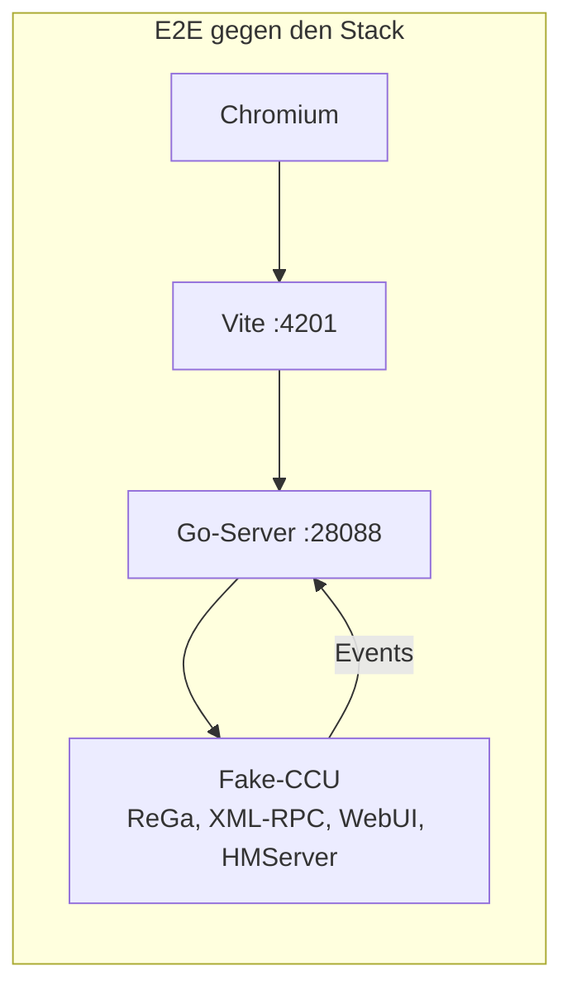

# Tests

Das Add-on ändert Dinge an einer Zentrale, die ein Haus steuert. Deshalb ist fast jede Funktion
automatisch getestet, und zwar auf mehreren Ebenen, bis hin zu Durchläufen im echten Browser gegen den
echten Server und eine nachgebaute CCU.

## Überblick

| Ebene | Was echt ist | Was nachgebaut ist | Tests | in der CI |
|---|---|---|---:|:---:|
| **Unit (Vitest)** | Funktionen und einzelne Komponenten der App | – | 299 in 54 Dateien | ✅ |
| **Go** | Server-Pakete; Integration: der ganze Server | die CCU (Fake-CCU) | 289 Testfunktionen in 69 Dateien | ✅ |
| **Protokoll** | jede Nachricht des Servers in den Go-Tests, jede Nachricht des Mocks an die App in den E2E-Tests | – | gegen `protocol/schema.json` | ✅ |
| **E2E mit Mock** | App im Browser | der WebSocket (im Browser) | 34 + 2 | ✅ |
| **E2E gegen den Stack** | Browser, App, Go-Server, WebSocket, XML-RPC, ReGa-Aufrufe | nur die CCU (Fake-CCU) | 74 | ✅ |
| **Screenshot-Vergleich** | Darstellung in 3 Größen, hell und dunkel | der WebSocket | 72 | ✅ |

Zusammen über 600 Tests, dazu 72 Screenshot-Vergleiche.



## Die Fake-CCU

Herzstück der Tests ist `go-server/pkg/fakeccu`, eine CCU zum Mitnehmen (gut 3.700 Zeilen Go). Sie lädt
eine **Fixture** (`fixtures/demo-ccu.json`: 3 Räume, 2 Gewerke, 36 Kanäle, Benutzer `Admin`/`secret` und
`Gast`/`gast`, Gerätebeschreibungen und Paramsets für BidCos-RF und HmIP-RF, Systemvariablen, Programme,
Favoriten, ein Gerät im Posteingang) und startet fünf Server:

- **ReGa**: erkennt jedes Skript des Servers an seiner Vorlage, denn sie macht aus jeder der 58 Vorlagen
  einen regulären Ausdruck, liest die eingesetzten Werte heraus und antwortet wie `rega.exe`. Einen
  HM-Script-Interpreter braucht es dafür nicht.
- **XML-RPC** für BidCos-RF, HmIP-RF, VirtualDevices und BidCos-Wired: Gerätebeschreibungen, Paramsets, Anlernen,
  Verknüpfungen, Firmware, Gerätetausch … Änderungen schickt sie wie die echte CCU als Events an die
  angemeldeten Callbacks. Nach einem `putParamset` steht `CONFIG_PENDING` drei Sekunden auf `true`.
- **WebUI**: `Session.login`, die Admin-Aufrufe per JSON-RPC, die CGI-Seiten für Backup, Restore, Firmware,
  Add-ons und Werkseinstellungen, `fileupload.ccc`.
- **HMServer** für Heizgruppen.
- **Steuerung für Tests**: `POST /fake/set` lässt ein Gerät einen Wert melden (z. B. ein Fenster öffnet sich),
  `POST /fake/reset` setzt alles auf die Fixture zurück.

Konfigurationsdateien wie `rfd.conf`, `netconfig`, `firewall.conf` und `groups.gson` kopieren die Tests in
ein frisches Verzeichnis, damit jeder Lauf sauber beginnt.

Eine Fixture lässt sich aus der eigenen CCU erzeugen (`bun run export:ccu`). `fixtures/my-ccu.json` ist ein
anonymisierter Export einer echten Zentrale mit 482 Kanälen; er dient als Prüfstein für Gerätebeschreibungen
aus der Praxis.

## Unit-Tests (Vitest)

`bun run test` · Konfiguration `vitest.config.mts` (jsdom, Testing Library)

Getestet werden vor allem reine Logik und kritische Komponenten:

- **Generische Kachel gegen alle Fixtures** (`ParamsetView.test.tsx`): jede Paramset-Beschreibung aus
  `fixtures/*.json`, auch aus dem Export der echten CCU, muss sich rendern lassen. 89 Fälle.
- Einstellungen: welcher Parameter welches Bedienelement bekommt (`settingKinds.test.ts`)
- Wochenprogramme von Thermostaten und Aktoren, Programmmodell, Verknüpfungsvorlagen
- Events in den Cache einspielen, Kanäle sortieren und ausblenden (`channels.test.ts`)
- Diagramme: Skalen, Ticks, CSV (`chart.test.ts`), Kachel-Layout
- Validierungen der Einrichten-Seiten: Firewall, Netzwerk, LAN-Gateways, Zertifikat, Anlernen, Benutzer
- Zuordnung der Kanaltypen zu Kacheln (`registry.test.ts`)
- Übersetzungen: Deutsch und Englisch haben dieselben Schlüssel, keiner ist leer

## Go-Tests

`bun run test:go` · Coverage: `bun run test:go:coverage`

- **Pakete**: ReGa (Skripte, Parser, Validierung, Programm-Code), XML-RPC-Client und -Server, Anmeldung und
  Tokens, Einstellungen, Diagramme, Push, Audit, Add-ons, Logs …
- **Integration** (`go-server/integration_test.go`, 64 Tests): startet die Fake-CCU auf freien Ports und den
  **echten** Server mit temporären Dateien, wartet auf die Anmeldung für Events und spricht dann über einen
  WebSocket-Client mit ihm: anmelden, schalten, Events, Rechte, Admin-Token, Paramsets, Anlernen,
  Verknüpfungen, Programme, Backup …
- **Protokoll-Vertrag**: Die Hilfsfunktion, die Nachrichten des Servers liest, prüft **jede** gegen
  `protocol/schema.json`. Ein eigener Test stellt sicher, dass das Schema unbekannte Felder ablehnt.

## E2E mit gemocktem WebSocket

`bun run test:e2e` · Konfiguration `playwright.config.ts`

Die App läuft im Vite-Dev-Server und in echtem Chromium; nur `window.WebSocket` ist durch einen Mock ersetzt
(`e2e/helpers/websocketMock.ts`), der Anfragen im Browser beantwortet und über `window.__wsMock` steuerbar
ist: Events auslösen, das nächste Schalten scheitern lassen, Alarme setzen, gesendete Nachrichten prüfen.

Damit der Mock nicht unbemerkt vom echten Server abweicht, zeichnet er jede Nachricht an die App auf, und
nach jedem Test prüft `e2e/helpers/protocol.ts` sie gegen `ServerMessage` in `protocol/schema.json`, wie die
Go-Tests die Nachrichten des Servers. Weicht eine Antwort oder Push-Nachricht ab, schlägt der Test fehl und
nennt die Nachricht.

Abgedeckt sind die Kacheln (Licht, Dimmer, Farblicht, Rollladen, Türschloss nur mit Geste, Fenster, Melder,
Sirene, Zutritt, Eingänge, Sensoren für Regen, Licht, CO₂, Feinstaub, Boden, Neigung und Netzausfall, Bewässerung, Fensterantriebe, Thermostate, Energie), Events und Event-Schübe, Rücknahme bei Fehlern, Batterie und
Erreichbarkeit, Meldungen, Alarme, Favoriten, Startseite, Kacheln anordnen, die generische Kachel und
*Alle Geräte*. `auth.spec.ts` prüft Anmeldung, Token über einen Neustart hinweg und Abmelden.

`bun run test:e2e:coverage` misst dabei die Abdeckung des Frontend-Codes (nyc, Bericht unter
`coverage/playwright`).

## E2E gegen den Stack

`bun run test:stack` (braucht Go) · Konfiguration `playwright.stack.config.ts`

Playwright startet drei Prozesse: die Fake-CCU, den echten Go-Server (mit allen Dateipfaden in einem
temporären Verzeichnis) und Vite. Jeder Test setzt die Fake-CCU zurück, meldet sich über die Anmeldemaske an
und bedient die App wie ein Mensch. Die Kette ist echt: Browser → Vite-Proxy → Go-Server → Fake-CCU und die
Events zurück.

Die 74 Tests decken praktisch jede Funktion von *Einrichten* ab, zum Beispiel:

- Licht schalten und Live-Events von einem anderen „Gerät“, Geräteprobleme, Dimmer
- Geräteeinstellungen mit Vorschau und Übertragungsstatus, Gastrechte, abgelaufenes Admin-Token
- Umbenennen, Räume und Gewerke, Anlernen, Posteingang, Löschen, Anlernen mit KEY/SGTIN, Wired-Gerätesuche
- Systemvariablen, Programm-Editor, Skript testen, *Als neues Programm speichern*
- Direktverknüpfungen mit Vorlage und mit allen Parametern
- Wochenprogramme für Thermostat und Schaltaktor, Heizgruppen
- Firmware-Update, Backup erstellen und einspielen, CCU-Firmware mit Lizenz, Add-ons installieren
- Benutzer, Passwort ändern, angemeldete Geräte abmelden
- Zeitzone und Zeitserver, Standort, Netzwerk, Firewall, LAN-Gateway, Zertifikat, SSH,
  Sicherheitsschlüssel, Sitzungs-Timeout, Sicherheitsstufe, Werkseinstellungen
- Diagramme, Systemprotokoll, virtuelle Taster, Funktionstest, Energiepreise, Info-LED

## Screenshot-Vergleich

`bun run test:visual` · Baselines erneuern: `bun run test:visual:update`

Zwölf Ansichten (Räume, Gewerke, Kacheln aller Art, Anmeldung, Meldungen, Menü) in drei Größen (Handy,
Tablet hoch und quer), hell und dunkel, mit fester Uhrzeit und Sprache: 72 Bilder unter
`e2e/visual.spec.ts-snapshots`. Weil Schriften auf jedem Rechner etwas anders gerendert werden, laufen sie
nur mit `VISUAL=1`, in der CI (Check *Screenshots*) im Docker-Image `mcr.microsoft.com/playwright`, aus dem
auch die Baselines stammen. Nach einer gewollten Änderung der Darstellung erneuert der Workflow *Update
screenshots* (Actions, manuell, auf dem Branch des Pull Requests) die Baselines im selben Image und committet
sie. Lokal geht das mit Docker:

```bash
docker run --rm --ipc=host -v "$PWD":/work -w /work -e VISUAL=1 \
  mcr.microsoft.com/playwright:v$(node -p "require('./package-lock.json').packages['node_modules/@playwright/test'].version")-noble \
  bunx playwright test visual -u
```

Damit jeder Lauf dasselbe Bild liefert, wartet der Test, bis die App keine Anfragen mehr stellt und die Seite
ihre Höhe behält, und nimmt die ganze Seite in einem passend hohen Fenster auf statt mit `fullPage`. Nur *Alle
Geräte* lässt 500 abweichende Pixel zu: Das Leuchten der vielen aktiven Kacheln kommt bei jedem Lauf etwas
anders heraus.

Die Bilder der Dokumentation (`docs/screenshot-*.png`) nimmt `bun run docs:screenshots` neu auf: die
Kacheln aus dem Mock (`e2e/docs-screenshots.spec.ts`), die Einrichten-Seiten aus der Fake-CCU
(`e2e-stack/docs-screenshots.spec.ts`). Derselbe Workflow kann auch sie erneuern.

## CI

| Workflow | Auslöser | Schritte |
|---|---|---|
| `build.yml` | Push und Pull Request auf `main` | Protokolltypen aktuell (`generate:protocol` + `git diff --exit-code`), Unit-Tests, Build mit Typprüfung (`vite build && tsc`), Go-Build für ARM und x86, die `tar.gz`-Archive als Artefakt `addon` |
| `go-unit-tests.yml` | Push und Pull Request auf `main` | `go test ./...` mit Coverage-Bericht als Artefakt |
| `playwright-e2e.yml` | Push und Pull Request auf `main` | Im Docker-Image `mcr.microsoft.com/playwright` (Version aus der `package-lock.json`, kein Browser-Download): E2E mit Mock inkl. Anmeldung (4 Worker, mit Frontend-Coverage), Screenshot-Vergleich und E2E gegen den Stack auf zwei Runnern (`--shard`), Berichte als Artefakte |
| `release.yml` | Tag `vX.Y.Z` | Die drei Workflows oben, dann die Release mit den Archiven und erzeugten Notizen |
| `bump.yml` | von Hand | Version erhöhen, Tag `vX.Y.Z` anlegen und `release.yml` darauf starten |

Ein Pull Request wird erst gemergt, wenn alle Prüfungen grün sind.

## Selbst laufen lassen

```bash
bun run test                  # Vitest
bun run typecheck         # TypeScript
bun run test:go           # Go
bun run test:e2e          # Playwright mit Mock (startet Vite selbst)
bun run test:stack        # Playwright gegen Go-Server + Fake-CCU
bun run test:visual       # Screenshot-Vergleich
```

Playwright braucht einmal `bun run test:e2e:install` für Chromium.
